# Django:mxonline教育平台在线开发

## 一、创建mxonline项目
##### 1. 环境：
(1) 本平台的开发环境
- python2.7.15
- 数据库：mysql
- django：1.9.8
- 在virtualenv中运行
  - `pip install virtualenv`
  - `virtualenv testvir`
  - `pip install virtualenvwrapper-win`
  - `mkvirtualenv mx`
  - `pip install virtualenvwrapper-win`
  - `pip install django==1.9.8`
  - `pip install pillow`
  

(2)虚拟环境原理介绍：

① virtualenv ：
- 安装virtualenv：
  - virtualenv 是用来创建虚拟环境的软件工具，我们可以通过 pip 或者 pip3 来安装：
    `pip install virtualenv`    
    `pip3 install virtualenv`
- 创建虚拟环境
    `virtualenv [虚拟环境的名字]`
- 在不同的操作系统中有不同的方式，一般分为两种，第一种是 Windows ，第二种是 *nix ：
  - windows 进入虚拟环境：进入到虚拟环境的 Scripts 文件夹中，然后执行 activate 。 
  - *nix 进入虚拟环境：`source /path/to/virtualenv/bin/activate` 
  - 一旦你进入到了这个虚拟环境中，你安装包，卸载包都是在这个虚拟环境中，不会影响到外面的环境。
- 退出虚拟环境：deactivate 。
- 创建虚拟环境的时候指定Python解释器,可以通过 -p 参数来指定具体 的 Python 解释器：
    `virtualenv -p C:\Python36\python.exe [virutalenv name]`

② virtualenvwrapper：
- 安装virtualenvwrapper ：
  - `*nix： pip install virtualenvwrapper` 
  - `windows： pip install virtualenvwrapper-win`
- virtualenvwrapper 基本使用：
- 创建虚拟环境：
  `mkvirtualenv my_env`
- 切换到某个虚拟环境：
  `workon my_env`
- 退出当前虚拟环境：
  `deactivate`
- 删除某个虚拟环境：
  `rmvirtualenv my_env`
- 列出所有虚拟环境：
  `lsvirtualenv`
-  进入到虚拟环境所在的目录：
    `cdvirtualenv`
- 修改`mkvirtualenv`的默认路径：
在 我的电脑->右键->属性->高级系统设置->环境变量->系统变量 中添加一个参数 WORKON_HOME ，将这个 参数的值设置为你需要的路径。
- 创建虚拟环境的时候指定 Python 版本：
   `mkvirtualenv --python==C:\Python36\python.exe hy_env`

##### 2. 创建数据库
- create database mxonline;

##### 3. 在pycharm中创建Django项目
- 修改__init__.py文件
```
import pymysql
pymysql.install_as_MySQLdb()
```
- 安装pymysql:`pip install pymysql`
- 修改settings.py文件
  - 配置数据库
	```
	DATABASES = {
	    'default': {
	        'ENGINE': 'django.db.backends.mysql',
	        'NAME': 'mxonline',
	        'USER': 'root',
	        'PASSWORD': '',
	        'HOST': 'localhost',
	        'port': '3306',
	    }
	}
	```
  - 汉化
	```
	LANGUAGE_CODE = 'zh-hans'
	TIME_ZONE = 'Asia/Shanghai'
	USE_I18N = True
	USE_L10N = True
	#防止取为UTC时间
	USE_TZ = False
	```

## 二、创建应用
- 在一个项目中可以创建多个应用，每个应用对应一种业务处理
- 点击Tools下的run manage.py task
- 执行`<startapp myApp>`
  - startapp users
  - startapp courses
  - startapp organization
  - startapp operation
- myApp目录说明	
  - admin.py　　　　站点配置
  - model.py　　　　模型
  - views.py　　　　视图

## 三、激活应用
- 在setting.py文件中，将myApp应用加入到INSTALLED_APPS选项中
```
INSTALLED_APPS = [
    'django.contrib.admin',
    'django.contrib.auth',
    'django.contrib.contenttypes',
    'django.contrib.sessions',
    'django.contrib.messages',
    'django.contrib.staticfiles',
    'users',
    'courses',
    'operation',
    'organization',
]
```

## 四、定义模型
##### 1. 概述：一个数据表对应一个模型
##### 2. 在models.py文件中定义模型
　　　　　　　　　　　　　　　　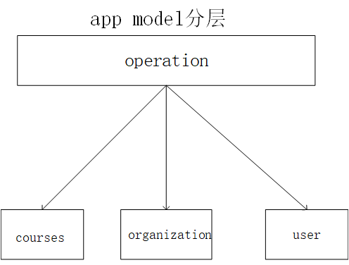

(1)users  
```
# _*_ encoding:utf-8 _*_
from __future__ import unicode_literals
from datetime import datetime
from django.db import models
from django.contrib.auth.models import AbstractUser

# Create your models here.


class UserProfile(AbstractUser):
    nick_name = models.CharField(max_length=50, verbose_name=u"昵称", default=u"")
    birthday = models.DateField(verbose_name=u"生日", null=True, blank=True)
    gender = models.CharField(max_length=10, choices=(("male", u"男"), ("female", u"女")), default="female")
    address = models.CharField(max_length=100, default=u"")
    mobile = models.CharField(max_length=11, null=True, blank=True)
    image = models.ImageField(upload_to="image/%Y/%X", default=u"image/default.png")

	class Meta:
	    verbose_name = "用户信息"
	    verbose_name_plural = verbose_name


class EmailVerifyRecord(models.Model):
    code = models.CharField(max_length=20,verbose_name=u"验证码")
    email = models.EmailField(max_length=50, verbose_name=u"邮箱")
    send_type = models.CharField(max_length=20, choices=(("register",u"注册"), ("forget", u"忘记密码"), ("found", u"找回密码")))
    # 去掉datetime.now()的(),使生成时间是实例化时间，而不是模型建立时间
    send_time = models.DateTimeField(default=datetime.now)

    class Meta:
        verbose_name = "邮箱验证码"
        verbose_name_plural = verbose_name

    def __unicode__(self):
        return self.username


class Banner(models.Model):
    title = models.CharField(max_length=100, verbose_name=u"标题")
    image = models.ImageField(upload_to="banner/%Y/%m", verbose_name=u"轮播图", max_length=100)
    url = models.URLField(max_length=200, verbose_name=u"访问地址")
    index = models.IntegerField(default=100, verbose_name=u"顺序")
    add_time = models.DateTimeField(default=datetime.now, verbose_name=u"添加时间")

    class Meta:
        verbose_name = u"轮播图"
        verbose_name_plural = verbose_name
```
- 由于UserProfile继承了AbstractUser，因此需要在settings.py中添加
  `AUTH_USER_MODEL = "users.UserProfile"`
- 否则会出现下面的错误
```
auth.User.groups: (fields.E304)
auth.User.user_permissions: (fields.E304)
users.UserProfile.groups: (fields.E304) 
users.UserProfile.user_permissions: (fields.E304)
```

(2)courses
```
# _*_ encoding:utf-8 _*_
from __future__ import unicode_literals
from django.db import models
from datetime import datetime

# Create your models here.


class Course(models.Model):
    name = models.CharField(max_length=50, verbose_name=u"课程名")
    desc = models.CharField(max_length=300, verbose_name=u"课程描述")
    detail = models.TextField(verbose_name=u"课程详情")
    degree = models.CharField(max_length=50, choices=(("cj", "初级"), ("zj", "中级"), ("gj", "高级")))
    learn_times = models.IntegerField(default=0, verbose_name=u"学习时长(分钟数)")
    students = models.IntegerField(default=0, verbose_name=u"学习人数")
    fav_nums = models.IntegerField(default=0, verbose_name=u"收藏人数")
    image = models.ImageField(upload_to="Courses/%Y/%m", verbose_name=u"封面图片")
    click_nums = models.IntegerField(default=0, verbose_name=u"点击数")
    add_time = models.DateTimeField(default=datetime.now, verbose_name=u"添加时间")

    class Meta:
        verbose_name = u"课程"
        verbose_name_plural = verbose_name


class Lesson(models.Model):
    course = models.ForeignKey(Course, verbose_name=u"课程",on_delete=models.DO_NOTHING)
    name = models.CharField(max_length=100, verbose_name=u"章节名")
    add_time = models.DateTimeField(default=datetime.now, verbose_name=u"添加时间")

    class Meta:
        verbose_name = u"章节"
        verbose_name_plural = verbose_name


class Video(models.Model):
    lesson = models.ForeignKey(Lesson, verbose_name=u"章节",on_delete=models.DO_NOTHING)
    name = models.CharField(max_length=100, verbose_name=u"视频名")
    add_time = models.DateTimeField(default=datetime.now, verbose_name=u"添加时间")

    class Meta:
        verbose_name = u"视频"
        verbose_name_plural = verbose_name


class CourseResource(models.Model):
    course = models.ForeignKey(Course, verbose_name=u"课程",on_delete=models.DO_NOTHING)
    name = models.CharField(max_length=100, verbose_name=u"名称")
    download = models.FileField(upload_to="course/resource/%Y/%m", verbose_name=u"资源文件")
    add_time = models.DateTimeField(default=datetime.now, verbose_name=u"添加时间")

    class Meta:
        verbose_name = u"课程资源"
        verbose_name_plural = verbose_name
```
(3) operation
```
# _*_ encoding:utf-8 _*_
from __future__ import unicode_literals

from datetime import datetime

from django.db import models

from users.models import UserProfile
from courses.models import Course

# Create your models here.


class UserAsk(models.Model):
    name = models.CharField(max_length=20, verbose_name=u"姓名")
    mobile = models.CharField(max_length=11, verbose_name=u"手机")
    course_name = models.CharField(max_length=50, verbose_name=u"课程名")
    add_time = models.DateTimeField(default=datetime.now, verbose_name=u"添加时间")

    class Meta:
        verbose_name = u"用户咨询"
        verbose_name_plural = verbose_name


class CourseComments(models.Model):
    user = models.ForeignKey(UserProfile, verbose_name=u"用户", on_delete=models.DO_NOTHING)
    course = models.ForeignKey(Course, verbose_name=u"课程", on_delete=models.DO_NOTHING)
    comments = models.CharField(max_length=200, verbose_name=u"评论")
    add_time = models.DateTimeField(default=datetime.now, verbose_name=u"添加时间")

    class Meta:
        verbose_name = u"课程评论"
        verbose_name_plural = verbose_name


class UserFavorite(models.Model):
    user = models.ForeignKey(UserProfile, verbose_name=u"用户",on_delete=models.DO_NOTHING)
    fav_id = models.IntegerField(default=0, verbose_name=u"数据id")
    fav_type = models.IntegerField(choices=((1, "课程"), (2, "课程机构"), (3, "讲师")))
    add_time = models.DateTimeField(default=datetime.now, verbose_name=u"添加时间")

    class Meta:
        verbose_name = u"用户收藏"
        verbose_name_plural = verbose_name


class UserMessage(models.Model):
    user = models.IntegerField(default=0, verbose_name=u"接收用户")
    message = models.CharField(max_length=500, verbose_name=u"消息内容")
    has_read = models.BooleanField(default=False, verbose_name=u"是否已读")
    add_time = models.DateTimeField(default=datetime.now, verbose_name=u"添加时间")

    class Meta:
        verbose_name = u"用户消息"
        verbose_name_plural = verbose_name


class UserCourse(models.Model):
    user = models.ForeignKey(UserProfile, verbose_name=u"用户",on_delete=models.DO_NOTHING)
    course = models.ForeignKey(Course, verbose_name=u"课程",on_delete=models.DO_NOTHING)
    add_time = models.DateTimeField(default=datetime.now, verbose_name=u"添加时间")

    class Meta:
        verbose_name = u"用户课程"
        verbose_name_plural = verbose_name
```
(4)organization
```
# _*_ encoding:utf-8 _*_
from __future__ import unicode_literals
from datetime import datetime

from django.db import models

# Create your models here.


class CityDict(models.Model):
    name = models.CharField(max_length=50, verbose_name=u"城市")
    desc = models.CharField(max_length=300, verbose_name=u"描述")
    add_time = models.DateTimeField(default=datetime.now, verbose_name=u"添加时间")

    class Meta:
        verbose_name = u"城市"
        verbose_name_plural = verbose_name


class CourseOrg(models.Model):
    name = models.CharField(max_length=50, verbose_name=u"机构名称")
    desc = models.CharField(max_length=300, verbose_name=u"机构描述")
    click_nums = models.IntegerField(default=0, verbose_name=u"点击数")
    fav_nums = models.IntegerField(default=0, verbose_name=u"收藏人数")
    image = models.ImageField(upload_to="org/%Y/%m", verbose_name=u"封面图片")
    address = models.CharField(max_length=50, verbose_name=u"机构地址")
    city = models.ForeignKey(CityDict,verbose_name=u"所在城市",on_delete=models.DO_NOTHING)
    add_time = models.DateTimeField(default=datetime.now, verbose_name=u"添加时间")

    class Meta:
        verbose_name = u"课程机构"
        verbose_name_plural = verbose_name


class Teacher(models.Model):
    org = models.ForeignKey(CourseOrg, verbose_name=u"所属机构",on_delete=models.DO_NOTHING)
    name = models.CharField(max_length=50,verbose_name=u"教师名")
    work_years = models.IntegerField(default=0, verbose_name=u"工作年限")
    work_company = models.CharField(max_length=50, verbose_name=u"就职公司")
    work_position = models.CharField(max_length=50, verbose_name=u"公司职位")
    points = models.CharField(max_length=50, verbose_name=u"教学特点")
    click_nums = models.IntegerField(default=0, verbose_name=u"点击数")
    fav_nums = models.IntegerField(default=0, verbose_name=u"收藏人数")
    add_time = models.DateTimeField(default=datetime.now, verbose_name=u"添加时间")

    class Meta:
        verbose_name = u"教师"
        verbose_name_plural = verbose_name
```
- 说明：不需要定义主键，在生成时自动添加，并且值为自动增加

## 五、在数据库中生成数据表
- 生成迁移文件
  - 执行`<makemigrations>`
    - 在migrations目录下生成一个迁移文件，此时数据库中还没有生成数据表
- 执行迁移
	- 执行`<migrate>`
	- 相当于执行sql语句创建数据表
	

　　　　　　　　　　　　　　　　　　　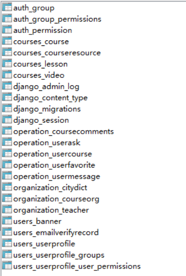

## 六、创建python package<apps>,用于放置所有app
- 将创建的apps文件夹mark为root
  - 此时编辑器知道，命令行不知道
- 将apps加入到python的搜索目录之下
```
import sys
sys.path.insert(0, os.path.join(BASE_DIR, 'apps'))
```

## 七、测试
- 创建超级用户
  - 执行`<createsuperuser>`
    - username
    - email
    - password
- 启动服务器
  - 格式
	  - python manage.py runserver ip:port
	  - ip可以不写，代表本机ip
	  - 端口号默认是8000
- 说明
  - 这是一个纯python写的轻量级web服务器，仅仅在开发测试中使用

## 八、站点管理
##### 1. Admin
- 自定义管理页面
```
# -*- coding: utf-8 -*-
from __future__ import unicode_literals
from django.contrib import admin
# Register your models here.
from .models import UserProfile
class UserProfileAdmin(admin.ModelAdmin):
    pass
admin.site.register(UserProfile, UserProfileAdmin)
```

##### 2.xadmin
(1) 安装xadmin
- [克隆](https://github.com/sshwsfc/xadmin.git)
- 将文件夹中的xadmin文件夹放在项目目录下
- 新建extra_apps文件夹，将xadmin放入该目录下
	- mark 为source root
	- 添加settings.py文件
	  - `sys.path.insert(0, os.path.join(BASE_DIR, 'extra_apps'))`
	  

(2) 注册站点
- INSTALLED_APPS添加
```
  'xadmin',
  'crispy_forms'
```
- 添加`httplib2`,`django-formtools`,`django-crispy-forms`,`future`,`django-import-export`等库.
- 需要完成迁移生成xadmin表才能打开网址

　　　　　　　　　　　　　　　　　　　　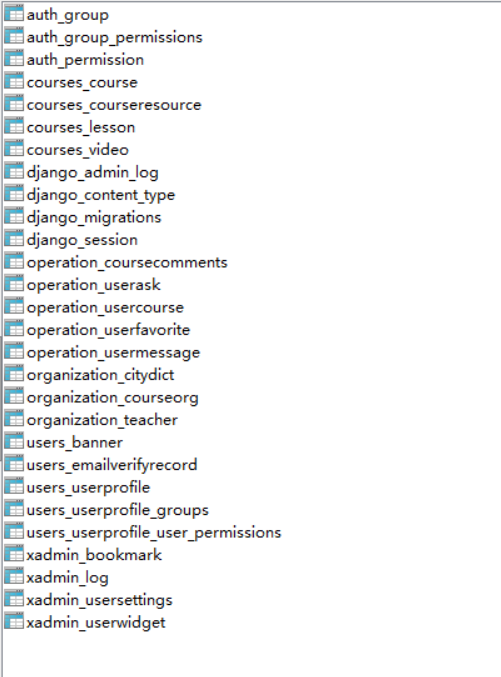
- urls.py文件下

	```
	from django.conf.urls import url
	from django.contrib import admin
	import xadmin
	
	urlpatterns = [
	    url(r'^xadmin/', xadmin.site.urls),
	]
	```
- 在settings中设置template   
	​         
	```
	- # -*- coding:utf-8 -*-
	__author__ = 'liying'
	__data__= '$DATE $TIME'
	```

- ######  在每一个app下建立adminx.py文件:
- users/adminx.py

```
# -*- coding:utf-8 -*-
__author__ = 'liying'
__data__= '2018/09/27 15:36'

import xadmin

from .models import EmailVerifyRecord, Banner


class EmailVerifyRecordAdmin(object):
    list_display = ['code', 'email', 'send_type', 'send_time']
    search_fields = ['code', 'email', 'send_type']
    list_filter = ['code', 'email', 'send_type', 'send_time']


class BannerAdmin(object):
    list_display = ['title', 'image', 'url', 'index', 'add_time']
    search_fields = ['title', 'image', 'url', 'index']
    list_filter = ['title', 'image', 'url', 'index', 'add_time']


xadmin.site.register(EmailVerifyRecord, EmailVerifyRecordAdmin)
xadmin.site.register(Banner, BannerAdmin)
```
- courses/adminx.py
  
```
# -*- coding:utf-8 -*-
__author__ = 'liying'
__data__ = '2018/9/27 16:04'

import xadmin
from .models import Course, Lesson, Video, CourseResource


class CourseAdmin(object):
    list_display = ['name', 'desc', 'detail', 'degree', 'learn_times', 'students']
    search_fields = ['name', 'desc', 'detail', 'degree', 'students']
    list_filter = ['name', 'desc', 'detail', 'degree', 'learn_times', 'students']


class LessonAdmin(object):
    list_display = ['course', 'name',  'add_time']
    search_fields = ['course', 'name']
    list_filter = ['course__name', 'name',  'add_time']


class VideoAdmin(object):
    list_display = ['lesson', 'name',  'add_time']
    search_fields = ['lesson', 'name']
    list_filter = ['lesson', 'name',  'add_time']


class CourseResourceAdmin(object):
    list_display = ['course', 'name', 'download', 'add_time']
    search_fields = ['course', 'name', 'download']
    list_filter = ['course', 'name', 'download', 'add_time']


xadmin.site.register(Course, CourseAdmin)
xadmin.site.register(Lesson, LessonAdmin)
xadmin.site.register(Video, VideoAdmin)
xadmin.site.register(CourseResource, CourseResourceAdmin)
```
- operation/adminx.py

```
# -*- coding:utf-8 -*-
__author__ = 'liying'
__data__ = '2018/9/27 16:32'

import xadmin

from .models import UserAsk, UserCourse, UserMessage, CourseComments, UserFavorite


class UserAskAdmin(object):
    list_display = ['name', 'mobile', 'course_name', 'add_time']
    search_fields = ['name', 'mobile', 'course_name']
    list_filter = ['name', 'mobile', 'course_name', 'add_time']


class UserCourseAdmin(object):
    list_display = ['user', 'course', 'add_time']
    search_fields = ['user', 'course']
    list_filter = ['user', 'course', 'add_time']


class UserMessageAdmin(object):
    list_display = ['user', 'message', 'has_read', 'add_time']
    search_fields = ['user', 'message', 'has_read']
    list_filter = ['user', 'message', 'has_read', 'add_time']


class CourseCommentsAdmin(object):
    list_display = ['user', 'course', 'comments', 'add_time']
    search_fields = ['user', 'course', 'comments', 'add_time']
    list_filter = ['user', 'course', 'comments', 'add_time']


class UserFavoriteAdmin(object):
    list_display = ['user', 'fav_id', 'fav_type', 'add_time']
    search_fields = ['user', 'fav_id', 'fav_type']
    list_filter = ['user', 'fav_id', 'fav_type', 'add_time']


xadmin.site.register(UserAsk, UserAskAdmin)
xadmin.site.register(UserCourse, UserCourseAdmin)
xadmin.site.register(UserMessage, UserMessageAdmin)
xadmin.site.register(CourseComments, CourseCommentsAdmin)
xadmin.site.register(UserFavorite, UserFavoriteAdmin)
```
- organization/adminx.py

```
# -*- coding:utf-8 -*-
__author__ = 'liying'
__data__ = '2018/9/27 16:25'

import xadmin


from .models import CityDict,CourseOrg,Teacher


class CityDictAdmin(object):
    list_display = ['name', 'desc', 'add_time']
    search_fields = ['name', 'desc']
    list_filter = ['name', 'desc', 'add_time']


class CourseOrgAdmin(object):
    list_display = ['name', 'desc', 'click_nums', 'fav_nums']
    search_fields = ['name', 'desc', 'click_nums', 'fav_nums']
    list_filter = ['name', 'desc', 'click_nums', 'fav_nums']


class TeacherAdmin(object):
    list_display = ['org', 'name', 'work_years', 'work_company']
    search_fields = ['org', 'name', 'work_years', 'work_company']
    list_filter = ['org', 'name', 'work_years', 'work_company']


xadmin.site.register(CityDict, CityDictAdmin)
xadmin.site.register(CourseOrg, CourseOrgAdmin)
xadmin.site.register(Teacher, TeacherAdmin)

```

(3) 应用主题
- users/adminx.py
```
from xadmin import views
class BaseSetting(object):
  enable_themes = True
  use_bootswatch = True
```

(4) 显示样式
- users/adminx.py
```
class GlobalSettings(object):
  site_title = "慕学后台管理系统"
  site_footer = "慕学在线网"
```

（5）形成折叠目录
- users/adminx.py
```
class GlobalSettings(object):
    menu_style = "accordion"
```

(6) 对app名字进行修改（以users为例）
- users/apps.py
```
# -*- coding: utf-8 -*-
from __future__ import unicode_literals
from django.apps import AppConfig
class UsersConfig(AppConfig):
    name = 'users'
    verbose_name = u"用户信息"
```
- users/__init__.py
`default_app_config = "users.apps.UsersConfig"`

(7)注册
```
xadmin.site.register(views.BaseAdminView, BaseSetting)
xadmin.site.register(views.CommAdminView, GlobalSettings)
```
------------------------------------------------------------------------------------
# 前端
## 九、配置首页和登录页面
- 新建static文件夹，将js、css、img、images文件夹放入该目录下
- 在templates文件夹下添加index.html文件
- 在urls.py中添加url用来处理静态文件

```
from django.views.generic import  TemplateView

urlpatterns = [
    url(r'^xadmin/', xadmin.site.urls),
    url('^$', TemplateView.as_view(template_name="index.html"), name="index")
]
```
- TemplateView.as_view（）会将template转化为view，完成index页面的返回
- settings.py配置静态路径

```
STATIC_URL = '/static/'
STATICFILES_DIRS = (
    os.path.join(BASE_DIR, "static")
)
```
- 出现如下错误：

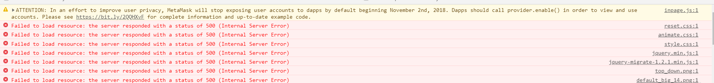
 Your STATICFILES_DIRS setting is not a tuple or list
解决方法如下：
```      
STATIC_URL = '/static/'
STATICFILES_DIRS = (
    os.path.join(BASE_DIR, "static"),
)
```
```

STATIC_URL = '/static/'
STATICFILES_DIRS = [(
    os.path.join(BASE_DIR, "static")
)]
```
## 十、首页与登录
#####  1.用户登录的后台逻辑

- 配置登录url
  `url(r'^login/$', TemplateView.as_view(template_name="login.html"), name="login"),`

  配置url之前需要先写好views函数，由于登录页面使用的是TemplateView，因此不需要写views函数。

- 写users自己的views

  用户登录一般使用的都是POST方法，更安全，因此首先判断登录是否使用的是POST方法。

  如果是get方法，把login页面返回给浏览器。

  users/views.py:

  ```
  from django.shortcuts import render
  
  # Create your views here.
  def login(request):
      if request.method == "POST":
          pass
      elif request.method == "GET":
          return render(request, "login.html", {})
  ```


  urls：

  ```
  from django.conf.urls import url
  from django.contrib import admin
  from django.views.generic import TemplateView
  import xadmin
  
  from users.views import login
  
  urlpatterns = [
      url(r'^xadmin/', xadmin.site.urls),
      url('^$', TemplateView.as_view(template_name="index.html"), name="index"),
      url('^login/$', login, name="login"),
  ]
  ```

  此时url('^login/$', login, name="login")不能写成url('^login/$', login（）, name="login"),因为此时是指向这个函数，而不是调用这个函数,传给它的只是一个句柄。

  登录127.0.0.1:8000网页：

  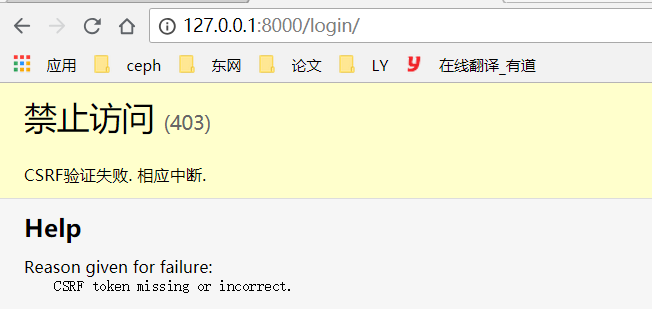

- 防止用户一直登录某一网站

​       在<form>结束前，加入

- 使用auth进行验证

​       引入`from django.contrib.auth import authenticate`

如果认证成功会返回用户的model，否则会返回None

- 使用login进行登录

  引入`from django.contrib.auth import authenticate, login`

  ```
  from django.shortcuts import render
  
  # Create your views here.
  from django.contrib.auth import authenticate, login
  
  # 把login修改为user_login,同时记得修改urls.py,定义名字时不能和默认定义函数的名称一样
  def user_login(request):   
      if request.method == "POST":
          user_name = request.POST.get("username", "")
          pass_word = request.POST.get("password", "")
          # 调用authenticate时，必须指明参数名称
          user = authenticate(username=user_name, password=pass_word)   
          if user is not None:
              login(request, user)
              return render(request, "index.html")
               return render(request, "index.html")
          else:
              return render(request, "login.html", {})
      elif request.method == "GET":
          return render(request, "login.html", {})
  ```

- 在index.html页面判断用户是否登录，并完成代码

  整体结构为：

  ```
             #判断user是否登陆
   	 <div class="top"...>
   	 	
   	 	<div class="top"...>
   
  ```

  具体代码为

  ```
  
  	<div class="top">
  	<div class="wp">
  		<div class="fl"><p>服务电话：<b>33333333</b></p></div>
          <!--登录后跳转-->
  
          	<div class="personal">
              <dl class="user fr">
              	<dd>admin@admin.com</dd>
                  <dt></dt>
              </dl>
              <div class="userdetail">
              <dl>
              	<dt></dt>
                  <dd>
                  	<h2>管理员</h2>
                      <p>admin@admin.com</p>
                  </dd>
              </dl>
              <div class="btn">
  	          <a class="personcenter fl" href="usercenter-info.html">进入个人中心</a>
  	          <a class="fr" href="/user/logout/">退出</a>
              </div>
          </div>
      </div>
      <a href="usercenter-message.html">
          <div class="msg-num">20</div>
      </a>
   </div>
  </div>
   
   <div class="top">
    <div class="wp">
   	<div class="fl"><p>服务电话：<b>33333333</b></p></div>
      <a style="..." class="fr registerbtn" href="">注册</a>
  	<a style="..." class="fr loginbtn" href="">登录</a>
    </div>
   </div>
   
  ```

- 自定义后台auth方法

  在users/views.py文件中引入`from django.contrib.auth.backends import ModelBackend`

  在users/views.py文件中添加代码：

  ```
  from django.contrib.auth.backends import ModelBackend
  from django.db.models import Q            # 完成并集
  
  from .models import UserProfile
  
  class CustomBackend(ModelBackend):
      # 这个类有这个authenticate方法
      def authenticate(self, username=None, password=None, **kwargs):  
          try:
              # 通过get只能得到一个user，得到两个或者0个都是不对的
              # 密码存储的时候都是密文，前端传来的是明文，没办法查询密码
              user = UserProfile.objects.get(Q(username=username)|Q(email=username))
              # 把传来的明文加密与user的密码进行对比
              if user.check_password(password):
                  return user
          except Exception as e:
              return None
  
  ```

  在settings.py文件下添加以下代码：

  ```
  AUTHENTICATION_BACKENDS = (
      'users.views.CustomBackend',            # 元组，必须加“，”
  )
  ```

  此时不仅可以用户名登录，也可以邮箱登录

  - 错误提示

    views.py（基于函数）：

  ```
  # _*_ encoding:utf-8 _*_
  from django.shortcuts import render
  
  # Create your views here.
  
  from django.contrib.auth import authenticate, login
  
  from django.contrib.auth.backends import ModelBackend
  from django.db.models import Q
  
  from .models import UserProfile
  
  
  class CustomBackend(ModelBackend):
      def authenticate(self, username=None, password=None, **kwargs):
          try:
              user = UserProfile.objects.get(Q(username=username)|Q(email=username))
              if user.check_password(password):
                  return user
          except Exception as e:
              return None
  
  
  def user_login(request):
      if request.method == "POST":
          user_name = request.POST.get("username", "")
          pass_word = request.POST.get("password", "")
          user = authenticate(username=user_name, password=pass_word)
          if user is not None:
              login(request, user)
              return render(request, "index.html")
          else:
              return render(request, "login.html", {"msg":"用户名或者密码错误"})
      elif request.method == "GET":
          return render(request, "login.html", {})
  ```

  下面的语句专门输出错误信息，去变量值需要“{{}}”，且两边要有空格：

  `<div class="error btns login-form-tips" id="jsLoginTips">{{ msg }}</div>`

#####  2.完善用户登陆

- 类、继承、方法

- Django更推荐基于类来做，类里可以定义很多函数

- 引入`from django.views.generic.base import View`,定义类继承View，可以自动调用View的get与post方法，不需要再自己判断，`if request.method == "POST":`语句将不再需要

  users/views.py（基于类）:

  ```
  # -*- coding:utf-8 -*-
  from django.shortcuts import render
  from django.contrib.auth import authenticate, login
  from django.contrib.auth.backends import ModelBackend
  from django.db.models import Q
  from django.views.generic.base import View
  
  from .models import UserProfile
  
  
  class CustomBackend(ModelBackend):
      def authenticate(self, username=None, password=None, **kwargs):
          try:
              user = UserProfile.objects.get(Q(username=username)|Q(email=username))
              if user.check_password(password):
                  return user
          except Exception as e:
              return None
  
  
  class LoginView(View):
      def get(self, request):
          return render(request, "login.html",{})
  
      def post(self,request):
          user_name = request.POST.get("username", "")
          pass_word = request.POST.get("password", "")
          user = authenticate(username=user_name, password=pass_word)
          if user is not None:
              login(request, user)
              return render(request, "index.html")
          else:
              return render(request, "login.html", {"msg": "用户名或密码错误"})
  ```

  urls.py:

  ```
  from django.conf.urls import url
  from django.contrib import admin
  from django.views.generic import TemplateView
  import xadmin
  
  from users.views import LoginView
  urlpatterns = [
      # url(r'^admin/', admin.site.urls),
      url(r'^xadmin/', xadmin.site.urls),
      url('^$', TemplateView.as_view(template_name="index.html"), name="index"),
      url(r'^login/$', LoginView.as_view(), name="login"),
  ]
  ```

  LoginView.as_view后面需要加（），调用的是方法，而不是传的句柄。


- 用form实现登陆

  - 在users下新建forms.py文件

  ​       forms.py文件下的参数必须与html中的保持一致

  ```
  from django import forms
  
  class LoginForm(forms.Form):
      username = forms.CharField(required=True)          
      password = forms.CharField(required=True, min_length=5)
  ```

  - users/views.py:

  ```
  # -*- coding:utf-8 -*-
  from django.shortcuts import render
  from django.contrib.auth import authenticate, login
  from django.contrib.auth.backends import ModelBackend
  from django.db.models import Q
  from django.views.generic.base import View
  
  from .models import UserProfile
  from .forms import LoginForm                # 导入LoginForm
  
  
  class CustomBackend(ModelBackend):
      def authenticate(self, username=None, password=None, **kwargs):
          try:
              user = UserProfile.objects.get(Q(username=username)|Q(email=username))
              if user.check_password(password):
                  return user
          except Exception as e:
              return None
  
  
  class LoginView(View):
      def get(self, request):
          return render(request, "login.html",{})
  
      def post(self, request):
          login_form = LoginForm(request.POST)          # 传入的是字典
          if login_form.is_valid():                     # 实际上验证的是errors里的内容
              user_name = request.POST.get("username", "")
              pass_word = request.POST.get("password", "")
              user = authenticate(username=user_name, password=pass_word)
              if user is not None:
                  login(request, user)
                  return render(request, "index.html")
          else:
              return render(request, "login.html", {"msg": "用户名或密码错误"})
  ```

  - 把form的验证信息errors传回来

    `<div class="form-group marb20 errorput">`                 <!--错误时会显示红色的方框-->

    `<div class="error btns login-form-tips" id="jsLoginTips">{{ error }}{{ msg }}</div>`

    users/views.py中:

    ```
    class LoginView(View):
        def get(self, request):
            return render(request, "login.html",{})
    
        def post(self, request):
            login_form = LoginForm(request.POST)          # 传入的是字典
            if login_form.is_valid():                     # 实际上验证的是errors里的内容
                user_name = request.POST.get("username", "")
                pass_word = request.POST.get("password", "")
                user = authenticate(username=user_name, password=pass_word)
                if user is not None:
                    login(request, user)
                    return render(request, "index.html")
                else:
                     # 显示登陆时的错误
                    return render(request, "login.html", {"msg": "用户名或密码错误"})
            else:
            	# 显示没有登陆时的错误
                return render(request, "login.html",{"login_form": login_form})               
    ```

- Django的user如何登录：

  - login(request, user)
    1、有状态协议与无状态协议
    [有状态与无状态协议](https://www.shoucloud.com/news/180-cn.html)

    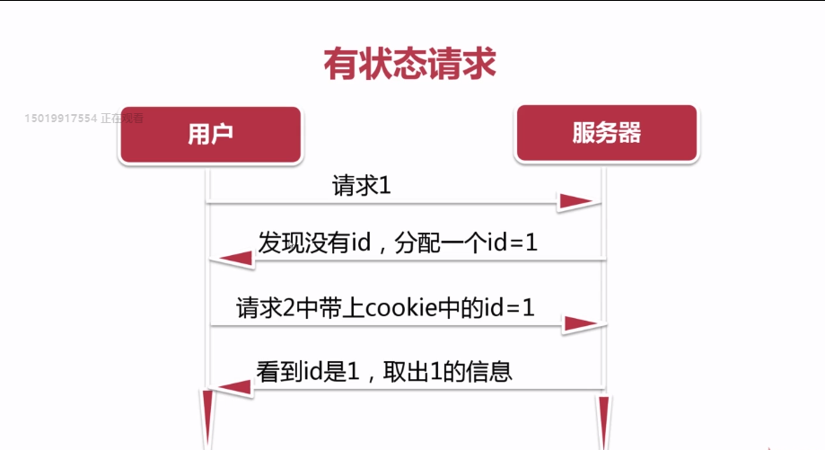

    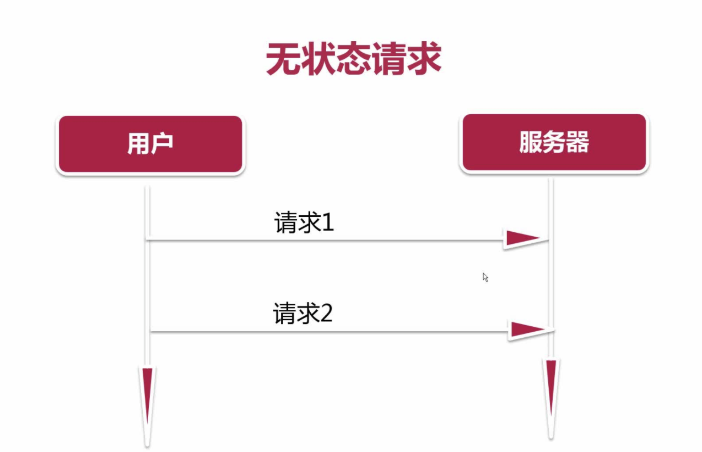

    2、session与cookie的区别：
    http请求无状态单一，引出cookie，cookie是浏览器的一种本地存储机制，存储在浏览器当中，与服务器没有关系，所以可以存储很多信息，可以在本地存储任何键值对。但是键值对实际是存储在某个域名之下的，每个域名下的key与value是不能相互访问的。存储这些信息之后，游览器在每次发送请求的时候会将域名中cookie的所有值发送到服务器，服务器通过cookie就可以看到浏览器自带的一些信息过来，这些信息实际上也是之前服务器返回给浏览器的或用户填写的信息。
    由于cookie的不安全性，服务器在返回id时用到了session机制，session机制根据用户名密码生成一段随机字符串，这段字符串有过期时间，session是服务器生成的，存储在服务器端的，将session发给用户，用户存储在cookie当中，然后下一次请求时用户将cookie当中的信息（即session）带到服务器，服务器再通过sessionid在数据库中查询是哪个用户，可以对用户做标记，然后django利用cookie和session完成自动登录。

    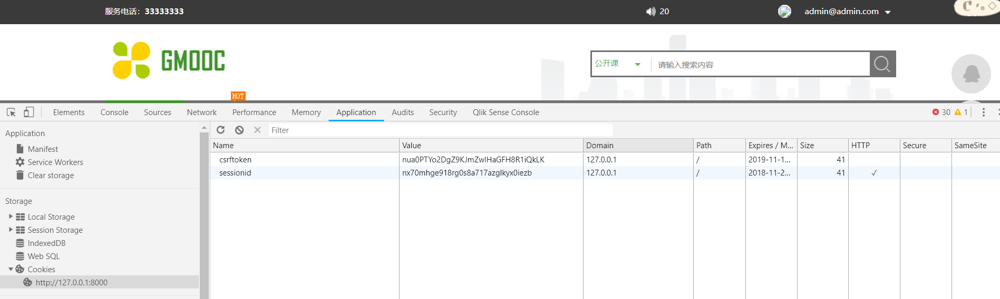

    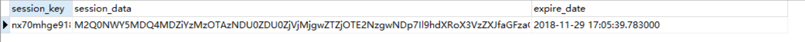

3、django.contrib.sessions
session是django那一部分做成的？
如何将sessionid转换成user，在后台逻辑（views）当中，可以直接取request.user，UseProfile如何完成自动转换？

-  (1)settings.py的INSTALLED_APPS中有django.contrib.sessions，默认配置好，若注释掉，自动登录会失效。

- (2)对每次的response或request做拦截，拦截之后找到其中的sessionid，通过sessionid来数据表查找，查找到原来有这个用户，解密，将sessiondata取出来，sessiondata存储了很多用户信息,直接将user给取出来了。

##### 3.用户的注册功能

- index.html页面：

  `<a style="..." class="fr registerbtn" href="">注册</a>`

  ``相当于一个过滤器，自动生成url

- 路径地址转换

  1. 首先引入```
  2. `STATIC_URL = '/static/'`

  - (1)`<link rel="stylesheet" type="text/css" href="../css/reset.css">`
  - (2)`<link rel="stylesheet" type="text/css" href="/static/css/reset.css">`
  - (3)`<link rel="stylesheet" type="text/css" href="">`
    拷贝的不再是static目录，而是一个相对路径,自动根据settings.py中的配置，自动在前面加上（STATIC_URL = '/static/'),以后在修改路径的时候会很容易。

- 完成views.py与url相关简单代码

  views.py:

  ```
  from .forms import LoginForm, RegisterForm
  
  class RegisterView(View):
      def get(self, request):
          register_form = RegisterForm()
          return render(request, "register.html", {'register_form': register_form})
  ```

  urls.py:

  ```
  from users.views import LoginView, RegisterView
  urlpatterns = [
      # url(r'^admin/', admin.site.urls),
      url(r'^xadmin/', xadmin.site.urls),
      url('^$', TemplateView.as_view(template_name="index.html"), name="index"),
      url(r'^login/$', LoginView.as_view(), name="login"),
      url('^register/$', RegisterView.as_view(), name="register"),
      url(r'^captcha/', include('captcha.urls')),
  ]
  ```

- django验证码

  1. django-simple-captcha库文档：https://django-simple-captcha.readthedocs.io/en/latest/

  - 注意：①安装pip install  django-simple-captcha==0.4.6版本

    ​            ②Add `captcha` to the `INSTALLED_APPS` in your `settings.py`

    ​            ③Add an entry to your `urls.py`（导入include）:

    ```
    urlpatterns += [
        url(r'^captcha/', include('captcha.urls')),
    ]
    ```

    ​            ④ Run `python manage.py migrate`

  - 完成forms.py的注册部分

    ```
    from django import forms
    from captcha.fields import CaptchaField
    
    class RegisterForm(forms.Form):
        email = forms.EmailField(required=True)
        password = forms.CharField(required=True, min_length=5)
        # 生成图片并完成图片验证
        captcha = CaptchaField()  
    ```

    register.html页面：

    ```
    <div class="form-group marb8 captcha1 errorput">
    	<label>验&nbsp;证&nbsp;码</label>
        {{ register_form.captcha }}           # 在验证码字段后添加register_form.captcha
    </div>
    ```

- 验证码工作原理：

  - 打开注册页面后，网页源代码会在验证码下自动生成下边代码：

```
  
 <input id="id_captcha_0" name="captcha_0" type="hidden" value="02235ae3d22c0763ef9abf7ee59c3c5ca31be893" />
 <input autocomplete="off" id="id_captcha_1" name="captcha_1" type="text" />
```

​        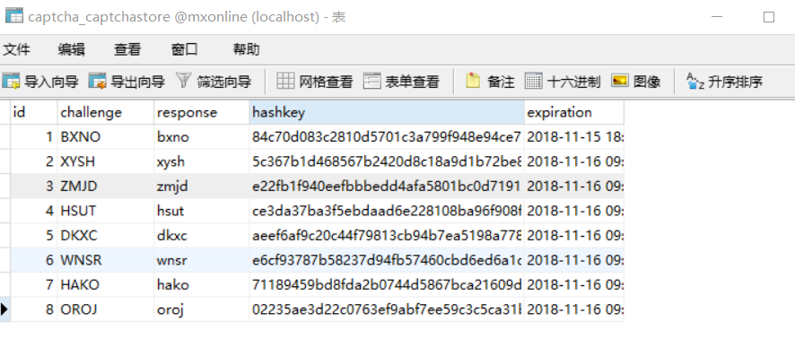

原理： 首先装配进一个`input   hidden`,然后再装配进一个`input`,这个`input`是输入框。会自动生成id_captcha_0和id_captcha_1，captcha后台会自动识别出id_captcha_1是用户填的，id_captcha_0是数据库中存储的hashkey。把用户传的值与hashkey联合做查询，查询数据表。如果联合查询出没有数据，说明验证码验证失败。

- 在进行验证前，需要加后台逻辑。

```
 def post(self, request):
        register_form = RegisterForm(request.POST)
        if register_form.is_valid():
        	pass
```

- 注意：forms.py中的RegisterForm的参数的名字必须与register.html中`<input name>`名字一致。

验证码刷新不是框架完成的，而是JS完成的。

- 验证码填错之后没有提示原因：

  - html没有配置完

  - 填写form时，必须定义method="post"，以及action为url地址

    ```
    <div class="tab-form">
        <form id="email_register_form" method="post" action="" autocomplete="off">
    ```

- 所有form结束前都需要添加

- `'captcha'(45825520)={ErrorList}<ul class="errorlist">Invalid CAPTCHA<li></li></ul>`：

  captcha可以自定义错误信息

  - `captcha = CaptchaField(error_messages={"invalid": u"验证码错误"})  `

- 注册流程

  ```
  # 引入包，可以将密码由明文转化为密文
  from django.contrib.auth.hashers import make_password
  
  def post(self, request):
          register_form = RegisterForm(request.POST)
          if register_form.is_valid():
              # 取出用户名，密码
              user_name = request.POST.get("username", "")
              pass_word = request.POST.get("password", "")
              # 实例化一个UserProfile
              user_profile = UserProfile()
              user_profile.username = user_name
              user_profile.email = user_name
              # django后台保存的是密码密文，将密码由原文转换成密文
              user_profile.password = make_password(pass_word)
              user_profile.save()
  ```

##### 4.邮箱的激活

- 由于涉及到了发送邮箱，需要写一个发送邮件的基础函数。在apps下新建一个包命名为utils，把函数放在utils中，命名为email_send.

- 发送邮件前先将链接保存到数据库，以后点击链接回来时需要查看链接是否存在。

- 如何生成随机字符串？

  ```
  from random import Random
  # 生成随机字符串的方法
  def random_str(randomlength=8):
      str = ''
      # 所有可选字符类型的字符串
      chars = 'AaBbCcDdEeFfGgHhIiJjKkLlMmNnOoPpQqRrSsTtUuVvWwXxYyZz0123456789'
      length = len(chars) - 1
      # 生成随机数字
      random = Random()
      for i in range(randomlength):
          str += chars[random.randint(0, length)]
      return str
  ```

-  send_register_email

  功能：一般会在用户链接里加一个随机字符串，字符串是后台随机生成不能伪造的，code是随机字符串，将它加到url的链接中，当用户点击链接时把code取出来查数据库看是否存在，如果存在就激活，如果不存在就报错。        

  ```
  def send_register_email(email, send_type="register"):
      email_record = EmailVerifyRecord()
      code = random_str(16)
      email_record.code = code
      email_record.email = email
      email_record.send_type = send_type
      email_record.save()
      # email 标题
      email_title = ""
      # email 内容
      email_body = ""
  ```

  - 在settings.py配置邮件的发送者

    ```
    # EMAIL_HOST：邮件服务器
    EMAIL_HOST = "smtp.sina.com"
    EMAIL_PORT = 25      # 默认25
    EMAIL_HOST_USER = "mmmliyingmmm@sina.com"
    EMAIL_HOST_PASSWORD = "admin123"
    EMAIL_HOST_TLS = False
    EMAIL_FROM = "mmmliyingmmm@sina.com"        # 需要和user保持一致，否则会出错
    ```

  - 函数可能会被多次调用，需要区分开不同的类型，不同的地方调用发送内容不一样。

  - 在`__init__.py`中：

    ```
    def send_mail(subject, message, from_email, recipient_list,
                  fail_silently=False, auth_user=None, auth_password=None,
                  connection=None, html_message=None):
    ```

  - 在`email_send.py`中：

    ```
    # 第四个必须为列表
    send_status = send_mail(email_title, email_body, EMAIL_FROM, [email])
    ```

  - 由于注册的时候使用的是邮箱，因此需要把username改为email

      ```
       from django.contrib.auth.hashers import make_password
       def post(self, request):
             register_form = RegisterForm(request.POST)
             if register_form.is_valid():
             		user_name = request.POST.get("emai", "")
                  pass_word = request.POST.get("password", "")
                  user_profile = UserProfile()
                  user_profile.username = user_name
                  user_profile.email = user_name
                  user_profile.password = make_password(pass_word)              					user_profile.save()
      ```

  - 引入send_register_email()函数

  ```
  from utils.email_send import send_register_email
  class RegisterView(View):
  
  def post(self, request):
          register_form = RegisterForm(request.POST)
          if register_form.is_valid():
              user_name = request.POST.get("emai", "")
              pass_word = request.POST.get("password", "")
              user_profile = UserProfile()
              user_profile.username = user_name
              user_profile.email = user_name
              user_profile.password = make_password(pass_word)
              user_profile.save()
  
              send_register_email(user_name, "register")
              pass
  ```

  -  完成注册之后，数据库表与邮箱的状态

  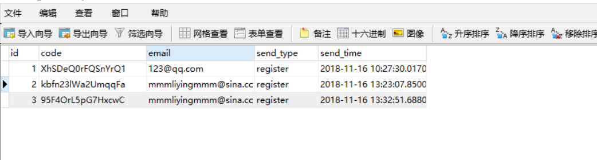

  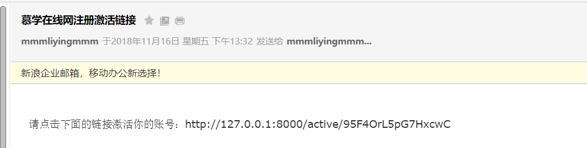

  - 在register页面上边显示错误信息

    ```
    <div class="error btns" id="jsEmailTips">{{ error }}{{ msg }}</div>
    ```

  - 出错时邮箱，密码，验证码加上focus功能

    ```
     <div class="form-group marb20 errorput">
     <div class="form-group marb8 errorput">
     <div class="form-group marb8 captcha1 errorput">
    ```

  -  即使是错的，也许要将值回填回去

        - 在下面语句中添加`value="{{ register_form.email.value }}"`,`value="{{ register_form.password.value }}"`

    ```
    <input  type="text" id="id_email" name="email" value="{{ register_form.email.value }}" placeholder="请输入您的邮箱地址" />
    <input type="password" id="id_password" name="password"  value="{{ register_form.password.value }}" placeholder="请输入6-20位非中文字符密码" />
    ```

  - 为了验证邮箱，需要用户在邮箱里进行激活

    - 激活前，数据表里is_active默认是True，需要在RegisterView中的post函数中添加：

      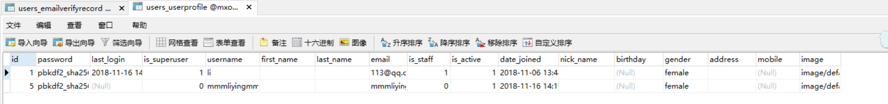

      `user_profile.is_active = False`

    - 提取出url中的变量,把激活连接中active后所有字符取出来放入`<active_code>`里边，完成提取变量操作，并将变量传到后台的views的变量中

      ```
      url(r'^active/(?P<active_code>.*)/$', ActiveUserView.as_view(), name="user_active"),
      ```

    - 在views.py中加入ActiveUserView(View)函数来激活，把提取到的code返回回来

      ```
      class ActiveUserView(View):
          def get(self, request, active_code):
          	# 通过code来查找
              all_codes = EmailVerifyRecord.objects.filter(code=active_code)
              # 查找之后看记录是否为空
              if all_codes:
                  for record in all_codes:
                  	# 发送邮件之前已经记录了发送到哪个邮箱了
                      email = record.email
                      # 通过邮箱找到对应的user
                      user = UserProfile.objects.get(email=email)
                      user.is_active = True
                      user.save()
                      
              return render(request, "login.html")
      ```

    - 既然用到了is_active,登陆时需要判断是否为True

      ```
      class LoginView(View):
          def get(self, request):
              return render(request, "login.html", {})
          def post(self, request):
              login_form = LoginForm(request.POST)
              if login_form.is_valid():
                  user_name = request.POST.get("username", "")
                  pass_word = request.POST.get("password", "")
                  user = authenticate(username=user_name, password=pass_word)
                  if user is not None:
                      if user.is_active:
                          login(request, user)
                          return render(request, "index.html")
                      else:
                          return render(request, "login.html", {"msg": "用户名未激                                     活！"})
                  else:
                      return render(request, "login.html", {"msg": "用户名或密码错                                  误"})
              else:
                  return render(request, "login.html", {"login_form": login_form})
      ```

#####  5.找回密码

（1）遗留的两个问题

- 判断用户是否已经存在

  - 在之前的后台注册逻辑里面，没有通过user的email是否存在来判断用户是否已注册，需要加一个逻辑，判断email是否存在，如果存在则返回给用户说明用户已经存在。

  ```
  class RegisterView(View):
      def get(self, request):
          register_form = RegisterForm()
          return render(request, "register.html", {'register_form': register_form})
  
      def post(self, request):
          register_form = RegisterForm(request.POST)
          if register_form.is_valid():
              user_name = request.POST.get("emai", "")
              # 用户存在的判断逻辑
              if UserProfile.objects.filter(email = user_name):
                 # 需要把form传回来，一是需要把用户信息回填，二是需要显示验证码
                 return render(request, "register.html", {'register_form':                                     register_form, "msg": "用户已经存在！"} )
                 
              pass_word = request.POST.get("password", "")
              user_profile = UserProfile()
              user_profile.username = user_name
              user_profile.email = user_name
              user_profile.is_active = False
              user_profile.password = make_password(pass_word)
              user_profile.save()
  
              send_register_email(user_name, "register")
              return render(request, "login.html")
          else:
              return render(request, "register.html", {"register_form":                                         register_form})
  ```

  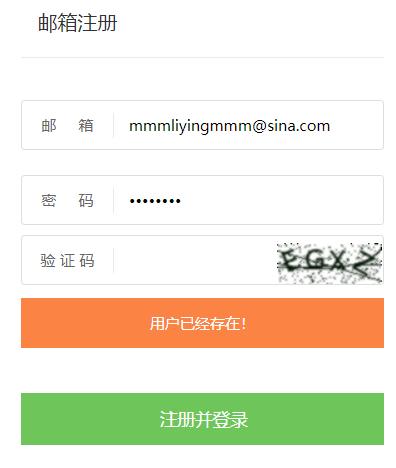

- 激活邮箱：用户存在，激活用户，用户不存在，告诉用户链接有误，需要写一个html页面。

  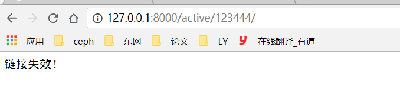

  (2)找回密码功能

  ​        首先，在url中配置一个找回密码的链接。在点击找回密码后，有一个页面提醒我们输入用户名和验证码。点击之后向邮箱发送重置密码链接，点击链接之后进入重置密码界面。

  ```
  from users.views import LoginView, RegisterView, ActiveUserView, ForgetPwdView
  urlpatterns = [
      url(r'^forget/$', ForgetPwdView.as_view(), name="forget_pwd"),
  ]
  ```


- 在templates下添加forgetpwd.html页面

- 在views.py下添加：

  ```
  class ForgetPwdView(View):
      def get(self,request):
          return render(request, "forgetpwd.html")
  ```

- login.html中：

  `<a class="fr" href="forget_pwd.html">忘记密码？</a>`

  - 把`<a></a>`配置到刚才设置的url

  `<a class="fr" href="">忘记密码？</a>`

  把login的静态页面配置一下

  ```
  
  	<link rel="stylesheet" type="text/css" href="">
  	<link rel="stylesheet" type="text/css" href="">
  ```

- 定义忘记密码的form

  ```
  class ForgetForm(forms.Form):
      email = forms.EmailField(required=True)
      captcha = CaptchaField(error_messages={"invalid": u"验证码错误"})
  ```

- 在forgetpwd.html页面添加`{{ forget_form.captcha }}`：

  ```
  <div class="form-group captcha1 marb38">
       <label>验&nbsp;证&nbsp;码</label>
       {{ forget_form.captcha }}
  </div>
  ```

  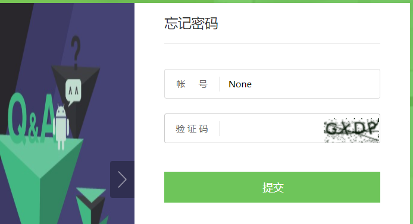

- views.py

  ```
  class ForgetPwdView(View):
      def get(self,request):
          forget_form = ForgetForm()
          return render(request, "forgetpwd.html", {"forget_form":forget_form})
  
      def post(self,request):
          forget_form = ForgetForm(request.POST)
          if forget_form.is_valid():
          	# 取email
              email = request.POST.get("email", "")
  			# 发送邮件
              send_register_email(email, "forget")
              return render(request, "send_success.html")
          else:
              return render(request, "forgetpwd.html", {"forget_form": forget_form}   
  ```

  - 取出email之前需要将html页面改好：

    - `<input name>`必须与ForgetPwdView里参数的名字保持一致

    - 添加method与action

      ```
      <form id="jsFindPwdForm" method="post" action="" autocomplete="off">
      ```

    - 添加


- email_send.py

  ```
  elif send_type == "forget":
     email_title = "慕学在线网密码重置链接"
     email_body = "请点击下面的链接重置密码：http://127.0.0.1:8000/reset/{0}".format(code)
  
     send_status = send_mail(email_title, email_body, EMAIL_FROM, [email])
     if send_status:
        pass
  ```

- 邮件发送成功后，返回send_success.html:

  ```
  <!DOCTYPE html>
  <html lang="en">
  <head>
      <meta charset="UTF-8">
      <title></title>
  </head>
  <body>
  <p>邮件已发送，请查收！</p>
  </body>
  </html>
  ```

- 用于显示错误的信息：

  ```
  <div class="error btns" id="jsForgetTips">{{ error }}{{ msg }}</div>
  ```

- 如果出错，focus信息：

  ```
   <div class="form-group marb20 errorput">
  ```

- 回填信息：

  ```
  <input type="text" id="account" name="email" value="{{ forget_form.email.value }}" placeholder="邮箱" />
  ```

- 测试“忘记密码”功能是否成功

  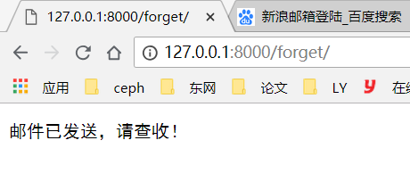

  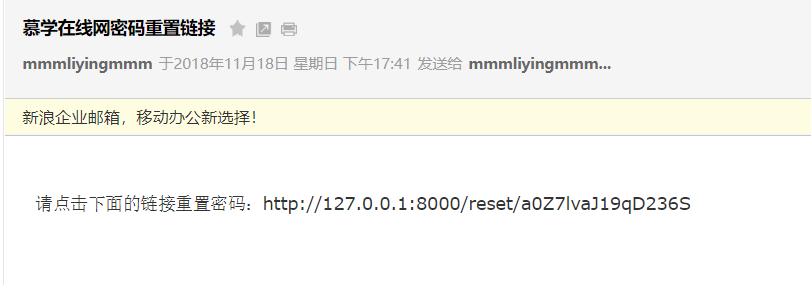

- 需要写一个接口，处理用户点击url链接之后的反应

  - 配置url

    ```
    url(r'^reset/(?P<active_code>.*)/$', ResetView.as_view(), name="reset_pwd"),
    ```

  - 完成password_reset.html页面

  - views.py/ResetView

    ```
    
    ```

    由于此时并未登陆，不知道重置密码的是谁，需要传回email。

    ```
      <li>
          <span class="">新 密 码 ：</span>
          <input type="password" name="password1" id="pwd" placeholder="6-20位非中文字符">
          <i></i>
      </li>
      
      <input type="hidden" value="{{ email }}">
      
      <li>
          <span class="">确定密码：</span>
          <input type="password" name="password2" id="repwd" placeholder="6-20位非中文字符">
          <i></i>
      </li>
    ```

  - password_reset.html

    ```
    （1）<div class="resetpassword" id="resetPwdForm">
            <h1>修改密码</h1>
            <p>已经通过验证，请设置新密码</p>
            <form id="reset_password_form" action="" method="post">
    ```

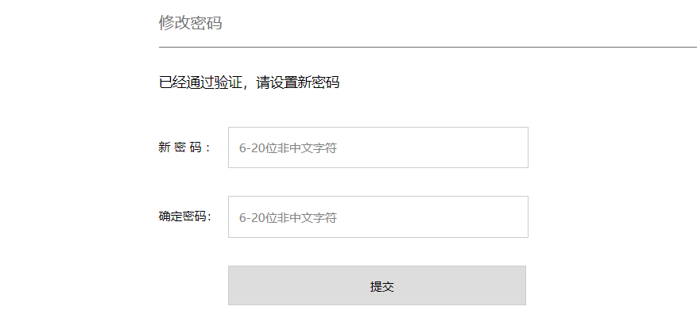

-  此时页面的源码(value="mmmliyingmmm.sina.com")

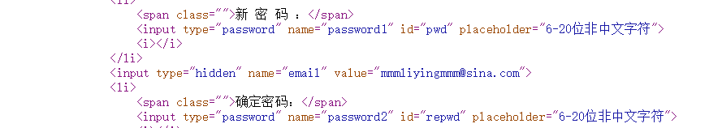

  - 需要将重置密码提交到哪里

    ```
    (2)<div class="resetpassword" id="resetPwdForm">
            <h1>修改密码</h1>
            <p>已经通过验证，请设置新密码</p>
            <form id="reset_password_form" action="" method="post">
    ```

  - 配置ModifyPwdForm

    ```
    class ModifyPwdForm(forms.Form):
        password1 = forms.CharField(required=True, min_length=5)
        password2 = forms.CharField(required=True, min_length=5)
    ```

  - 用户点击提交之后的处理逻辑

    ```
    class ResetView(View):
        def get(self, request, active_code):
            all_codes = EmailVerifyRecord.objects.filter(code=active_code)
            if all_codes:
                for record in all_codes:
                    email = record.email
                    return render(request, "password_reset.html", {"email":email})
            else:
                return render(request, "active_fail.html")
            return render(request, "login.html")
            
        def post(self, request):
            modify_form = ModifyPwdForm(request.POST)
            if modify_form.is_valid():
            	pass
    ```

    - 在写提交逻辑之前确保html与ModifyPwdForm参数的名称一致

      - password1     password2

    - ```
        <li>
            <span class="">新 密 码 ：</span>
            <input type="password" name="password1" id="pwd" placeholder="6-20位非中文字符">
            <i></i>
        </li>
        
        <input type="hidden" name="email" value="{{ email }}">
        
        <li>
            <span class="">确定密码：</span>
            <input type="password" name="password2" id="repwd" placeholder="6-20位非中文字符">
            <i></i>
        </li>
        ```

     在`<input type="hidden" value="{{ email }}">`中添加 name="email"   ，明确添加的是什么

    ```
    class ResetView(View):
          def get(self, request, active_code):
              all_codes = EmailVerifyRecord.objects.filter(code=active_code)
              if all_codes:
                  for record in all_codes:
                      email = record.email
                      return render(request, "password_reset.html", {"email":email})
              else:
                  return render(request, "active_fail.html")
              return render(request, "login.html")
              
          def post(self, request):
          	modify_form = ModifyPwdForm(request.POST)
          	if modify_form.is_valid():
              pwd1 = request.POST.get("password1", "")
              pwd2 = request.POST.get("password2", "")
              email = request.POST.get("email", "")
              if pwd1 != pwd2:
                  return render(request, "password_reset.html", {"email":email, "msg":"密码不一致！"})
              user = UserProfile.objects.get(email=email)
              user.password = make_password(pwd2)
              user.save()
      
              return render(request, "login.html")
          else:
              email = request.POST.get("email", "")
              return render(request, "password_reset.html", {"email": email, "modify_form":modify_form})
    ```

    -  ` <form id="reset_password_form" action="" `由于之前传到了`reset_pwd`，但是由于`url(r'^reset/(?P<active_code>.*)/$', ResetView.as_view(), name="reset_pwd"),`中reset后有参数，如果不传参数进来，就会出错，所以post函数不能重用
       `ResetView`,需要重写一个函数。

    ```
     class ResetView(View):
          def get(self, request, active_code):
              all_codes = EmailVerifyRecord.objects.filter(code=active_code)
              if all_codes:
                  for record in all_codes:
                      email = record.email
                      return render(request, "password_reset.html", {"email":email})
              else:
                  return render(request, "active_fail.html")
              return render(request, "login.html")
              
      class ModifyPwdView(View):
          def post(self, request):
              modify_form = ModifyPwdForm(request.POST)
              if modify_form.is_valid():
                  pwd1 = request.POST.get("password1", "")
                  pwd2 = request.POST.get("password2", "")
                  email = request.POST.get("email", "")
                  if pwd1 != pwd2:
                      return render(request, "password_reset.html", {"email":email, "msg":"密码不一致！"})
                  user = UserProfile.objects.get(email=email)
                  user.password = make_password(pwd2)
                  user.save()
                        return render(request, "login.html")
              else:
             	 email = request.POST.get("email", "")
                 return render(request, "password_reset.html", {"email": email, "modify_form":modify_form})
    ```

    - 重写的url

      `  url(r'^modify_pwd/$', ModifyPwdView.as_view(), name="modify_pwd"),`

    - 跳转至modify_pwd的逻辑

      ```
      (3)<div class="resetpassword" id="resetPwdForm">
              <h1>修改密码</h1>
              <p>已经通过验证，请设置新密码</p>
              <form id="reset_password_form" action="" method="post">
      ```


## 十一、授课机构与详情页的基本信息

##### 1.django templates模板继承1

（1）include机制

- 隐患：include会将页面写死

（2）为了解决上边问题，有继承机制

- 在templates文件夹下新建base.html文件

- 拷贝org-list.html文件至templates文件夹

- 将org-list.html文件复制到base.html

- ``

- 替换css和js文件

- 希望被子模板重写的地方用`  `给包起来

  - ①title：`慕学在线首页`

  - ②静态文件：重载可包含已有的静态文件，也可加入自己的静态文件

    ```
    <link rel="stylesheet" type="text/css" href="">
    <link rel="stylesheet" type="text/css" href="">
    <link rel="stylesheet" type="text/css" href="">
    
    <script src="" type="text/javascript"></script>
    <script src="" type="text/javascript"></script>
    
    ```

  - 面包屑

    ```
    
    <section>
    	<div class="wp">
    		<ul  class="crumbs">
    			<li><a href="/">首页</a>></li>
                <li>课程机构</li>
    		</ul>
    	</div>
    </section>
    
    ```

  - 主要内容

    ```
    
    <section>
    	<div class="wp butler_list_box list">
    	<div class='left'>
    		<div class="listoptions">
    			<ul>
    				<li>
    					<h2>机构类别</h2>
    					<div class="cont">
                            <a href="?city={{ city_id }}"><span class="active2">全部</span></a>
    
                                <a href="?ct=pxjg&city={{ city_id }}"><span class="active2">培训机构</span></a>
    
                                <a href="?ct=gx&city={{ city_id }}"><span class="active2">高校</span></a>
    
                                <a href="?ct=gr&city={{ city_id }}"><span class="active2">个人</span></a>
    
    					</div>
    				</li>
    				<li>
    					<h2>所在地区</h2>
    					<div class="more">更多</div>
    					<div class="cont">
                            <a href="?ct={{ category }}"><span class="active2">全部</span></a>
                                
                                    <a href="?city={{ city.id }}&ct={{ category }}"><span class="active2">{{ city.name }}</span></a>
                                
    					</div>
    				</li>
    			</ul>
    		</div>
    		<div class="all">共<span class="key">{{ org_nums }}</span>家</div>
    		<div class="butler_list company list">
    		<div class="layout">
    			<div class="head">
    				<ul class="tab_header">
    					<li class="active"><a href="?ct={{ category }}&city={{ city_id }}">全部</a> </li>
    					<li class="active"><a href="?sort=students&ct={{ category }}&city={{ city_id }}">学习人数 &#8595;</a></li>
    				</ul>
    			</div>
    
                    <dl class="des difdes">
                        <dt>
                            <a href="/company/22/">
                                
                            </a>
                        </dt>
                        <dd>
                            <div class="clearfix">
                                 <a href="org-detail-homepage.html">
                                     <h1>南京大学</h1>
                                     <div class="pic fl">
    
                                             
    
                                             
    
                                     </div>
                                 </a>
                            </div>
                            <ul class="cont">
                                <li class="first"><p class="pic9">课程数：<span>1</span></p><p class="c7">学习人数：<span>1000</span></p></li>
                                <li class="c8" style="padding-left:18px;">北京市海淀区中关村北大街</li>
                                <li class="pic10" style="padding-left:18px;">经典课程：
    
                                        <a href="/diary/19/">c语言基础入门</a>
    
                                        <a href="/diary/16/">数据库基础</a>
    
                                </li>
                            </ul>
                        </dd>
                        <div class="buy start_groupbuy jsShowPerfect2" data-id="22"><br/>联系<br/>服务</div>
                    </dl>
    
    
    		</div>
    		 <div class="pageturn">
                <ul class="pagelist">
                    
                        <li class="long"><a href="?{{ all_orgs.previous_page_number.querystring }}">上一页</a></li>
                    
    
                    
                        
                            
                                <li class="active"><a href="?{{ page.querystring }}">{{ page }}</a></li>
                            
                                <li><a href="?{{ page.querystring }}" class="page">{{ page }}</a></li>
                            
                        
                            <li class="none"><a href="">...</a></li>
                        
                    
                    
                        <li class="long"><a href="?{{ all_orgs.next_page_number.querystring }}">下一页</a></li>
                    
    
                </ul>
            </div>
    		</div>
    	</div>
    	<div class="right companyright">
    			<div class="head">我要学习</div>
    			<form class="rightform" id="jsStayForm">
    				<div>
                        
                        <input type="text" name="name" id="companyName" placeholder="名字" maxlength="25" />
                    </div>
    				<div>
                        
                        <input type="text" name="mobile" id="companyMobile" placeholder="联系电话"/>
                    </div>
    				<div>
                        
                        <input type="text" name="address" id="companyAddress" placeholder="课程名" maxlength="50" />
                    </div>
                    <p class="error company-tips" id="jsCompanyTips"></p>
    				<input class="btn" type="text" id="jsStayBtn" value="立即咨询 >" />
                
                </form>
    		</div>
    
    		<div class="right companyrank layout">
    			<div class="head">授课机构排名</div>
    
                
                    <dl class="des">
                        <dt class="num fl">{{ forloop.counter }}</dt>
                        <dd>
                            <a href="/company/2/"><h1>{{ curent_org.name }}</h1></a>
                            <p>{{ curent_org.address }}</p>
                        </dd>
                    </dl>
                
    
    		</div>
        </div>
    </section>
    
    ```

  - base.html页面完成

  - org-list.html清空

- 替换title

  - 在org-list.html页面中添加：

    ```
    
    课程机构列表 - 慕学在线网
    ```

- 为课程机构首页配置url

  ```
   url(r'^org_list/$', OrgView.as_view(), name="org_list"),
  ```

- organization/views.py

  ```
  # -*- coding:utf-8 -*-
  from django.shortcuts import render
  from django.views.generic import View
  
  # Create your views here.
  
  class OrgView(View):
      """
      课程机构列表功能
      """
      def get(self,request):
          # 课程机构
          return render(request, "org-list.html", {})
  ```

  运行，此时已能显示课程列表页

- 需要添加``

  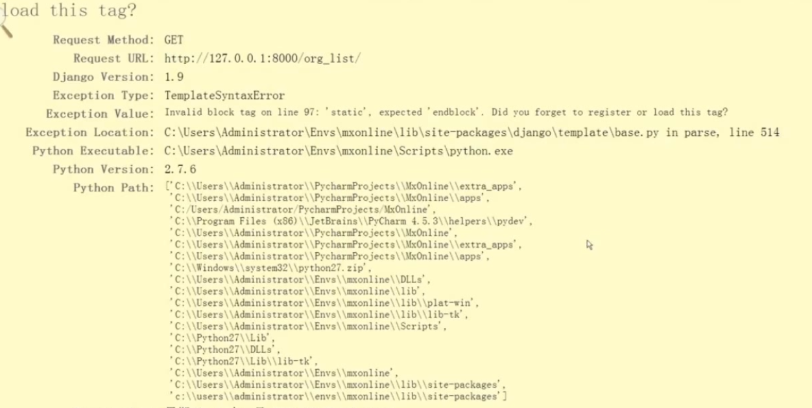

- 在org-list.html添加面包屑

  ```
  <section>
  	<div class="wp">
  		<ul  class="crumbs">
  			<li><a href="/">首页</a>></li>
              <li>课程机构</li>
  		</ul>
  	</div>
  </section>
  
  ```

- 在base.html中删除contend内容，在org-list.html写入

##### 2.课程机构列表页数据展示

- 确定哪些是后台传过来的动态数据

  - 课程信息本身动态数据
  - 授课机构排名从后台传过来
  - 所在地区动态数据
  - 机构类别静态数据

- 在xadmin中添加城市和课程数据

  - 添加城市信息后会出现下面情形：

    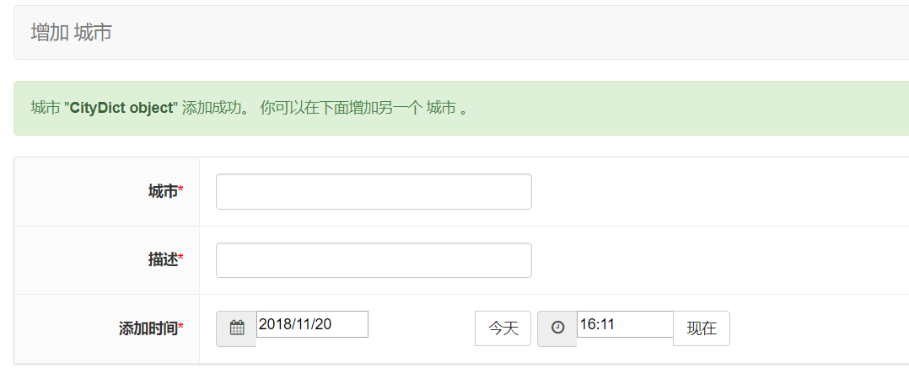

  此时在organization/models.py中重载unicode方法可以解决该问题：

  ```
      def __unicode__(self):
          return self.name
  ```

  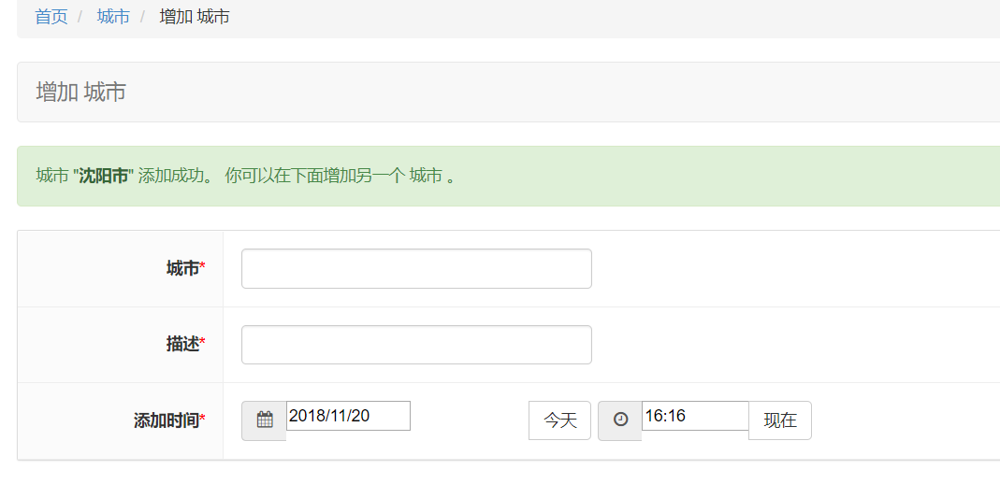

- 添加课程机构

  - 封面图：

    ```
    image = models.ImageField(upload_to="org/%Y/%m", verbose_name=u"logo")
    ```

    在项目下新建media文件夹，并标记为根目录

    上传文件，可指明上传路径：

    在settings.py设置media参数：

    ```
    MEDIA_URL = '/media/'
    MEDIA_ROOT = os.path.join(BASE_DIR, 'media')
    ```

    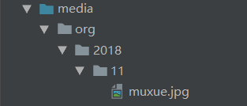

  - 此时在organization/models.py中重载unicode方法可以解决该问题：

    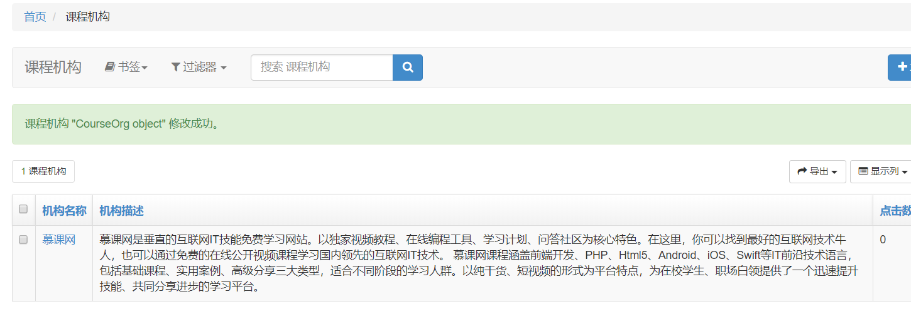

  ```
    def __unicode__(self):
          return self.name
  ```

  - 为满足对机构类别的筛选，在organization/models.py/CourseOrg中添加：

    ```
     category = models.CharField(default="pxjg", max_length=20, verbose_name=u"机构类别", choices=(("pxjg", "培训机构"), ("gx", "高校"), ("gr", "个人")))
    ```

  - 完善view

    ```
    # -*- coding:utf-8 -*-
    from django.shortcuts import render
    from django.views.generic import View
    
    from .models import CourseOrg, CityDict
    # Create your views here.
    
    class OrgView(View):
        """
        课程机构列表功能
        """
        def get(self,request):
            # 课程机构
            all_orgs = CourseOrg.objects.all()
            # 城市
            all_citys = CityDict.objects.all()
            return render(request, "org-list.html", {
                "all_orgs": all_orgs,
                "all_citys": all_citys,
            })
    ```

  - 所在地区

    - 静态

      ```
      <li>
      	<h2>所在地区</h2>
      	<div class="more">更多</div>
      	<div class="cont">
          <a href="?order_by=&price=all"><span class="active">全部</span></a>
          <a href="?district=1&price=all"><span>北京市</span></a>
          <a href="?district=2&price=all"><span>上海市</span></a>
          <a href="?district=3&price=all"><span>广州市</span></a>
          <a href="?district=4&price=all"><span>深圳市</span></a>
          <a href="?district=5&price=all"><span>沈阳市</span></a>
          </div>
      </li>
      ```

    - 动态

      ```
      <li>
      	<h2>所在地区</h2>
      	<div class="more">更多</div>
      	<div class="cont">
          <a href="?order_by=&price=all"><span class="active">全部</span></a>
          
          	<a href="?district=1&price=all"><span>{{city.name}}</span></a>
          
          </div>
      </li>
      ```

  - 课程信息

    - 原来：

      ```
      <dl class="des difdes">
         <dt>
            <a href="org-detail-homepage.html">
               
            </a>
         </dt>
         <dd>
            <div class="clearfix">
               <a href="org-detail-homepage.html">
                   <h1>南京大学</h1>
                      <div class="pic fl">
                          
                          
                      </div>
               </a>
            </div>
            <ul class="cont">
               <li class="first"><p class="pic9">课程数：<span>1</span></p><p class="c7">学习人数：<span>1000</span></p></li>
               <li class="c8" style="padding-left:18px;">北京市海淀区中关村北大街</li>
               <li class="pic10" style="padding-left:18px;">经典课程：
               <a href="/diary/19/">c语言基础入门</a>
               <a href="/diary/16/">数据库基础</a>
               </li>
           </ul>
         </dd>
         <div class="buy start_groupbuy jsShowPerfect2" data-id="22"><br/>联系<br/>服务</div>
      </dl>
      ```


      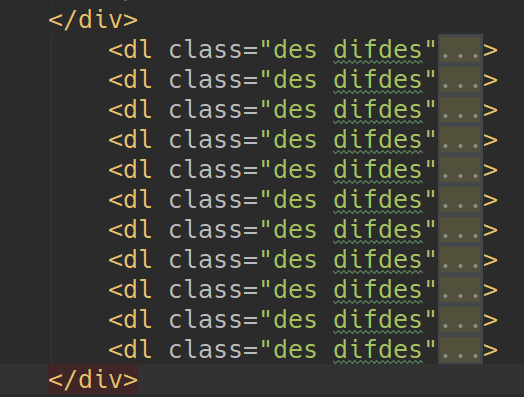
    
    - 之后
    
        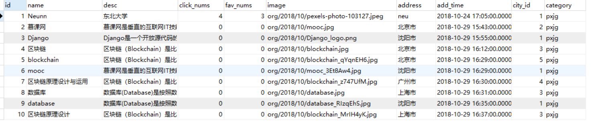
    
      - organization_courseorg数据表中image以字符串形式存储，且是相对路径地址
    
      - 因此取image值时会自动做相对路径转换
    
        ```
        
        ```


      ```
      
      <dl class="des difdes">
         <dt>
            <a href="org-detail-homepage.html">
               
            </a>
         </dt>
         <dd>
            <div class="clearfix">
               <a href="org-detail-homepage.html">
                   <h1>南京大学</h1>
                      <div class="pic fl">
                          
                          
                      </div>
               </a>
            </div>
            <ul class="cont">
               <li class="first"><p class="pic9">课程数：<span>1</span></p><p class="c7">学习人数：<span>1000</span></p></li>
               <li class="c8" style="padding-left:18px;">北京市海淀区中关村北大街</li>
               <li class="pic10" style="padding-left:18px;">经典课程：
               <a href="/diary/19/">c语言基础入门</a>
               <a href="/diary/16/">数据库基础</a>
               </li>
           </ul>
         </dd>
         <div class="buy start_groupbuy jsShowPerfect2" data-id="22"><br/>联系<br/>服务</div>
      </dl>
      
      ```
    
    - 添加动态数据
    
      `'django.core.context_processors.media',`,自动将MEDIA_URL的值注册到html
    
    - 配置上传文件的访问处理函数
    
      `url(r'^media/(?P<path>.*)$', serve, {"document_root": MEDIA_ROOT})`
    
      取出路径放到path变量下，与之前配置取变量一样，把后面全取出来。media下是静态文件，为处理这种静态文件，去要用一个django内置函数`django.views.static`,这个函数下有一个serve方法用于处理静态文件，导入serve`from django.views.static import serve`。serve方法有些参数需传进来，参数名称叫`document_root`,导入`from mxonline.settings import MEDIA_ROOT`

- 在views中添加`org_nums = all_orgs.count()`,`"org_nums": org_nums,`

  - `<div class="all">共<span class="key">{{ org_nums }}</span>家</div>`

- Django列表分页功能

  - [pure pagination网址](https://github.com/jamespacileo/django-pure-pagination)

    - pip install django-pure-pagination

    - ```
      INSTALLED_APPS = (
          ...
          'pure_pagination',
      )
      ```

    - ```
      # views.py
      from django.shortcuts import render_to_response
      
      from pure_pagination import Paginator, EmptyPage, PageNotAnInteger
      
      
      def index(request):
      
          try:
              page = request.GET.get('page', 1)
          except PageNotAnInteger:
              page = 1
      
          objects = ['john', 'edward', 'josh', 'frank']
      
          # Provide Paginator with the request object for complete querystring generation
      
          p = Paginator(objects, request=request)
      
          people = p.page(page)
      
          return render_to_response('index.html', {
              'people': people,
          }
      ```

      根据示例改编自己的views.py

      ```
       def get(self,request):
              # 课程机构
              all_orgs = CourseOrg.objects.all()
              org_nums = all_orgs.count()
              # 对课程机构进行分页
              try:
                  page = request.GET.get('page', 1)
              except PageNotAnInteger:
                  page = 1
      
              p = Paginator(all_orgs, 5, request=request)
      
              orgs = p.page(page)
      
              return render(request, "org-list.html",{
                  "all_orgs": orgs,
                  "all_citys": all_citys,
                  "org_nums": org_nums,
              })
      ```

    - 页码问题

      ```
      
      <div class="pagination">
          
              <a href="?{{ page_obj.previous_page_number.querystring }}" class="prev">&lsaquo;&lsaquo; </a>
          
              <span class="disabled prev">&lsaquo;&lsaquo; </span>
          
          
              
                  
                      <span class="current page">{{ page }}</span>
                  
                      <a href="?{{ page.querystring }}" class="page">{{ page }}</a>
                  
              
                  ...
              
          
          
              <a href="?{{ page_obj.next_page_number.querystring }}" class="next"> &rsaquo;&rsaquo;</a>
          
              <span class="disabled next"> &rsaquo;&rsaquo;</span>
          
      </div>
      ```

      改编（org-list.html）：

      ```
      <div class="pageturn">
         <ul class="pagelist">
         
            <li class="long"><a href="?{{                   all_orgs.previous_page_number.querystring }}">上一页</a></li>
         
         
         
         
         <li class="active"><a href="?{{ page.querystring }}">{{ page }}</a></li>
         
         <li><a href="?{{ page.querystring }}" class="page">{{ page }}</a></li>
         
         
         <li class="none"><a href="">...</a></li>
         
         
         
         <li class="long"><a href="?{{ all_orgs.next_page_number.querystring }}">下一页</a></li>
         
         </ul>
       </div>
      ```

- Django列表筛选功能

- 

- 


