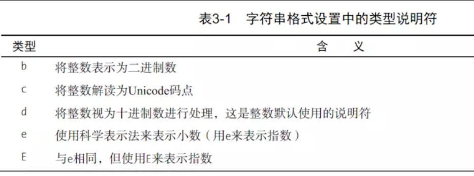
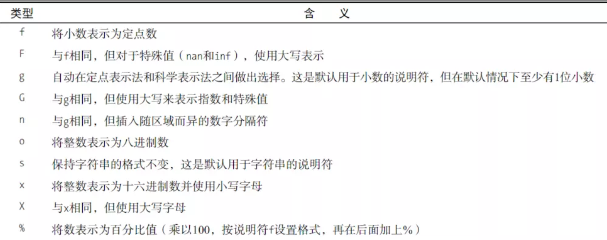

# 三 使用字符串

1.基本字符串操作
（1）所有标准的序列操作 （索引、分片、乘怯、判断成员资格、求长度、取最小值和最大值）对字符串同样适用。但是，字符串都是不可变的。因此，所有的元素赋值和切片赋值是不合法的。
```
>>> web = 'http://www.python.org'
>>> web[-3:]='com'
Traceback (most recent call last):
  File "<stdin>", line 1, in <module>
TypeError: 'str' object does not support item assignment
```
2.设置字符串的格式
（1）字符串格式化使用字符串格式化操作符，即百分号%来实现。在%的左侧放置一个字符串（格式化字符串） ，而右侧则放置希望格式化的值。可以使用一个值（如一个字符串或者数字），也可以使用多个值的元组或者下一章将会讨论的字典（如果希望格 式化多个的话）。一般情况下使用元组 ：
```
>>> format = "Hello, %s %s enough for ya?"
>>> values = ('world','Hot')
>>> format % values
'Hello, world Hot enough for ya?'
```
如果使用列表或者其他序列代替元组，那么序列就会被解释为一个值。只有元组和字典可以格式化一个以上的值 。

格式化字符串的%s部分称为转换说明符（conversion   specifier)，它们标记了需要插入转换值的位置。s表示值会被格式化为字符串一一如果不是字符串  ，则会用str将其转换为字符串 。

如果要在格式化字符串里面包括百分号 ，那么必须使用%%，这样Python就不会将百分号误认为是转换说明符了 。

（2）模板字符串
```
>>> from string import Template
>>> tmpl = Template("Hello, $who! $what enough for ya?")
>>> tmpl.substitute(who="Mars", what="Dusty")
'Hello, Mars! Dusty enough for ya?'
```
包含等号的参数称为关键字参数。在字符串格式设置中，可将关键字参数视为一种向命名替换字段提供值的方式，
编写新代码时，应选择使用字符串方法format，每个替换字段都用花括号括起，其中可能包含名称，还可能包括有关如何对相应的值进行转换和格式设置的信息。
在最简单的情况下，替换字段没有名称或者将索引用作名称。
```
>>> "{},{} and {}".format("first","second","third")
'first,second and third'
>>> "{0},{1} and {2}".format("first","second","third")
'first,second and third'
```
索引无需按顺序排列：
```
>>> "{3} {0} {2} {1} {3} {0}".format("be","not","or","to")
'to be or not to be'
```
Python3.6中，如果变量与替换字段同名，可使用简写。可使用f字符串---在字符串前面加上f。
```
>>> from math import e
>>> f"Euler's constant is roughly {e}."
"Euler's constant is roughly 2.718281828459045."
```
3.设置字符串的格式
（1）基本思想是对字符串调用方法format，并提供要设置其格式的值。字符串中包含有关如何设置格式的信息。每个值都被插入字符串中，以替换用花括号括起来的替换字段。要在最终结果中包含花括号，可在格式字符串中使用两个花括号（{{}}）来指定。
```
>>> "{{ceil n'est pas une replacement filed}}".format()
"{ceil n'est pas une replacement filed}"
```

(2)在格式字符串中，替换字段由如下部分组成，其中每个部分都是可选的。
- 字段名：索引或标识符，指出要设置哪个值的格式并使用结果来替换该字段。除指定值外，还可指定值的特定部分，如列表的元素。
- 转换标志：跟在叹号后面的单个字符。当前 支持的字符包括 r （表示repr）、 s（表示str）和a（表示ascii） 。如果你指定了转换标志，将不使用对象本身的格式设置机制，而是使用指定的函数将对象转换为字符串，再做进一步的格式设置。
- 格式说明符：跟在冒号后面的表达式（这种表达式是使用微型格式指定语言表示的）。格式说明符让我们能够详细地指定最终的格式，包括格式类型（如字符串、浮点数或十六进制数），字段宽度和数的精度，如何显示符号和千位分隔符，以及各种对齐和填充方式。

(3)替换字段名
在最简单的情况下，只需向format提供要设置其格式的未命名参数，并在格式字符串中使用未命名字段。此时，将按顺序将字段和参数配对。你还可给参数指定名称，这种参数将被用于相应的替换字段中。你可混合使用这两种方法。
```
>>> "{foo} {} {bar} {}".format(1, 2, bar=4, foo=3)
'3 1 4 2'
```
还可通过索引来指定要在哪个字段中使用相应的未命名参数，这样可不按顺序使用未命名参数。
```
>>> "{foo} {1} {bar} {0}".format(1, 2, bar=4, foo=3)
'3 2 4 1'
```
(4)基本转换
```
>>> print("{pi!s} {pi!r} {pi!a}".format(pi="π"))
π 'π' '\u03c0'
```
- 上述三个标志（s、 r和a）指定分别使用str、 repr和ascii进行转换。函数str通常创建外观普通的字符串版本（这里没有对输入字符串做任何处理）。函数repr尝试创建给定值的Python表示（这里是一个字符串字面量）。函数ascii创建只包含ASCII字符的表示，类似于Python 2中的repr。

- 你还可指定要转换的值是哪种类型，更准确地说，是要将其视为哪种类型。例如，你可能提供一个整数，但将其作为小数进行处理。为此可在格式说明（即冒号后面）使用字符f（表示定点数）
```
>>> "The number is {num}".format(num=42)
'The number is 42'
>>> "The number is {num:f}".format(num=42)
'The number is 42.000000'
你也可以将其作为二进制数进行处理。
>>> "The number is {num:b}".format(num=42)
'The number is 101010'
```


(5) 宽度、精度、千分位分隔符
宽度是使用整数指定的（默认填充为空格），并且数字默认是右对齐，字符串默认是右对齐。
```
>>> "{num:10}".format(num=3)
'         3'
>>> "{name:10}".format(name="Bob")
'Bob       '
```
精度也是使用整数指定的，但需要在它前面加上一个表示小数点的句点。
```
>>> "Pi day is {pi:.2f}".format(pi=pi)
'Pi day is 3.14'
```
当然，可同时指定宽度和精度。
```
>>> "{pi:10.2f}".format(pi=pi)
'      3.14'
```
可使用逗号来指出你要添加千位分隔符。
```
>>> 'One googol is {:,}'.format(10**100)
'One googol is 10,000,000,000,000,000,000,000,000,000,000,000,000,000,000,000,000,000,000,000,000,000,000,000,000,000,000,000,000,000,000,000,000,000'
```
(6) 符号、对齐和用0填充
在指定宽度和精度的数前面，可添加一个标志。这个标志可以是零、加号、减号或空格。其中零表示使用0来填充数字。
```
>>> '{:010.2f}'.format(pi)
'0000003.14'
>>> '{:+10.2f}'.format(pi)
'     +3.14'
>>> '{:-10.2f}'.format(pi)
'      3.14'
#在整数数字前面不能指定不能指定0、+、-以外的填充符号
>>> '{:*10.2f}'.format(pi)
Traceback (most recent call last):
  File "<stdin>", line 1, in <module>
ValueError: Invalid format specifier
Error in sys.excepthook:
```
要指定左对齐、右对齐和居中，可分别使用<、 >和^。
```
>>> print('{0:<10.2f}\n{0:^10.2f}\n{0:>10.2f}'.format(pi))
3.14      
   3.14   
      3.14
```
可以使用填充字符来扩充对齐说明符(将填充字符放在对齐符号的前面)，这样将使用指定的字符而不是默认的空格来填充
```
>>> "{:$^15}".format(" WIN BIG ")
'$$$ WIN BIG $$$'
```
还有更具体的说明符=，它指定将填充字符放在符号和数字之间。

```
>>> print('{0:10.2f}\n{1:10.2f}'.format(pi, -pi))
3.14
>>> print('{0:10.2f}\n{1:10.2f}'.format(pi, -pi))
      3.14
     -3.14
>>> print('{0:10.2f}\n{1:=10.2f}'.format(pi, -pi))
      3.14
-     3.14
```
如果要给正数加上符号，可使用说明符+（将其放在对齐说明符后面）
```
#默认情况下，正数前无符号，负数前有符号
>>> print('{0:>10.2f}\n{1:>10.2f}'.format(pi, -pi)) #默认
      3.14
     -3.14
>>> print('{0:>-10.2f}\n{1:>-10.2f}'.format(pi, -pi)) #默认
      3.14
     -3.14
#可以在正数前加正号来更改默认设置
>>> print('{0:>+10.2f}\n{1:>-10.2f}'.format(pi, -pi))
     +3.14
     -3.14
```
需要介绍的最后一个要素是井号（#）选项，你可将其放在符号说明符和宽度之间（如果指定了这两种设置）。这个选项将触发另一种转换方式，转换细节随类型而异。例如，对于二进制、八进制和十六进制转换，将加上一个前缀。
```
>>> "{:b}".format(42)
'101010'
>>> "{:#b}".format(42)
'0b101010'
#对于各种十进制数，它要求必须包含小数点（对于类型g，它保留小数点后面的零）。
>>> "{:g}".format(42)
'42'
>>> "{:#g}".format(42)
'42.0000
```
4.常见字符串函数
(1)center方法
center通过在两边添加填充字符（默认为空格）让字符串居中。
使用方式：`"str".center(para1,para2)`，其中para1指定显示字符的宽度，para2指定填充字符，默认为空格。
```
>>> "Center".center(10,'*')
'**Center**'
>>> "Center".center(10)
'  Center  '
```
（2）find方法
方法find在字符串中查找子串。如果找到，就返回子串的第一个字符的索引，否则返回-1。
```
>>> "hello world".find("world")
6
>>> "hello world".find("aa")
-1
```
可以使在find中指定起点或同时指定起点和终点，注意查找范围不包括终点
```
>>> subject="$$$ find the string $$$"
>>> subject.find("$$$")
0
>>> subject.find("$$$",1)
20
>>> subject.find("$$$",1,-1)
-1
```
(3)join方法
join是一个非常重要的字符串方法，其作用与split相反，用于合并序列的元素。
使用方式："连接字符（串）".join(待合并序列）
```
>>> seq=[1,2,3,4,5]
>>> sep='+'
>>> sep.join(seq)        #无法合并数字序列
Traceback (most recent call last):
  File "<stdin>", line 1, in <module>
TypeError: sequence item 0: expected str instance, int found
>>> seq=['1','2','3','4','5']  #可以合并字符串序列
>>> sep.join(seq)
'1+2+3+4+5'
>>> dir=['','usr','bin','env']
>>> '/'.join(dir)
'/usr/bin/env'
>>> print("C:"+"\\".join(dir))
C:\usr\bin\env

```
所合并序列的元素必须都是字符串。
（4）lower方法
方法lower返回字符串的小写版本。
```
>>> "Hello World".lower()
'hello world'
```
(5)replace方法
方法replace将指定子串都替换为另一个字符串，并返回替换后的结果
```
>>> "this is a cat".replace("is","are")
'thare are a cat'
```
(6)split方法
split是一个非常重要的字符串方法，其作用与join相反，用于将字符串拆分为序列。
```
>>> "1+2+3+4+5".split("+")
['1', '2', '3', '4', '5']
>>> "hello wold".split()
['hello', 'wold']
>>> "/usr/bin/env".split("/")
['', 'usr', 'bin', 'env']
```
注意：如果没有指定分隔符，将默认在单个或多个连续的空白字符（空格、制表符、换行符等）处进行拆分.
(7)strip方法
方法strip将字符串开头和末尾的空白（但不包括中间的空白）删除，并返回删除后的结果。
```
>>> "  hello world  ".strip()
'hello world'
```
可在一个字符串参数中指定要删除哪些字符
```
 '*** SPAM * for * everyone!!! ***'.strip('*! ')
'SPAM * for * everyone'
>>> '*** SPAM * for * everyone!!! ***'.strip('*!')
' SPAM * for * everyone!!! '
>>> '*** SPAM * for * everyone!!! ***'.strip(' *!')
'SPAM * for * everyone'
>>> '*** SPAM * for * everyone!!! ***'.strip('* ')
'SPAM * for * everyone!!!'
```
(8)translate方法
方法translate与replace一样替换字符串的特定部分，但不同的是它只能进行单字符替换。这个方法的优势在于能够同时替换多个字符，因此效率比replace高。
这个方法的用途很多（如替换换行符或其他随平台而异的特殊字符），但这里只介绍一个比较简单（也有点傻）的示例。假设你要将一段英语文本转换为带有德国口音的版本，为此必须将字符c和s分别替换为k和z。
然而，使用translate前必须创建一个转换表。这个转换表指出了不同Unicode码点之间的转换关系。要创建转换表，可对字符串类型str调用方法maketrans，这个方法接受两个参数：两个长度相同的字符串，它们指定要将第一个字符串中的每个字符都替换为第二个字符串中的相应字符。就这个简单的示例而言，代码类似于下面这样：
`>>> table = str.maketrans('cs', 'kz')`
如果愿意，可查看转换表的内容，但你看到的只是Unicode码点之间的映射。
```
>>> table
{115: 122, 99: 107}
```
创建转换表后，就可将其用作方法translate的参数。
```
>>> 'this is an incredible test'.translate(table)
'thiz iz an inkredible tezt'
```
调用方法maketrans时，还可提供可选的第三个参数，指定要将哪些字母删除。例如，要模仿语速极快的德国口音，可将所有的空格都删除。
```
>>> table = str.maketrans('cs', 'kz', ' ')
>>> table
{99: 107, 115: 122, 32: None}
>>> 'this is an incredible test'.translate(table)
'thizizaninkredibletezt'
```
(9)判断字符串是否满足特定的条件
- string.isalnum() 检查字符串中的字符是否都是字母或数
- string.isalpha() 检查字符串中的字符是否都是字母
- string.isdecimal() 检查字符串中的字符是否都是十进制数
- string.isdigit() 检查字符串中的字符是否都是数字
- string.isidentifier() 检查字符串是否可用作Python标识符
- string.islower() 检查字符串中的所有字母都是小写的
- string.isnumeric() 检查字符串中的所有字符是否都是数字字符
- string.isprintable() 检查字符串中的字符是否都是可打印的
- string.isspace() 检查字符串中的字符是否都是空白字符
- string.istitle() 检查字符串中位于非字母后面的字母都是大写的，且其他所有字母都是小写的
- string.isupper() 检查字符串中的字母是否都是大写的
