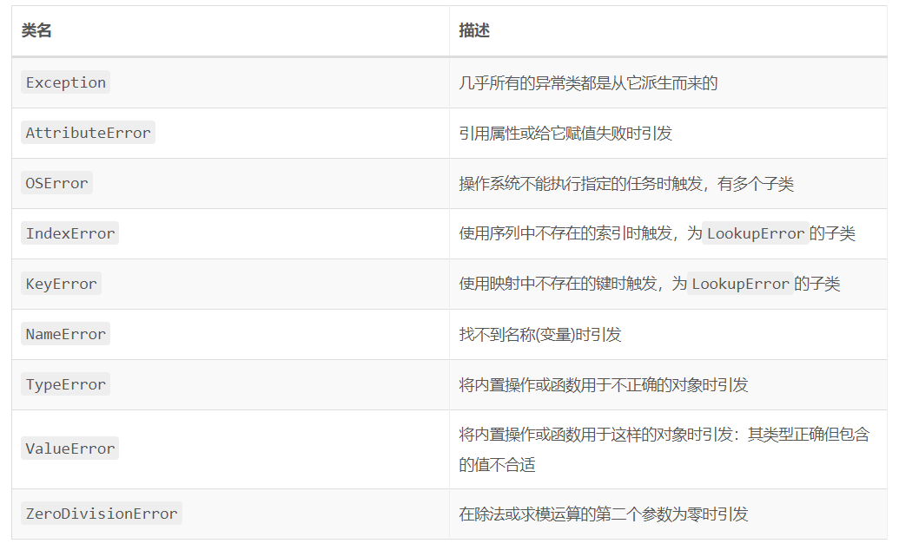
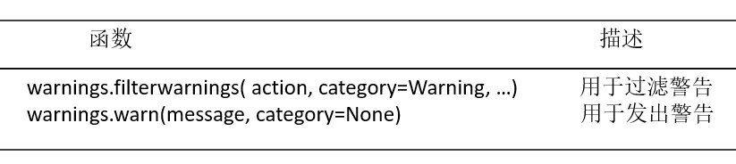

# 第八章 异常
##### 1.异常是什么
Python使用异常对象来表示异常状态，并在遇到错误时引发异常，异常对象未被处理(捕获)时，程序将终止并显示一条错误信息：
```
>>> 1 / 0
Traceback (most recent call last):
  File "<pyshell#147>", line 1, in <module>
    1 / 0
ZeroDivisionError: division by zero
```
每个异常都是ZeroDivisionError类的实例，我们可以使用各种方式引发和捕获这些实例，从而采取措施而不是放任整个程序失败。

##### 2. 让事情沿你指定的轨道出错
(1) `raise`语句
在Python中，我们可以使用`raise`语句来引发异常，并将一个类(必须是`Exception`类的子类)或实例作为参数，将类作为参数时，将自动创建一个实例。下面的示例使用的是内置异常类`Exception`:
```
>>> raise Exception
Traceback (most recent call last):
  File "<pyshell#148>", line 1, in <module>
    raise Exception
Exception
```
```
>>> raise Exception('hyperdrive overload')
Traceback (most recent call last):
  File "<pyshell#149>", line 1, in <module>
    raise Exception('hyperdrive overload')
Exception: hyperdrive overload
```
Python内置了很多异常类，下表描述了一些重要的，这些异常类都可以用于`raise`语句。
　　　　　　　　　　　　　　　　　　　　　　　　　　一些内置的异常类

（2）自定义的异常类
虽然Python内置了大量的异常类，供我们使用，但有时也需要我们自定义异常类，创建自定义异常类，跟创建其他类一样，只是需要直接或间接的继承`Exception`类(从其他的异常类派生也是可以的，因为所有的异常类都派生自`Exception`类):
`class SomeCustomException(Exception): pass`
如果有需要，也可以在自定义异常类中添加方法。

##### 3. 捕获异常
在Python中，我们可以使用try/except语句来捕获异常，比如我们有一段程序，让用户输入两个数，然后将它们相除，如果用户输入的第二个数为零，则我们需要捕获这个异常：
```
try:
    x = int(input('Enter the first number: '))
    y = int(input('Enter the second number: '))
    print(x / y)
except ZeroDivisionError:
    print('The second number can\'t be zero!')
```
执行结果如下，我们对这种情况友好的做了提示：
```
Enter the first number: 2
Enter the second number: 0
The second number can't be zero!
```
好像这种情况使用if语句更简单，但如果程序很庞大，里面有多个像这样的计算任务，使用一个`try/except`就可以捕获所有的错误。

注意：异常是从函数向外传播到调用函数的地方的，如果异常在这里没有被捕获，那么它将向程序的最顶层传播。这意味着你可以使用try/except来捕获他人所编写函数引发的异常。

(1)不用提供参数
捕获异常后，如果要重新引发它(继续向上传播)，可调用raise且不提供任何参数。
```
class MuffleCalculator:
    muffled = False
    def calc(self, expr):
        try:
            return eval(expr)
        except ZeroDivisionError:
            # 带有’抑制‘功能
            if self.muffled:
                print('Division by zero is illegal')
            else:
                raise
```
注意：发生除零行为时，如果启用了“抑制”功能，方法calc将（隐式地）返回None。换言之，如果启动了“抑制”功能，就不应依赖返回值。

上面的例子运行如下：
```
>>> calculator = MuffleCalculator()
>>> calculator.calc('10 / 2')
5.0
>>> calculator.calc('10 / 0')
Traceback (most recent call last):
  File "<pyshell#159>", line 1, in <module>
    calculator.calc('10 / 0')
  File "<pyshell#155>", line 5, in calc
    return eval(expr)
  File "<string>", line 1, in <module>
ZeroDivisionError: division by zero  # 关闭抑制功能，捕获了异常，但继续向上传播
>>> calculator.muffled = True
>>> calculator.calc('10 / 0')
Division by zero is illegal
```
关闭抑制功能时，捕获了异常`ZeroDivisionError`，但继续向上传播它。
如果无法处理异常，在`except`子句中使用不带参数的`raise`通常是不错的选择。

（2）多个except子句
如果程序需要同时捕获多个异常，我们可以在try/except语句中再添加一个except子句：
```
try:
    x = int(input('Enter the first number: '))
    y = int(input('Enter the second number: '))
    print(x / y)
except ZeroDivisionError:
    print('The second number can\'t be zero!')
except TypeError:
    print('That wasn\'t a number, was it?')
```
(3)一箭双雕
如果我们只想使用一个except语句来捕获多个异常呢？可以在一个元组中指定这些异常。
```
try:
    x = int(input('Enter the first number: '))
    y = int(input('Enter the second number: '))
    print(x / y)
except (ZeroDivisionError, TypeError, NameError):
    print('Your numbers were bogus ...')
```
在except子句中，异常两边的括号很正常。省略可能导致错误。
（4）捕获对象
要在`except`子句中访问异常对象本身，可使用两个二不是一个参数，这种方式可以让程序继续运行并记录错误：
```
try:
    x = int(input('Enter the first number: '))
    y = int(input('Enter the second number: '))
    print(x / y)
except (ZeroDivisionError, TypeError) as e:
    print(e)
```
(5)一网打尽
如果我们不在except语句中指定任何异常类，那么我们将可以捕获所有的异常：
```
try:
    x = int(input('Enter the first number: '))
    y = int(input('Enter the second number: '))
    print(x / y)
except:
    print('Something wrong happended ...')
```
使用这样的方式并不是很好，因为这样不仅会隐藏我们已知的错误，还会隐藏我们没有考虑到的错误。所以，在大多数情况下，更好的选择是使用`execpt Exception as e`并对异常对象进行检查。

(6)万事大吉时
我们还可以给`try/execpt`语句加上一个`else`子句，当没有异常发生时，`else`里的语句将会被执行。
```
try:
    print('A simple task')
except:
    print('What? Something went wrong?')
else:
    print('Ah... It went as planned.')
```
使用else子句，可以实现前面的一个循环获取用户输入的示例，只有当没有引发异常时，才会跳出循环，如果用户输入错误，则会一直提示用户输入：
```
while True:
    try:
        x = int(input('Enter the first number: '))
        y = int(input('Enter the second number: '))
        value = x / y
        print('x / y is ', value)
    except:
        print('Invalid input. Please try again.')
    else:
        break
```
运行结果如下：
```
Enter the first number: 1
Enter the second number: 0
Invalid input. Please try again.
Enter the first number: foo
Invalid input. Please try again.
Enter the first number: 'foo'
Invalid input. Please try again.
Enter the first number: 10
Enter the second number: 2
x / y is  5.0
```
我们也可以使用`except Exception as e`这种方式打印更有用的错误信息：
```
while True:
    try:
        x = int(input('Enter the first number: '))
        y = int(input('Enter the second number: '))
        value = x / y
        print('x / y is ', value)
    except Exception as e:
        print('Invalid input: ', e)
        print('Please try again')
    else:
        break
```
运行结果如下：
```
Enter the first number: 1
Enter the second number: 0
Invalid input:  division by zero
Please try again
Enter the first number: 'x'
Invalid input:  invalid literal for int() with base 10: "'x'"
Please try again
Enter the first number: 10
Enter the second number: 2
x / y is  5.0
```
(7)最后
最后，还有一个`finally`子句，它可用于在发生异常时执行清理工作，这个子句是与`try`子句配套的。
```
x = None
try:
    x = 1 / 0
finally:
    print('Clearing up ...')
    del x
```
不管`try`子句中发生什么异常，都将执行`finally`子句。`finally`子句也非常适合用于确保文件或网络套接字被关闭。

我们也可以在一条语句中同时包含`try`、`except`、`finally`和`else`,或其中的3个
```
try:
    1 / 0
except NameError:
    print('Unknown variable')
else:
    print('That went well!')
finally:
    print('Clearing up.')
```
##### 4. 异常和函数
通常如果不处理在函数中引发的异常，它就会向上传播到调用函数的地方，如果那里也未得到处理，异常将继续传播，直至到达主程序(全局作用域),如果主程序也没有异常处理，那么程序将终止并显示栈跟踪信息。
```
>>> def faulty():
        raise Exception('Something is wrong')

>>> def ignore_exception():
        faulty()

>>> def handle_exception():
        try:
            faulty()
        except:
            print('Exception handled!')
```
调用结果如下：
```
>>> ignore_exception()
Traceback (most recent call last):
  File "<pyshell#178>", line 1, in <module>
    ignore_exception()
  File "<pyshell#175>", line 2, in ignore_exception
    faulty()
  File "<pyshell#173>", line 2, in faulty
    raise Exception('Something is wrong')
Exception: Something is wrong
>>> handle_exception()
Exception handled!
```
##### 5. 异常之禅
如果你知道代码可能引发某种异常，且不希望出现这种异常时程序终止并系那是栈跟踪信息，可以添加必要的`try/excep`t或`try/finally`语句来处理它。

有时候你可能觉得使用`if/else`更自然一些，但使用`try/except`要比`if/else`效率更高。例如我们要打印某人的信息，且参数传入了一个字典：
```
def describe_person(person):
    print('Description of ', person['name'])
    print('Age: ', person['age'])
    if 'occupation' in person:
        print('Occupation: ', person['occupation'])
```
像上面的这段代码，程序必须两次检查`occupation`键是否存在于参数字典`person`中，一次检查，一次调用。如果我们换成`try/except`来完成，则效率更高：
```
def describe_person(person):
    print('Description of ', person['name'])
    print('Age: ', person['age'])
    try:
        print('Occupation: ', person['occupation'])
    except KeyError: pass
```
往往在检查对象是否包含特定的属性时，`try/except`就很有用。然而，这种效率方面的提升并不明显，但使用`try/except`更符合`Python`风格，因此我们应养成多使用它的习惯。

##### 6. 不那么异常的情况
如果我们想在程序运行出现问题时发出警告，则可以使用模块`warnings`中的函数`warn`
```
>>> from warnings import warn
>>> warn('I\'ve got a bad feeling about this.')
```
```
Warning (from warnings module):
  File "__main__", line 1
UserWarning: I've got a bad feeling about this.
```
我们也可以使用`warnings`中的函数`filterwarnings`来抑制你发出的警告并指定要采取的措施
```
>>> from warnings import filterwarnings
>>> filterwarnings('ignore')
>>> warn('ANyone out there?')
>>> filterwarnings('error')
>>> warn('Something is very wrong!')
Traceback (most recent call last):
  File "<pyshell#8>", line 1, in <module>
    warn('Something is very wrong!')
UserWarning: Something is very wrong!
```
