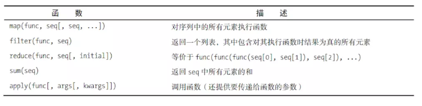

# 第六章 抽象
##### 1.自定义函数
（1）函数执行特定的操作并返回一个值，你可以调用它（调用时可能需要提供一些参数--放在圆括号中的内容）。一般而言，要判断某个对象是否可调用，可使用内置函数callable。
```
>>> import math
>>> x = 1
>>> y = math.sqrt
>>> callable(x)
False
>>> callable(y)
True
```
(2)如何定义函数？
- 函数定义以def开头，函数体部分位于“：”之后；
- 放在函数开头的字符串被成为文档字符串，作为函数的一部分来存储起来，并且可以使用func_name.__doc__的-方式来进行访问；
- 可以使用help(func_name)方式来访问文档字符串；
- 可以使用callable函数判断某个对象是否可以作为函数来调用，返回值为True/False。
- python中所有的函数均有返回值，对于无明确返回值的函数，默认返回None。
（3）放在函数开头的字符串称为文档字符串，将作为函数的一部分保存起来。
```
def Square(x):
    'Calculates the square of the number x.'
    return x*x
```
__doc__是函数的一个属性。
```
>>> Square.__doc__
'Calculates the square of the number x.'
>>> help(Square)
Help on function Square in module __main__:
Square(x)
    Calculates the square of the number x.
```
（4）并不是函数的函数
- 在Python中，有些函数什么都不返回，但函数就是函数，即使它严格来说并非函数。什么都不返回的函数不包含return语句，或者包含return语句，但没有在return后面指定值。
```
def test():
    print('This is printed.')
    return
    print('This is not')
```
这里使用return语句只是为了结束函数。
```
>>> x=test()
This is printed.
```
x指向什么呢？
```
>>> x
>>> 
```
```
>>> print(x)
None
```
- 所有的函数都返回值，如果你没有告诉它们该返回什么，将返回None。
- 警告：不要让这种默认行为带来麻烦。如果你在if之类的语句中返回值，务必保证其他的分支也返回值，以免在调用者期望函数返回一个序列时（举例），不小心返回None。

##### 2. 参数魔法

（1）值从哪里来？
- 通常，你不用为此操心。编写函数旨在为当前程序（甚至其他程序）提供服务，你的职责是确保它在提供的参数正确时完成任务，并在参数不对时以显而易见的方式失败。
- 注意 在def语句中，位于函数名后面的变量通常称为形参，而调用函数时提供的值称为实参，但本书基本不对此做严格的区分。在很重要的情况下，我会将实参称为值，以便将其与类似于变量的形参区分开来。

（2）是否可以修改参数？
- 参数不过是变量而已，行为与你预期的完全相同。在函数内部给参数赋值对外部没有任何影响。
```
>>> def try_to_change(n):
... n = 'Mr. Gumby'
...
>>> name = 'Mrs. Entity'
>>> try_to_change(name)
>>> name
'Mrs. Entity'
```
在try_to_change内，将新值赋给了参数n，但如你所见，这对变量name没有影响。说到底，这是一个完全不同的变量。传递并修改参数的效果类似于下面这样：
```
>>> name = 'Mrs.Entity'
>>> n = name             #与传递参数的效果几乎相同
>>> n = 'Mr.Gumby'       #这是在函数内进行的
>>> name
'Mrs.Entity'
```
- 变量n变了，但变量name没变。同样，在函数内部重新关联参数（即给它赋值）时，函数外部的变量不受影响。
- 注意：参数存储在局部作用域内。

- 字符串（以及数和元组）是不可变的（immutable），这意味着你不能修改它们（即只能替换为新值）。因此这些类型作为参数没什么可说的。但如果参数为可变的数据结构（如列表）呢？
```
>>> def change(n):
... n[0] = 'Mr. Gumby'
...
>>> names = ['Mrs. Entity', 'Mrs. Thing']
>>> change(names)
>>> names
['Mr. Gumby', 'Mrs. Thing']
```
在这个示例中，也在函数内修改了参数，但这个示例与前一个示例之间存在一个重要的不同。在前一个示例中，只是给局部变量赋了新值，而在这个示例中，修改了变量关联到的列表。
```
>>> names=['Mrs.Entity', 'Mrs.Thing']
>>> n = names        # 再次假装传递名字作为参数
>>> n[0]='Mr. Gumby'   #修改列表
>>> names
['Mr. Gumby', 'Mrs.Thing']
```
- 将同一个列表赋值给两个变量时，这两个变量将同时指向这个列表。要避免这样的结果，必须创建列表的副本。对序列进行切片操作时，返回的切片都是副本。因此，如果你创建覆盖整个列表的切片，得到的将是列表的副本。
```
>>> names=['Mrs.Entity', 'Mrs.Thing']
>>> n = names[:]
>>> n is names
False
>>> n == names
True
```
- 现在修改n，将不会影响names。

（3）我能修改参数吗
在提高程序的抽象程度方面，使用函数来修改数据结构（如列表或字典）是一种不错的方式。

（4）如果参数是不可变的
- 在有些语言（如C++、 Pascal和Ada）中，经常需要给参数赋值并让这种修改影响函数外部的变量。在Python中，没法直接这样做，只能修改参数对象本身。但如果参数是不可变的（如数）呢？
- 没办法，在这种情况下，应从函数返回所有需要的值（如果需要返回多个值，就以元组的方式返回它们）。例如，可以像下面这样编写将变量的值加1的函数：
```
>>> def inc(x): return x + 1
...
>>> foo = 10
>>> foo = inc(foo)
>>> foo
11
```
- 如果一定要修改参数，可玩点花样，比如将值放在列表中，如下所示：
```
>>> def inc(x): x[0] = x[0] + 1
...
>>> foo = [10]
>>> inc(foo)
>>> foo
[11]
```
但更清晰的解决方案是返回修改后的值。

(5) 关键字参数和默认值
- 参数的排列顺序可能难以记住，为了简化调用工作，可指定参数的名称。
```
def hello_3(greeting='Hello', name='world'):
    print('{}, {}!'.format(greeting, name))
>>> hello_3(name='world', greeting='Hello')
Hello, world!
```
- 给参数指定名称的参数叫做关键字参数，其主要用于区分各个参数的含义，此外还可以对关键字参数指定默认值
```
>>> def hello_3(greeting='Hello',name='world'):
...     print('{},{}!'.format(greeting,name))
```
- 像这样给参数指定默认值后，调用函数时可不提供它！可以根据需要，一个参数值也不提供、提供部分参数值或提供全部参数值。
```
>>> hello_3()
Hello, world!
>>> hello_3('Greetings')
Greetings, world!
>>> hello_3('Greetings', 'universe')
Greetings, universe!
```
- 你可结合使用位置参数和关键字参数，但必须先指定所有的位置参数，否则解释器不知道它们是哪个参数。
- 通常不应结合使用位置参数和关键字参数。一般而言，除非必不可少的的参数很少，而带默认值的可选参数很多，否则不应结合使用关键字参数和位置参数。
- 例如下面函数必须指定姓名，而问候语和标点是可选的。
```
>>> def hello_4(name,greeting='Hello',punctuation='!'):
...     print('{},{}{}'.format(greeting, name, punctuation))
```

(6） 收集参数
- 允许用户提供任意数量的参数很有用。
- 前面有星号的参数叫做收集参数，参数前面的星号将提供的所有值都放在一个元组中，也就是将这些值收集起来。通过收集参数可以实现可变形参。
```
#收集到的参数放在了元组中
>>> def func(x,*para):
...     print(x)
...     print(para)
...
>>> func(1) #若没有可供收集的参数将形参para为一个空元组
1
()
>>> func(1,2,3,4)
1
(2, 3, 4)
```
- 星号意味着收集余下的未知参数。如果没有可供收集的参数，params将是一个空元组。
- 与赋值时一样，带星号的参数也可放在其他位置（而不是最后），不同的是，这种情况下：使用名称来指定后续参数。
```
>>> def in_the_middle(x,*y,z):
...     print(x,y,z)
...
>>> in_the_middle(1,2,3,4,5,z=7)
1 (2, 3, 4, 5) 7
>>> in_the_middle(1,2,3,4,5,7)
Traceback (most recent call last):
  File "<stdin>", line 1, in <module>
TypeError: in_the_middle() missing 1 required keyword-only argument: 'z'
```
- 星号不会收集关键字参数，若想收集关键字参数使用两个星号，收集到的关键字参数以字典的形式存放；
```
>>> def print_params_3(**params):
... print(params)
...
>>> print_params_3(x=1, y=2, z=3)
{'z': 3, 'x': 1, 'y': 2}
```
- 这样得到的是字典，而不是元组
```
>>> def print_params_4(x,y,z=3,*pospar,**keypar):
...   print(x,y,z)
...   print(pospar)
...   print(keypar)
...
>>> print_params_4(1,2,3,5,6,7,foo=1,bar=2)
1 2 3
(5, 6, 7)
{'foo': 1, 'bar': 2}
```
- 不管在函数定义中是否使用了*和**，都可在函数调用中使用它们。
（7）分配参数:在函数调用时使用星号来将元组或序列拆分成函数允许的参数形式进行调用；使用两个星号将字典拆分成关键字参数来进行调用。
```
#单个星号的分配参数
>>> def add(x,y):return x+y
...
>>> paras=(1,2)
>>> add(*paras)
3
```
- 这是通过在调用函数（而不是定义函数）时使用运算符*实现的。
- 这种做法也可用于参数列表的一部分，条件是这部分位于参数列表末尾。通过使用运算符**，可将字典中的值分配给关键字参数。
```
#元组中的参数个数要和形参个数一致才能调用成功
>>> paras=(1,2,3)
>>> add(*paras)
Traceback (most recent call last):
  File "<stdin>", line 1, in <module>
TypeError: add() takes 2 positional arguments but 3 were given
>>>
```
##### 只有在定义函数或者调用函数时使用，星号才能发挥作用。
###### 3. 作用域
(1)
- 有一个名为vars的内置函数，它返回这个不可见的字典：
```
>>> x = 1
>>> scope = vars()
>>> scope['x']
1
>>> scope['x'] += 1
>>> x
2
```
- 警告：一般而言，不应修改vars返回的字典，因为这样做的结果是不确定的。
- “看不见的字典”称为命名空间或作用域。
- 除全局作用域外，每个函数调用都将创建一个。
- 可以使用var()函数来返回一个字典，该字典表示的就是当前作用域的所有变量；
- 每个函数都有一个局部作用域，可以在局部作用域直接读取全局作用域中的值（但是遇到全局作用域和局部作用域同名的情况下，会默认使用局部作用域中的变量，若想使用全局作用域的变量可以使用`globals()['val_name']）`来进行访问，但是若想修改全局作用域中变量的值，需要先使用语句`global val_name`；
```
#使用globals()来访问全局作用域中的变量
>>> def combine(parameter):
... print(parameter + globals()['parameter'])
...
>>> parameter = 'berry'
>>> combine('Shrub')
Shrubberry
```
- 重新关联全局变量（使其指向新值）是另一码事。在函数内部给变量赋值时，该变量默认为局部变量，除非明确地告诉Python是全局变量。
```
#使用global来修改全局作用域中的变量
>>> x = 1
>>> def change_global():
... global x
... x = x + 1
...
>>> change_global()
>>> x
2
```
(2) 作用域嵌套
- Python函数可以嵌套，即将一个函数放在另一个函数内。
- 嵌套的突出用途：使用能够一个函数来创建另一个函数，编写如下：
```
>>> def multiplier(factor):
...   def multiplyByFactor(number):
...       return number*factor
...   return multiplyByFactor
```
- 一个函数位于另一个函数中，且外面的函数返回里边的函数（不是调用它）。返回的函数能够访问其定义所在的作用域。换言之，它携带着自己的环境。
- 每将外部函数被调用时，都将重新定义内部的函数。
```
>>> double = multiplier(2)
>>> double(5)
10
>>> multiplier(5)(4)
20
```
- 像multiplyByFactor这样存储其所在作用域的函数称为闭包。
- 通常不能给外部作用域的函数赋值，如果一定要这么做，使用关键字nonlocal。与global很像，让你能够给外部作用域（非全局作用域）内的变量赋值。
###### 4 递归
（1）递归函数通常包含下面两个部分:
- 基线条件（针对最小的问题）：满足这种条件时函数将直接返回一个值。
- 递归条件：包含一个或多个调用，这些调用旨在解决问题的一部分。
（2）每次调用函数时，都将为此创建一个新的命名空间。这意味着函数自身调用时，是两个不同的函数（不同命名空间的同一个函数）在交流。
###### 5 函数式编程
（1）函数式编程的一些函数：map、filter、reduce。
- 在较新的Python版本中，函数map和filter用途不大，应该使用列表推导来代替它们。
- 可以使用map将序列的所有元素传递给函数。
```
>>> list(map(str, range(10)))    #与[str(i) for i in range(10)]等价
['0', '1', '2', '3', '4', '5', '6', '7', '8', '9']
```
- 可以使用filter根据布尔函数的返回值来对元素进行过滤
```
>>> def func(x):
...     return x.isalnum()
...
>>> seq = ["foo","x41","?!","***"]
>>> list(filter(func,seq))
['foo', 'x41']
```
- lambda表达式，可以创建简单的内嵌函数（主要供map、filter、reduce使用）
` filter(lambda x:x.isalnum(), seq)`
- reduce
```
>>> numbers = [12,23,76,23,65,98,14,67,43,33]
>>> from functools import reduce
>>> reduce(lambda x,y: x+y ,numbers)
454
```
(2) 新函数
