# Regular Expression

工具：https://regexr.com/

```
1234567890
abcdefghijklmnopqrstuvwxyz
ABCDEFGHIJKLMNOPQRSTUVWXYZ
+-*$
```


###### 匹配任意字符

- " . "匹配除断行外任意一个字符

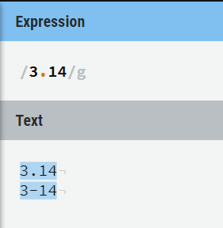

- "\ ."代表转义，此时两个字符代表一个字符 

  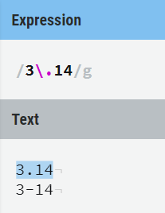

###### 匹配字母和数字

- "\w"用来匹配阿拉伯数字、英文大小写字母和下划线（w是小写的）

  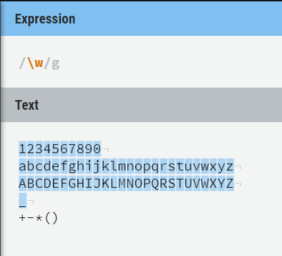

- “\W”匹配被“\w”排除在外的字符（\w的补集）

  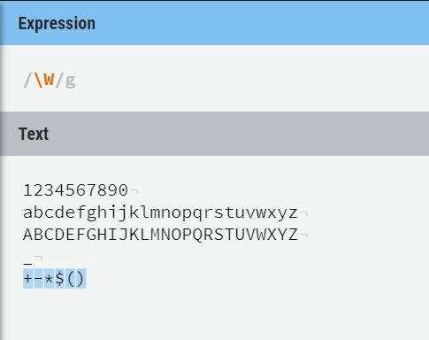

###### 匹配数字

- "\d"匹配阿拉伯数字

  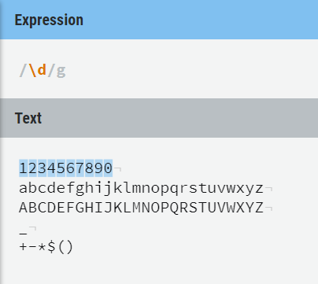

- "\d\\.\d"匹配小数

  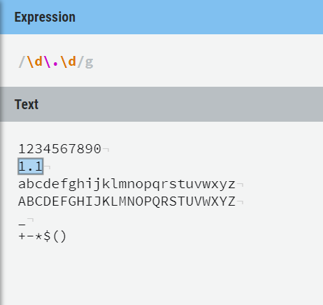

- "\D"匹配非阿拉伯数字（\d的补集）

  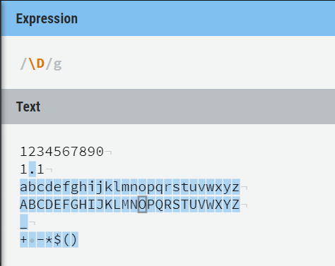

###### 匹配空白字符

- "\s"匹配空白字符：空格、制表符、断行等

  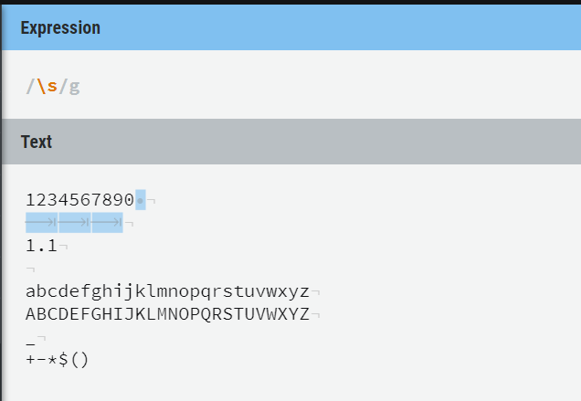

- "\S"匹配被"\s"排除在外的字符（\s的补集）

  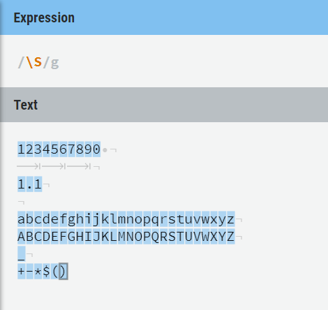

###### 字符集合

- [选择范围]匹配括号中的任意一个字符

  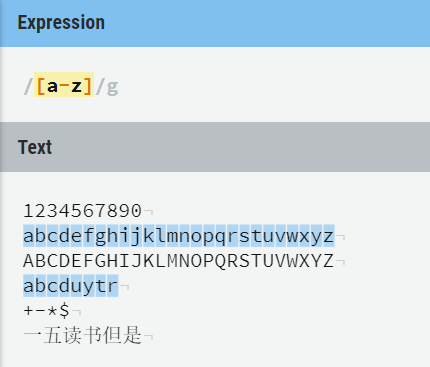

- Unicode   万国码，用数字代表文字的一项标准

- [[\u4e00-\u9fa5]]匹配所有中文,共20901个，包括从“一”到“龥”

  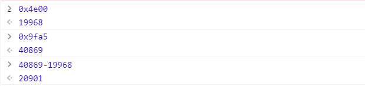

- [可以查看匹配的字符串](http://graphemica.com/)


###### 重复一次或多次

- [范围]+    
- 
- 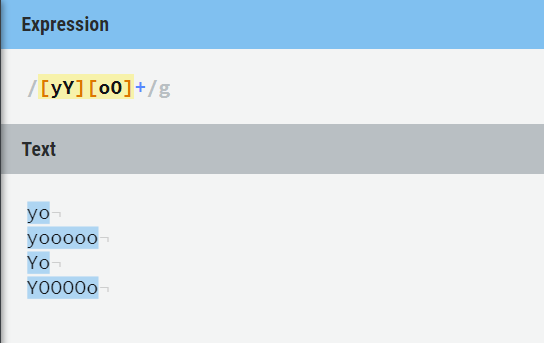

###### 重复零个或多个

- [范围]*
- 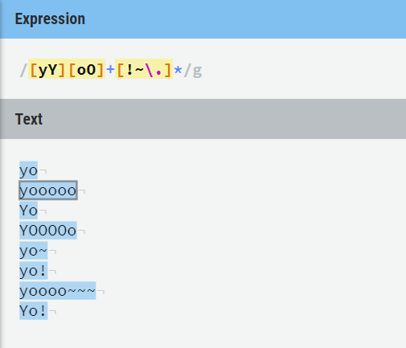

###### 重复零个或一个

- [范围]？  出现零次或一次

  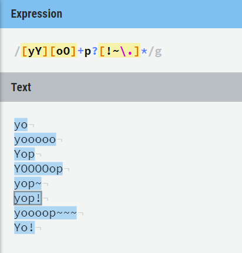

###### 指定重复范围

- {a,b}  重复a次至b次

  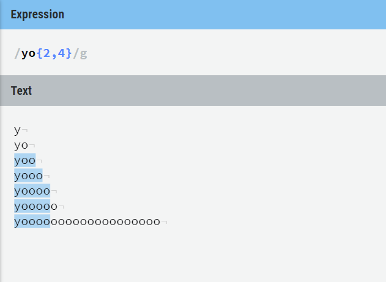

- 在{a,b}后边加上“\b”边界符，形成边界

  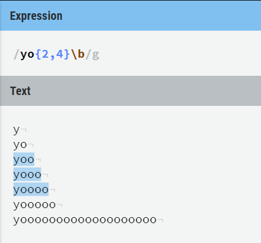

- 精确地匹配一段字符

  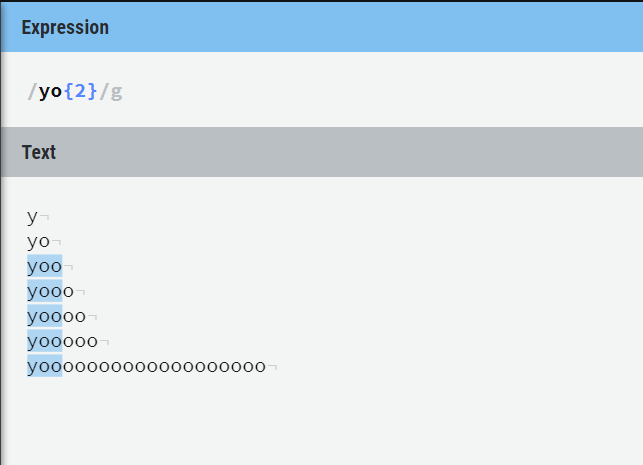

- 至少选中多少次

  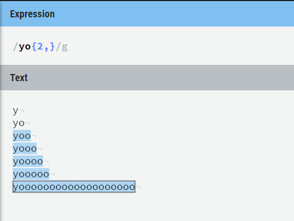

###### 分组匹配

- 每一个(.+)代表一组


