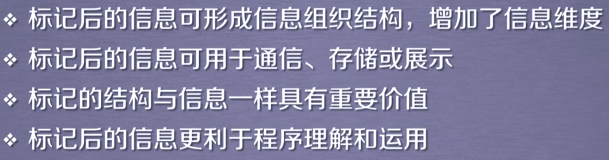

# Python网络爬虫与信息提取

##### 第二周：

###### 内容导学：

Beautiful:解析HTML页面信息标记与提取方法

Project：实例1一中国大学排名爬虫

###### 0 BeautifulSoup库的安装

- 打开cmd，输入pip install beautifulsoup4

- Beautiful Soup 库的安装小则：

  - 演示HTML页面地址：https://python123.io/ws/demo.html

  - 

  - 页面源代码：HTML5.0格式代码

    ```
    <html><head><title>This is a python demo page</title></head>
    <body>
    <p class="title"><b>The demo python introduces several python courses.</b></p>
    <p class="course">Python is a wonderful general-purpose programming language. You can learn Python from novice to professional by tracking the following courses:
    <a href="http://www.icourse163.org/course/BIT-268001" class="py1" id="link1">Basic Python</a> and <a href="http://www.icourse163.org/course/BIT-1001870001" class="py2" id="link2">Advanced Python</a>.</p>
    </body></html>
    ```

  - 使用爬虫获取：

    ```
    import requests
    from bs4 import BeautifulSoup
    
    r = requests.get('https://python123.io/ws/demo.html')
    demo = r.text
    soup = BeautifulSoup(demo, "html.parser")
    print(soup.prettify())
    ```

  - 如何使用Beautiful Soup？

    ```
    from bs4 import BeautifulSoup
    soup = BeautifulSoup('<p>data</p>', "html.parser")
    ```

###### 1  Beautiful Soup库的基本元素

- Beautiful Soup库的理解

  - Beautiful Soup库是解析、遍历、维护“标签树”的功能库
  - 
  -  

- Beautiful Soup库的引用

  - Beautiful Soup库，也叫作beautifulsoup4或者bs4
    - `from bs4 import BeautifulSoup`
    - `import bs4`

- Beautiful Soup类

  - HTML文档    标签树     BeautifulSoup类   等价

  - 

  - ```
    from bs4 import BeautifulSoup
    soup = BeautifulSoup('<html>data</html>', "html.parser")
    soup = BeautifulSoup(open("D://demo.html"), "html.parser")
    ```

- Beautiful Soup库解析器

  

- Beautiful Soup类的基本元素

  

- 标签方法

  ```
  >>> import requests
  >>> from bs4 import BeautifulSoup
  >>> r = requests.get('https://python123.io/ws/demo.html')
  >>> demo = r.text
  >>> soup = BeautifulSoup(demo,"html.parser")
  >>> soup.title
  <title>This is a python demo page</title>
  >>> tag = soup.a
  >>> tag
  <a class="py1" href="http://www.icourse163.org/course/BIT-268001" id="link1">Basic Python</a>
  >>> soup.a.name
  'a'
  >>> soup.a.parent.name
  'p'
  >>> soup.a.parent.parent.name
  'body'
  
  
  >>> tag = soup.a
  >>> tag.attrs
  {'href': 'http://www.icourse163.org/course/BIT-268001', 'class': ['py1'], 'id': 'link1'}
  >>> tag.attrs['class']
  ['py1']
  >>> tag.attrs['href']
  'http://www.icourse163.org/course/BIT-268001'
  >>> type(tag.attrs)
  <class 'dict'>
  >>> type(tag)
  <class 'bs4.element.Tag'>
  
  
  >>> soup.a
  <a class="py1" href="http://www.icourse163.org/course/BIT-268001" id="link1">Basic Python</a>
  >>> soup.a.string
  'Basic Python'
  >>> soup.p
  <p class="title"><b>The demo python introduces several python courses.</b></p>
  >>> soup.p.string
  'The demo python introduces several python courses.'
  >>> type(soup.p.string)
  <class 'bs4.element.NavigableString'>
  
  
  >>> newsoup = BeautifulSoup('<b><!--This is a comment--></b><p>This is a comment</p>',"html.parser")
  >>> newsoup.b.string
  'This is a comment'
  >>> type(newsoup.b.string)
  <class 'bs4.element.Comment'>
  >>> newsoup.p.string
  'This is a comment'
  >>> type(newsoup.p.string)
  <class 'bs4.element.NavigableString'>
  ```

###### 2 基于bs4库的HTML内容遍历方法

- 回顾demo.html

  

- HTML基本格式

  

  

- 三种遍历方法

  

  - 标签树的下行遍历

    

    ```
    >>> soup.head
    <head><title>This is a python demo page</title></head>
    >>> soup.head.contents
    [<title>This is a python demo page</title>]
    >>> soup.body.contents
    ['\n', <p class="title"><b>The demo python introduces several python courses.</b></p>, '\n', <p class="course">Python is a wonderful general-purpose programming language. You can learn Python from novice to professional by tracking the following courses:
    
    <a class="py1" href="http://www.icourse163.org/course/BIT-268001" id="link1">Basic Python</a> and <a class="py2" href="http://www.icourse163.org/course/BIT-1001870001" id="link2">Advanced Python</a>.</p>, '\n']
    >>> len(soup.body.contents)
    5
    >>> soup.body.contents[1]
    <p class="title"><b>The demo python introduces several python courses.</b></p>
    ```

    - ```
      for child in soup.body.children:
      	print(child)                     # 遍历儿子节点
      ```

    - ```
      for child in soup.body.descendants:
      	print(child)                     # 遍历子孙节点
      ```

  - 标签树的上行遍历

    

    

    ```
    >>> soup.title.parent
    <head><title>This is a python demo page</title></head>
    >>> soup.html.parent
    <html><head><title>This is a python demo page</title></head>
    <body>
    <p class="title"><b>The demo python introduces several python courses.</b></p>
    <p class="course">Python is a wonderful general-purpose programming language. You can learn Python from novice to professional by tracking the following courses:
    
    <a class="py1" href="http://www.icourse163.org/course/BIT-268001" id="link1">Basic Python</a> and <a class="py2" href="http://www.icourse163.org/course/BIT-1001870001" id="link2">Advanced Python</a>.</p>
    </body></html>
    >>> soup.parent
    >>> 
    ```

    - 打印所有a标签先辈

      

  - 标签树的平行遍历

    

    ```
    >>> import requests
    >>> from bs4 import BeautifulSoup
    >>> r = requests.get('https://python123.io/ws/demo.html')
    >>> demo = r.text
    >>> soup = BeautifulSoup(demo, "html.parser")
    >>> soup.a.next_sibling
    ' and '
    >>> soup.a.next_sibling.next_sibling
    <a class="py2" href="http://www.icourse163.org/course/BIT-1001870001" id="link2">Advanced Python</a>
    >>> soup.a.previous_sibling
    'Python is a wonderful general-purpose programming language. You can learn Python from novice to professional by tracking the following courses:\r\n'
    >>> soup.a.previous_sibling.previous_sibling
    >>> soup.a.parent
    <p class="course">Python is a wonderful general-purpose programming language. You can learn Python from novice to professional by tracking the following courses:
    
    <a class="py1" href="http://www.icourse163.org/course/BIT-268001" id="link1">Basic Python</a> and <a class="py2" href="http://www.icourse163.org/course/BIT-1001870001" id="link2">Advanced Python</a>.</p>
    ```

    

- 三种遍历总结


###### 3 基于bs4库的HTML格式化和编码

- 如何让<html>内容更加友好的显示

  

  - bs4库的prettify()方法

    ```
    >>> import requests
    >>> from bs4 import BeautifulSoup
    >>> r = requests.get('https://python123.io/ws/demo.html')
    >>> demo = r.text
    >>> soup = BeautifulSoup(demo, "html.parser")
    >>> soup.prettify()
    '<html>\n <head>\n  <title>\n   This is a python demo page\n  </title>\n </head>\n <body>\n  <p class="title">\n   <b>\n    The demo python introduces several python courses.\n   </b>\n  </p>\n  <p class="course">\n   Python is a wonderful general-purpose programming language. You can learn Python from novice to professional by tracking the following courses:\n   <a class="py1" href="http://www.icourse163.org/course/BIT-268001" id="link1">\n    Basic Python\n   </a>\n   and\n   <a class="py2" href="http://www.icourse163.org/course/BIT-1001870001" id="link2">\n    Advanced Python\n   </a>\n   .\n  </p>\n </body>\n</html>'
    >>> print(soup.prettify())
    <html>
     <head>
      <title>
       This is a python demo page
      </title>
     </head>
     <body>
      <p class="title">
       <b>
        The demo python introduces several python courses.
       </b>
      </p>
      <p class="course">
       Python is a wonderful general-purpose programming language. You can learn Python from novice to professional by tracking the following courses:
       <a class="py1" href="http://www.icourse163.org/course/BIT-268001" id="link1">
        Basic Python
       </a>
       and
       <a class="py2" href="http://www.icourse163.org/course/BIT-1001870001" id="link2">
        Advanced Python
       </a>
       .
      </p>
     </body>
    </html>
    ```

    ```
    >>> print(soup.a.prettify())
    <a class="py1" href="http://www.icourse163.org/course/BIT-268001" id="link1">
     Basic Python
    </a>
    ```

  - 中文

    ```
    >>> soup = BeautifulSoup("<p>中文</p>","html.parser")
    >>> soup.p.string
    '中文'
    >>> print(soup.p.prettify())
    <p>
     中文
    </p>
    ```

###### 单元小结

- Beautiful Soup库入门

  


###### 0 信息标记的三种形式

- 信息的标记

  

- HTML的信息标记

  HTML是www的信息组织形式。

  超文本：声音      图像       视频

  

- 信息标记的三种形式：XML   JSON    YAML

- XML    eXtensible Markup Language

  

  

  

- JSON   JavaScript Object Notatuion

  - 有类型的键值对key：value

    

  - 无论键还是值需要增加双引号表明是字符串形式，如果值不是字符串而是数字，直接写数字即可。这种形式反映在键值对上，说明它是有数据类型的键值对。

  - 值有多个信息

  - 键值对可以嵌套使用

  - 

- YAML  YAML Ain't  Markup Language

  - 无类型键值对key:value    

  - 通过缩进表示所属关系

  - -表达并列关系

    

  - | 表达整块数据    #  表示注释

    

  - 


###### 1 三种信息标记形式的比较

- XML

- JS

  

- YAML               

- 比较：

  


###### 2 信息提取的一般方法

- 

- 

- 

- 

- ```
  import requests
  from bs4 import BeautifulSoup
  
  r = requests.get('https://python123.io/ws/demo.html')
  demo = r.text
  soup = BeautifulSoup(demo, "html.parser")
  for link in soup.find_all('a'):
      print(link.get('href'))
  ```

  ```
  http://www.icourse163.org/course/BIT-268001
  http://www.icourse163.org/course/BIT-1001870001
  ```


###### 3 基于bs4库的HTML内容查找方法

- 回顾demo.html            
- 
- 查出所有的<a>标签

```
>>> import requests
>>> from bs4 import BeautifulSoup
>>> r = requests.get('https://python123.io/ws/demo.html')
>>> demo = r.text
>>> soup = BeautifulSoup(demo, "html.parser")
>>> soup.find_all('a')
[<a class="py1" href="http://www.icourse163.org/course/BIT-268001" id="link1">Basic Python</a>, <a class="py2" href="http://www.icourse163.org/course/BIT-1001870001" id="link2">Advanced Python</a>]
```

- 查找<a>标签和<b>标签，a,b以列表的形式出现

  ```
  >>> soup.find_all(['a','b'])
  [<b>The demo python introduces several python courses.</b>, <a class="py1" href="http://www.icourse163.org/course/BIT-268001" id="link1">Basic Python</a>, <a class="py2" href="http://www.icourse163.org/course/BIT-1001870001" id="link2">Advanced Python</a>]
  ```

- 当标签名称是True，会显示当前所有的soup标签信息

  ```
  >>> for tag in soup.find_all(True):
  	print(tag.name)
  
  	
  html
  head
  title
  body
  p
  b
  p
  a
  a
  ```

- 只显示其中以b开头的标签

  ```
  >>> import re
  >>> for tag in soup.find_all(re.compile('b')):
  	print(tag.name)
  
  	
  body
  b
  ```

- p标签中包含course字符串的信息

  

  ```
  >>> soup.find_all('p','course')
  [<p class="course">Python is a wonderful general-purpose programming language. You can learn Python from novice to professional by tracking the following courses:
  
  <a class="py1" href="http://www.icourse163.org/course/BIT-268001" id="link1">Basic Python</a> and <a class="py2" href="http://www.icourse163.org/course/BIT-1001870001" id="link2">Advanced Python</a>.</p>]
  ```

- 对属性做相关约定

  ```
  >>> soup.find_all(id='link1')
  [<a class="py1" href="http://www.icourse163.org/course/BIT-268001" id="link1">Basic Python</a>]
  >>> soup.find_all(id='link')
  []
  ```

- 如果想查找属性的部分信息，可以引入正则表达式

  ```
  >>> import re
  >>> soup.find_all(id=re.compile('link'))
  [<a class="py1" href="http://www.icourse163.org/course/BIT-268001" id="link1">Basic Python</a>, <a class="py2" href="http://www.icourse163.org/course/BIT-1001870001" id="link2">Advanced Python</a>]
  ```

- 

- recursive默认为Tue

  ```
  >>> soup.find_all('a',recursive=False)
  []
  ```

- 

- ```
  >>> soup
  <html><head><title>This is a python demo page</title></head>
  <body>
  <p class="title"><b>The demo python introduces several python courses.</b></p>
  <p class="course">Python is a wonderful general-purpose programming language. You can learn Python from novice to professional by tracking the following courses:
  
  <a class="py1" href="http://www.icourse163.org/course/BIT-268001" id="link1">Basic Python</a> and <a class="py2" href="http://www.icourse163.org/course/BIT-1001870001" id="link2">Advanced Python</a>.</p>
  </body></html>
  >>> soup.find_all(string = "Basic Python")
  ['Basic Python']
  >>> soup.find_all(string = re.compile("python"))
  ['This is a python demo page', 'The demo python introduces several python courses.']
  ```

- 简写

  - <tag>(..)等价于<tag>.find_all(..)
  - <soup>(..)等价于<soup>.find_all(..)

- 扩展方法

  


###### 单元小结

- 信息标记与提取方法

  - XML   <>..</>
  - JSON   有类型key:value
  - YAML   无类型key:value
  - 信息提取的一般方法              


###### 0 “中国大学排名定向爬虫”实例介绍

- 中国大学排名基本信息：

  [最好大学](http://www.zuihaodaxue.com/zuihaodaxuepaiming2018.html)

- 功能描述：

  

- 查看http://www.zuihaodaxue.com/zuihaodaxuepaiming2018.html的源代码

- 查看robots协议

- 程序结构设计

  

- 除了排名还包括其他的基本信息，是典型的二维结构

- 


###### 1 “中国大学排名定向爬虫”实例编写

- 先写出main()函数与基本框架

```
import requests
from bs4 import BeautifulSoup


def getHTMLText(url):
    return ""


def fillUnivList(ulist, html):
    pass


def printUnivList(ulist, num):
    print("Suc" + str(num))


def main():
    uinfo = []
    url = 'http://www.zuihaodaxue.com/zuihaodaxuepaiming2018.html'
    html = getHTMLText(url)
    fillUnivList(uinfo, html)
    printUnivList(uinfo, 20)
```

- 完善

  每一个<tr>标签代表一个大学，每个<tr>标签的儿子标签可能出现字符串类型，而这里所有的信息封装在<tr>标签中。<tr>标签是标签类型，过滤掉非标签类型的其他类型，此时需引入bs4,才能使用对应标签类型定义。（bs4.element.Tag）

- 可视化输出

  

  ```
  import requests
  from bs4 import BeautifulSoup
  import bs4
  
  
  def getHTMLText(url):
      try:
          r = requests.get(url, timeout=30)
          r.raise_for_status()
          r.encoding = r.apparent_encoding
          return r.text
      except:
          return ""
  
  
  def fillUnivList(ulist, html):
      soup = BeautifulSoup(html, "html.parser")
      for tr in soup.find('tbody').children:
          if isinstance(tr, bs4.element.Tag):
              tds = tr('td')
              ulist.append([tds[0].string, tds[1].string, tds[3].string])
  
  
  def printUnivList(ulist, num):
      print("{:^10}\t{:^6}\t{:^10}".format("排名", "学校", "总分"))
      for i in range(num):
          u = ulist[i]
          print("{:^10}\t{:^6}\t{:^10}".format(u[0], u[1], u[2]))
  
  
  def main():
      uinfo = []
      url = 'http://www.zuihaodaxue.cn/zuihaodaxuepaiming2018.html'
      html = getHTMLText(url)
      fillUnivList(uinfo, html)
      printUnivList(uinfo, 20)
  
  
  if __name__ == "__main__":
      main()
  
  ```


###### 2 “中国大学排名定向爬虫”实例优化

- 中文对齐问题的原因         

- 中文对齐问题的解决方案：

  采用中文字符的空格填充chr(12288)

- 修改printUnivList函数

  ```
  def printUnivList(ulist, num):
      tplt = "{0:^10}\t{1:{3}^10}\t{2:^10}"
      print(tplt.format("排名", "学校", "总分", chr(12288)))
      for i in range(num):
          u = ulist[i]
          print(tplt.format(u[0], u[1], u[2],chr(12288)))
  ```


###### 单元小结

- 实例一：中国大学排名定向爬虫

  

