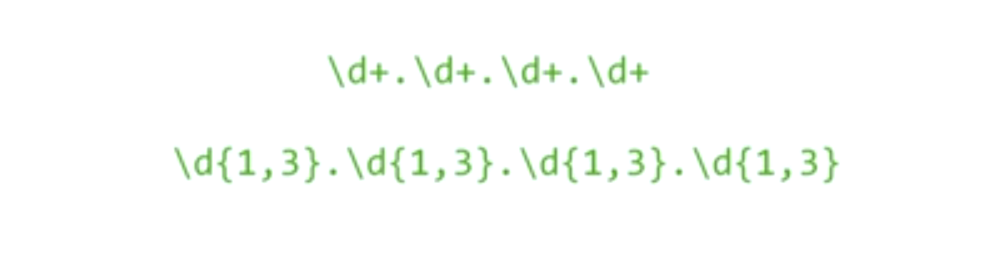
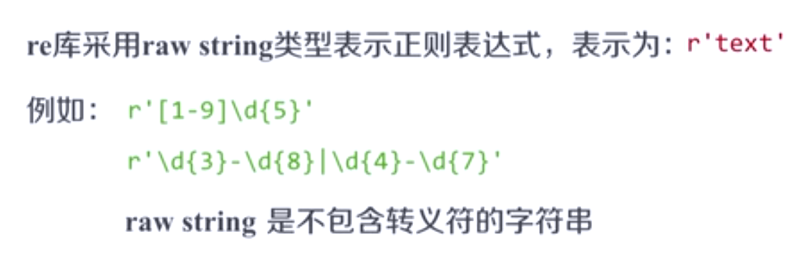
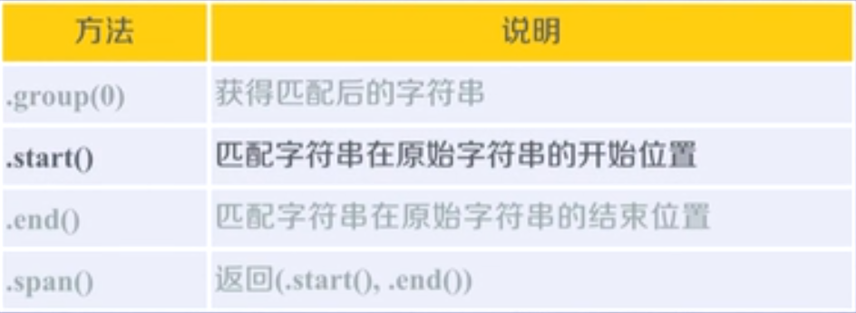

# Python网络爬虫与信息提取

###### 第三单元导学：

- Re : 正则表达式详解

​        提取页面关键信息

- 实例2-淘宝商品比价定向爬虫
- 实例3-股票数据定向爬虫

###### 0 正则表达式的概念

- 正则表达式

  - 正则表达式是用来简洁表达一组字符串的表达式      

  - 正则表达式优势：简洁     ‘一行胜千言’

  - 无穷多个以P开头，但后边只有一个或无穷多个Y的字符串组

  - 

  - 正则表达式

    

  - 正则表达式在文本处理中十分常用

    

    正则表达式主要应用在字符串匹配中

  - 正则表达式的使用

    编译：将符合正则表达式语法的字符串转换为正则表达式特征

    

    可以认为编译后的特征与一组字符串对应，而编译之前的正则表达式只是符合正则表达式语法的单一字符串，并不是真正意义上的正则表达式。

###### 1 正则表达式的语法

- 正则表达式的常用操作符             

  

- 正则表达式语法实例

  

- 经典正则表达式实例

  

- 匹配IP地址的正则表达式

  - IP地址字符串形式的正则表达式（IP地址分四段，每段0-255）

  - 不太精确地写：
  - 


###### 2 Re库的基本使用

- Re库介绍

  - Re库是Python的标准库，主要用于字符串匹配。
  - 调用方式：import re

- 正则表达式的表示类型

  - raw string类型（原生字符串类型）
  - string类型，更繁琐          
  - 当[正则表达式]包含<转义符>时，使用raw string

- Re库主要功能函数

  

  - re.search(pattern, string, flags=0) 

    

    ```
    >>> import re
    >>> match = re.search(r'[1-9]\d{5}', 'BIT 100081')
    >>> if match:
    	print(match.group(0))
    	
    100081
    ```

  - re.match(pattern, string, flags=0)        

    

    ```
    
    >>> import re
    >>> match = re.match(r'[1-9]\d{5}', 'BIT 100081')
    >>> if match:
    	print(match.group(0))
    
    	
    >>> 
    
    # 由于未匹配成功，所以match不存在，未打印
    
    >>> import re
    >>> match = re.match(r'[1-9]\d{5}', 'BIT 100081')
    >>> match.group(0)
    Traceback (most recent call last):
      File "<pyshell#16>", line 1, in <module>
        match.group(0)
    AttributeError: 'NoneType' object has no attribute 'group'
    >>> 
    
    # 如果希望对匹配结果进行使用时，一定要加if语句判断match语句是否为空，如果为空把这条排除掉
    
    
    >>> match = re.match(r'[1-9]\d{5}', '100081 BIT')
    >>> if match:
    	match.group(0)
    
    	
    '100081'
    
    ```

  - re.findall(pattern, string, flags = 0)

    

    ```
    >>> import re
    >>> ls = re.findall(r'[1-9]\d{5}', 'BIT100081  TSU100084')
    >>> ls
    ['100081', '100084']
    ```

  - re.split(pattern, string, maxsplit=0, flags = 0)

    

    ```
    >>> import re
    >>> re.split(r'[1-9]\d{5}', 'BIT100081  TSU100084')
    ['BIT', '  TSU', '']
    
    >>> re.split(r'[1-9]\d{5}', 'BIT100081  TSU100084', maxsplit=1)
    ['BIT', '  TSU100084']
    ```

  - re.finditer(pattern, string, flags = 0)            

    ```
    >>> import re
    >>> for m in re.finditer(r'[1-9]\d{5}', 'BIT100081  TSU100084'):
    	if m:
    		print(m.group(0))
    
    		
    100081
    100084
    ```

  - re.sub(pattern, repl,  string, count=0, flags = 0)   

    

    ```
    >>> import re
    >>> re.sub(r'[1-9]\d{5}', ':zipcode', 'BIT100081  TSU100084')
    'BIT:zipcode  TSU:zipcode'
    ```

- Re库的另一种等价用法

  

- 正则表达式对象

  

  字符串或者原生字符串并不是正则表达式，它只是一种表示。通过compile编译生成的一个对象regex才是正则表达式，它代表一组字符串。

- Re库的另一种等价用法

  


###### 3 Re库的Match对象

```
>>> import re
>>> match = re.search(r'[1-9]\d{5}', 'BIT 100081')
>>> if match:
	print(match.group(0))

	
100081
>>> type(match)
<class '_sre.SRE_Match'>
```

- Match对象的属性          

  

  ```
  >>> match.string
  'BIT 100081'
  >>> match.re                #在程序内部认为只有经过compile标识的才是正则表达式
  re.compile('[1-9]\\d{5}')
  >>> match.pos
  0
  >>> match.endpos
  10
  
  >>> match.group(0)
  '100081'
  >>> match.start()
  4
  >>> match.end()
  10
  >>> match.span()
  (4, 10)
  ```


###### Re库的贪婪匹配和最小匹配

- 实例：

  该实例中满足匹配条件的字符串有4个，结果返回哪一个呢？

- 贪婪匹配

  

- 最小匹配

  

- 最小匹配操作符

  

###### 单元小结


###### 0 “淘宝商品信息定向爬虫”实例介绍

- 功能描述：                

- 观察规律

- 定向爬虫可行性

  - http://www.taobao.com/robots.txt

    ```
    User-agent:  Baiduspider
    Allow:  /article
    Allow:  /oshtml
    Allow:  /ershou
    Allow: /$
    Disallow:  /product/
    Disallow:  /
    
    User-Agent:  Googlebot
    Allow:  /article
    Allow:  /oshtml
    Allow:  /product
    Allow:  /spu
    Allow:  /dianpu
    Allow:  /oversea
    Allow:  /list
    Allow:  /ershou
    Allow: /$
    Disallow:  /
    
    User-agent:  Bingbot
    Allow:  /article
    Allow:  /oshtml
    Allow:  /product
    Allow:  /spu
    Allow:  /dianpu
    Allow:  /oversea
    Allow:  /list
    Allow:  /ershou
    Allow: /$
    Disallow:  /
    
    User-Agent:  360Spider
    Allow:  /article
    Allow:  /oshtml
    Allow:  /ershou
    Disallow:  /
    
    User-Agent:  Yisouspider
    Allow:  /article
    Allow:  /oshtml
    Allow:  /ershou
    Disallow:  /
    
    User-Agent:  Sogouspider
    Allow:  /article
    Allow:  /oshtml
    Allow:  /product
    Allow:  /ershou
    Disallow:  /
    
    User-Agent:  Yahoo!  Slurp
    Allow:  /product
    Allow:  /spu
    Allow:  /dianpu
    Allow:  /oversea
    Allow:  /list
    Allow:  /ershou
    Allow: /$
    Disallow:  /
    
    User-Agent:  *
    Disallow:  /
    
    ```

- 程序的结构设计

  


###### 1 “淘宝商品信息定向爬虫”实例编写

- 函数的整体框架

```
import requests
import re


def getHtmlText(url):
    print("")


def parsePage(ilt, html):
    print("")


def printGoodsList(ilt):
    print("")


def main():
    goods = '书包'
    depth = 2
    start_url = 'https://s.taobao.com/search?q=' + goods
    infoList = []
    for i in range(depth):
        try:
            url = start_url + '&s=' + str(44*i)
            html = getHtmlText(url)
            parsePage(infoList, html)
        except:
            continue
    printGoodsList(infoList)
    
    
main()
```

- 全部代码：

  - ` tlt = re.findall(r'\"raw_title\"\:\".*?\"', html)`

    "*?"表示最小匹配,"raw_title"为键，“ ”作为值的键值对，最小匹配表明它只取得最后一个“ ”为止的那部分内容

  - price = eval(plt[i].split(':')[1])

    eval 表示去掉“ ” 

  - `depth = 2`

    只获取两个页面上的信息

```
import requests
import re


def getHtmlText(url):
    try:
        r = requests.get(url, timeout = 30)
        r.raise_for_status()
        r.encoding = r.apparent_encoding
        return r.text
    except:
        return ""


def parsePage(ilt, html):
    try:
        plt = re.findall(r'\"view_price\"\:\"[\d\.]*\"', html)
        tlt = re.findall(r'\"raw_title\"\:\".*?\"', html)
        for i in range(len(plt)):
            price = eval(plt[i].split(':')[1])
            title = eval(tlt[i].split[:][1])
            ilt.append([price, title])
    except:
        print("")


def printGoodsList(ilt):
    tplt = "{:4}\t{:8}\t{:16}"
    print(tplt.format("序号", "价格", "商品名称"))
    count = 0
    for g in ilt:
        count = count + 1
        print(tplt.format(count, g[0], g[1]))


def main():
    goods = '书包'
    depth = 2
    start_url = 'https://s.taobao.com/search?q=' + goods
    infoList = []
    for i in range(depth):
        try:
            url = start_url + '&s=' + str(44*i)
            html = getHtmlText(url)
            parsePage(infoList, html)
        except:
            continue
    printGoodsList(infoList)


main()
```

###### 单元小结


######  0 “股票数据定向爬虫”实例介绍

- 功能描述

  

- 候选数据网站的选择

  - 新浪股票：https://finance.sina.com.cn/stock/

  ​        百度股票：https://gupiao.baidu.com/stock

  - 选取原则：

    

  - 选取方法

    浏览F12，源代码查看等

  - 选取心态

    不要纠结于某个网站，多找信息源尝试

  - 相比而言，百度股票满足条件

- [东方财富网](http://quote.eastmoney.com/stocklist.html)

  列取所有上交所和深交所的股票信息

  ​    

  

- 程序的设计结构

  


###### 1 “股票数据定向爬虫”实例编写

- 全代码：

  ```
  import requests
  from bs4 import BeautifulSoup
  import traceback
  import re
  import bs4
  
  
  def getHtmlText(url):
      try:
          r = requests.get(url, timeout = 30)
          r.raise_for_status()
          r.encoding = r.apparent_encoding
          return r.text
      except:
          return ""
  
  
  def getStockList(lst, stockURL):
      html = getHtmlText(stockURL)
      soup = BeautifulSoup(html, 'html.parser')
      a = soup.find_all('a')
      for i in a:
          try:
              href = i.attrs['href']
              lst.append(re.findall(r'[s][hz]\d{6}', href)[0])
          except:
              continue
  
  
  def getStockInfo(lst, stockURL, fpath):
      for stock in lst:
          url = stockURL + stock + ".html"
          html = getHtmlText(url)
          try:
              if html == "":
                  continue
              infoDict = {}
              soup = BeautifulSoup(html, 'html.parser')
              stockInfo = soup.find('div', attrs={'class': 'stock-bets'})
              if isinstance(stockInfo, bs4.element.Tag):
                  name = stockInfo.find_all(attrs={'class': 'bets-name'})[0]
                  infoDict.update({'股票名称': name.text.split()[0]})
  
                  keyList = stockInfo.find_all('dt')
                  valueList = stockInfo.find_all('dd')
                  for i in range(len(keyList)):
                      key = keyList[i].text
                      val = valueList[i].text
                      infoDict[key] = val
  
                  with open(fpath, 'a', encoding='utf-8') as f:
                      f.write(str(infoDict) + '\n')
          except:
              traceback.print_exc()
              continue
  
  def main():
      stock_list_url = 'http://quote.eastmoney.com/stocklist.html'
      stock_info_url = 'https://gupiao.baidu.com/stock'
      output_file = 'E://BaiduStockInfo.txt'
      slist = []
      getStockList(slist, stock_list_url)
      getStockInfo(slist, stock_info_url, output_file)
  
  
  main()
  ```


###### 2 “股票数据定向爬虫”实例优化

- 速度提高：编码识别的优化

  

  - r.apparent_encoding将获得的html文本内容进行分析，有程序来判断其中的文本可能使用什么样的编码方式
  - r.encoding从html的头文件中解析它能有什么编码方式
  - r.apparent_encoding的获取其实需要很多时间，因此，定向爬虫尤其固定网站可用手工的方式先获取编码类型，然后直接将编码类型赋值给encoding。
  - 将`def getHTMLText(url):`改为`def getHTMLText(url,code='utf-8'):`
  - 将`r.encoding =r.apparent`改为`r.encoding =code`
  - 将` html = getHtmlText(stockURL)`改为`html = getHTMLText(stockURL,'GB2312')`

- 体验提高：增加动态进度显示

  

- 优化后全代码：

  ```
  import requests
  from bs4 import BeautifulSoup
  import re
  import traceback
  import bs4   #注意点1：引入模块
  
  
  def getHTMLText(url,code='utf-8'):
      try:
          r = requests.get(url)
          r.raise_for_status()
          r.encoding = code
          return r.text
      except:
          return ""
  
  
  def getStockList(lst,stockURL):
      html = getHTMLText(stockURL,'GB2312')
      soup = BeautifulSoup(html,'html.parser')
      a = soup.find_all('a')
      for i in a:
          try:
              href = i.attrs['href']
              lst.append(re.findall(r"[s][hz]\d{6}",href)[0])
          except:
              continue
  
  
  def getStockInfo(lst,stockURL,fpath):
      count = 0
      for stock in lst:
          url = stockURL + stock + ".html"
          html = getHTMLText(url)
          try:
              if html == "":
                  continue
              infoDict = {}
              soup = BeautifulSoup(html,'html.parser')
              stockInfo = soup.find('div',attrs={'class':'stock-bets'})
              if isinstance(stockInfo,bs4.element.Tag):   # 注意点2：增加一个if判断语句以及后续代码的缩进
                  name = stockInfo.find_all(attrs={'class':'bets-name'})[0]
                  infoDict.update({'股票名称': name.text.split()[0]})
                  keyList = stockInfo.find_all('dt')
                  valueList = stockInfo.find_all('dd')
                  for i in range(len(keyList)):
                      key = keyList[i].text
                      val = valueList[i].text
                      infoDict[key] = val
                  with open(fpath,'a',encoding='utf-8') as f:
                      f.write(str(infoDict) + '\n')
                      count = count + 1
                      print("\r当前进度:{:.2f}%".format(count * 100 / len(lst)),end="")
          except:
              count = count + 1
              print("\r当前进度:{:.2f}%".format(count * 100 / len(lst)), end="")
              traceback.print_exc()
              continue
  
  
  def main():
      stock_list_url = 'http://quote.eastmoney.com/stocklist.html'
      stock_info_url = 'https://gupiao.baidu.com/stock/'
      output_file = 'D://BaiduStockInfo.txt'
      slist = []
      getStockList(slist,stock_list_url)
      getStockInfo(slist,stock_info_url,output_file)
  main()
  ```

  - 如果不引入`import bs4 `,并添加` if isinstance(stockInfo,bs4.element.Tag):`,会出现以下错误：

    ```
    name = stockInfo.find_all(attrs={'class':'bets-name'})[0]
    AttributeError: 'NoneType' object has no attribute 'find_all'
    ```

    - 错误提示分析：属性错误，'NoneType' 对象没有属性 'find_all' 。

    - 错误提示出现的原因：因为上一行代码：`stockInfo = soup.find('div', attrs={'class' : 'stock-bets'}) `中获取的数据类型中有空类型'NoneType’ ，通过` print(type(stockInfo)) `可以输出变量stockInfo的类型，发现输出了<class 'bs4.element.Tag'>和<class 'NoneType'>这两种类型。所以出现错误提示的原因是<class 'NoneType'>

    - 解决办法：

      办法是过滤掉<class 'NoneType'>这种类型，因为这个空类型是错误的根本。

      在`stockInfo = soup.find('div', attrs={'class' : 'stock-bets'})`代码下面增加一个if 判断， 用isinstance()函数将空类型过滤掉。

      即：`if isinstance(stockInfo,bs4.element.Tag):`

      然后缩进后续相关的代码，注意在使用isinstance()时，参数2：bs4.element.Tag是参数1：stockInfo要匹配的类型。在使用参数2时要在开头引入bs4模块，即import bs4


###### 单元小结

实例3：股票数据定向爬虫

- 采用requests-bs4-re路线实现了股票信息爬取和存储

- 实现了展示爬取进程的动态滚动条


