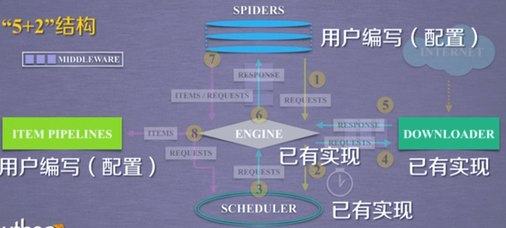
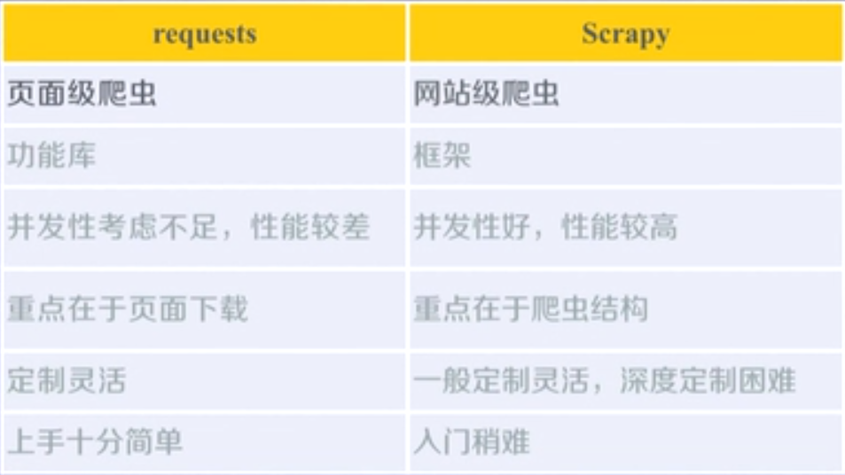
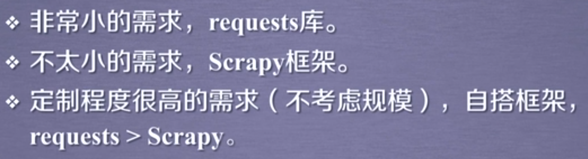
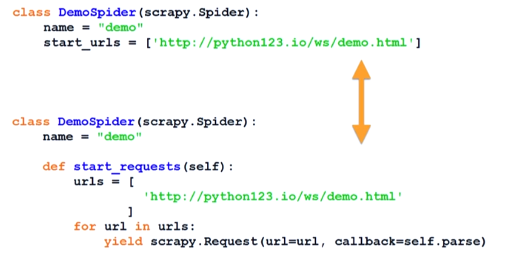

# Python网络爬虫与信息提取

###### 第四周

- Scrapy

  - 专业爬虫介绍

  - 爬虫框架的基本使用


###### 0 Scrapy爬虫框架介绍

- Scrapy不是一个函数功能库，而是一个爬虫框架

- 爬虫框架

  

- Scrapy爬虫框架结构

  

  

  - Scrapy的第一条路径

    SPIDERS通过ENGINE到达SCHEDULER，ENGINE从SPIDERS的地方获得爬取用户的请求，对这种请求叫request，可以简单地把钱能够求理解为一个url。请求通过SPIDERS到达ENGINE之后，ENGINE将这个爬取请求转发给SCHEDULER，通过名字可以理解到SCHEDULER对爬取请求进行调度。

  - Scrapy的第二条路径

    SCHEDULER通过ENGINE模块到达DOWNLOADER模块，并最终返回到SPIDERS模块。ENGINE从SCHEDULER获取下一个要爬取的网络请求，此时的网络请求是真实的，要去网络上爬取的请求。ENGINE获得这样的请求后通过中间件发送给DOWNLOADER模块，DOWNLOADER模块拿到这样的请求后真实地连接到互联网并爬取相关网页。爬取到网页之后，DOWNLOADER模块将爬取的内容形成一个对象response。将所有内容封装成一个response之后通过中间件发送给SPIDERS，这条路径中，一个真实的，爬取url的请求经SCHEDULER，DOWNLOADER最终返回相关内容到达SPIDERS。

  - Scrapy的第三条路径

    SPIDERS通过ENGINE到达ITEM PIPELINES和SCHEDULER。

    SPIDERS处理从DOWNLOADER获取的响应，也就是从网络中爬取的相关内容，处理之后产生两个数据类型。一个数据类型叫爬取项，也称为ITEMS，另一个数据类型是新的爬取请求。也就是我们从网络上获取一个网页之后，如果这个网页中有其他链接也是我们十分感兴趣的，可以在s中增加相关的功能对新的链接发起再次的爬取，SPIDERS生成这两个数据类型之后发送给ENGINE，ENGINE收到两类数据类型之后，将其中的ITEMS发送给ITEM PIPELINES，将其中的REQUESTS发送给SCHEDULER。

  - 一共有三条数据路径。ENGINE控制各个模块的数据流，并且不断从SPIDERS获得真实的要爬取的请求，并把请求发送给DOWNLOADER。入口是SPIDERS，出口是ITEM PIPELINES。

###### 1 Scrapy爬虫框架解析

- 

- 由sc发送请求，e到达d，如果用户希望对请求做一定的配置，需要Downloader Middleware

  - Downloader Middleware

    

- 

  - Spider Middleware

    

###### 2 requests库和Scrapy爬虫的比较

- requests vs. Scrapy

  相同点：

  

  不同点：

  

- 选用哪个技术路线开发爬虫呢？

  

  - 如果希望持续地、不间断地、周期性地爬取网站信息，并对数据信息进行积累形成自己的爬取库，建议Scrapy。
  - 如果希望有自己的爬取框架，希望能满足自身的更高的业务需求，建议requests。

###### 3 Scrapy爬虫的常用命令

- Scrapy命令行

  Scrapy是持续运行设计的专业爬虫框架，提供操作的Scrapy命令行

  在cmd中输入`scrapy -h`可以查看Scrapy命令

  ```
  C:\Users\Liying>scrapy -h
  Scrapy 1.5.1 - no active project
  
  Usage:
    scrapy <command> [options] [args]
  
  Available commands:
    bench         Run quick benchmark test
    fetch         Fetch a URL using the Scrapy downloader
    genspider     Generate new spider using pre-defined templates
    runspider     Run a self-contained spider (without creating a project)
    settings      Get settings values
    shell         Interactive scraping console
    startproject  Create new project
    version       Print Scrapy version
    view          Open URL in browser, as seen by Scrapy
  
    [ more ]      More commands available when run from project directory
  
  Use "scrapy <command> -h" to see more info about a command
  ```

- Scrapy命令行格式

  

- Scrapy常用命令

  

  

- Scrapy爬虫的命令行逻辑

  

###### 单元小结


###### 0 Scrapy爬虫的第一个实例

- 演示HTML地址

  - 演示HTML页面地址：http://python123.io/ws/demo.html
  - 文件名称：demo.html

- 产生步骤

  

  - 步骤一：建立一个Scrapy爬虫工程

    - 建立一个名为pycode的文件夹
    - 在cmd中cd pycode
    - 在pycode文件夹下输入scrapy startproject python123demo

    

    

  - 步骤二：在工程中生成一个Scrapy爬虫

    ```
    D:\pycode>cd python123demo
    D:\pycode\python123demo>scrapy genspider demo python123.io
    ```

    - spiders文件夹下生成一个新文件demo.py

      ```
      # -*- coding: utf-8 -*-
      import scrapy
      
      
      class DemoSpider(scrapy.Spider):         # 继承于scrapy.Spider的一个子类
          name = 'demo'                        # 当前爬虫的名字叫demo 
          # 最开始用户提交给命令行的域名，爬虫在爬取网站的时候只能爬取这个域名以下的相关链接
          allowed_domains = ['python123.io'] 
          # start_urls后面以列表的形式包含一个或多个url，就是spider所要爬取页面的初始页面
          start_urls = ['http://python123.io/']
          # 解析页面的空的方法包含在类中
          def parse(self, response):
              pass
      ```

      parse()用于处理响应，解析内容形成字典，发现新的url爬取请求。

  - 步骤三：配置产生的spider爬虫

    ```
    # -*- coding: utf-8 -*-
    import scrapy
    
    
    class DemoSpider(scrapy.Spider):
        name = 'demo'
        # allowed_domains = ['python123.io']
        start_urls = ['http://python123.io/ws/demo.html']
    
        def parse(self, response):
            # 从响应的url中提取文件名字作为我们保存为本地的名字
            fname = response.url.split("/")[-1]
            # 我们将返回的内容保存为文件
            with open(fname, 'wb') as f:
                f.write(response.body)
            # 爬取网页，并将网页保存在一个html页面中
            self.log('Saved file %s.' % fname)
    ```

    - 在cmd执行 scrapy  crawl demo

      - 执行后出现错误：ModuleNotFoundError: No module named 'win32api'

        解决方法： pip install pypiwin32

    执行之后会生成demo.html文件

  - demo.py代码的完整版本

    

  - demo.py两个等价版本的区别

    

  - 步骤四：运行代码，产生网页

###### 1 yield关键字的使用

- yield关键字

  

- 实例

  

- 为什么要有生成器？

  

  

  - 第一个函数当n=1M时，它要把1M的所有值全部列出来并存在列表中。对一个程序来讲，存储很多个值会占用很大的存储空间，速度变慢，这样计算资源的消耗得不偿失。
  - 生成器每调用一次产生一个值，这个值返回之后当再次被调用时，再产生第二个值。即n=1M，对生成器来讲，它需要使用的存储空间仍然是一个元素的存储空间。

- demo.py

  

  所有的其它url通过列表方式定义，通过for循环使用yield语句每次提交一个url请求，这是一个生成器写法。说明start_requests是一个生成器函数。对它的调用，每次返回一个url链接。当urls很多时，这种方法会带来非常有效的计算资源的占有。

###### 2 Scrapy爬虫的基本使用

- Scrapy爬虫的使用步骤

  

- Requests类

  - class scrapy.http.Request()
    - Request对象表示一个HTTP请求
    - 由Spider生成，由Downloader执行
    - 

- Response类

  - class scrapy.http.Response(）
    - Response对象表示一个HTTP响应
    - 由Downloader生成，由Spider处理
    - 

- Item类

  class scrapy.item.Item(）

  - Item对象表示一个从HTML页面中提取的信息内容
  - 由Spider生成，由Item Pipeline处理

- Scrapy爬虫提取信息的方法

  

- CSS Selector的基本使用

  

###### 单元小结

- Scrapy爬虫基本使用

  

######  0 “股票数据Scrapy爬虫”实例介绍

- 功能描述

  - 技术路线：scrapy
  - 目标：获取上交所和深交所所有股票的名称和交易信息
  - 输出：保存到文件中

- 数据网站的确定

  - 获取股票列表：

    东方财富网：http://quote.eastmoney.com/stocklist.html

  - 获取个股信息：

    - 百度股票：https://gupiao.baidu.com/stock
    - 单个股票：https://gupiao.baidu.com/stock/sz002439.html

###### 1 “股票数据Scrapy爬虫”实例编写


###### 2 配置并发连接选项

- settings.py

  

当CONCURRENT_REQUESTS_PER_IP为零时不发挥作用，实际上最后两个只有一个能发挥作用。可以在settings.py中修改参数对应的默认值，并且告诉scrapy框架。通过改变并发数量，来提高或降低爬取速度。

###### 单元小结


######  ”网络爬虫“未完待续...

- Scrapy爬虫的地位

  

- Scrapy功能和特点

  - 持续爬取
  - 商业服务
  - 高可靠性

- Scrapy爬虫的应用展望

  

  

- "MOOC进阶课程"


###### 网络爬虫课程回顾和总结

- 两条技术路线：
  - requests-bs4-re
  - scrapy(5+2结构)

- 本课程实例

  

- 技术路线展望

  