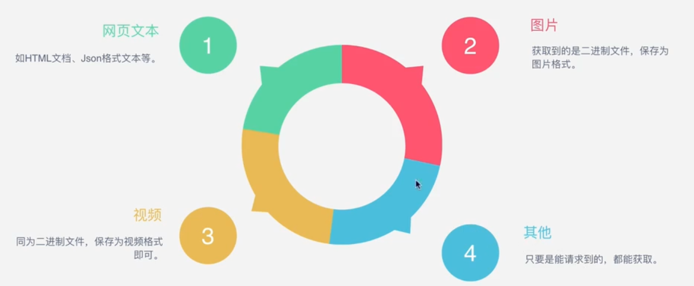

# 基础篇

##### 一、爬虫基本原理讲解

###### 1 什么是爬虫？

- **请求**网站并**提取**信息的**自动化**程序

- 爬虫的基本流程

  

###### 2 什么是Request和Response？


###### 3 Request中包括什么？


###### 4 Response中包括什么？


###### 5 能抓怎样的数据？



- 抓取图片：

  ```
  >>> import requests
  >>> response = requests.get("https://ss0.bdstatic.com/5aV1bjqh_Q23odCf/static/superman/img/logo_top_86d58ae1.png")
  >>> print(response.content)
  b'\x89PNG\r\n\x1a\n\x00\x00\x00\rIHDR\x00\x00\x00u\x00\x00\x00&\x08\x06\x00\x00\x00\xfa\x1e\xd4\xe5\x00\x00\x00\x19tEXtSoftware\x00Adobe ImageReadyq\xc9e<\x00\x00\x03hiTXtXML:com.adobe.xmp\x00\x00\x00\x00\x00<?xpacket begin="\xef\xbb\xbf" id="W5M0MpCehiHzreSzNTczkc9d"?> <x:xmpmeta xmlns:x="adobe:ns:meta/" x:xmptk="Adobe XMP Core 5.5-c014 79.151481, 2013/03/13-12:09:15        "> <rdf:RDF xmlns:rdf="http://www.w3.org/1999/02/22-rdf-syntax-ns#"> <rdf:Description rdf:about="" xmlns:xmpMM="http://ns.adobe.com/xap/1.0/mm/" xmlns:stRef="http://ns.adobe.com/xap/1.0/sType/ResourceRef#" xmlns:xmp="http://ns.adobe.com/xap/1.0/" xmpMM:OriginalDocumentID="xmp.did:CFFF06A83C2068118083F1D1FAF42DDB" xmpMM:DocumentID="xmp.did:E57B2566763711E5844AAC3E2C829398" xmpMM:InstanceID="xmp.iid:E57B2565763711E5844AAC3E2C829398" xmp:CreatorTool="Adobe Photoshop CS6 (Macintosh)"> <xmpMM:DerivedFrom stRef:instanceID="xmp.iid:CFFF06A83C2068118083F1D1FAF42DDB" stRef:documentID="xmp.did:CFFF06A83C2068118083F1D1FAF42DDB"/> </rdf:Description> </rdf:RDF> </x:xmpmeta> <?xpacket end="r"?>\x03\x08\x94\x8c\x00\x00\x07\x8cIDATx\xda\xec[\x0blTE\x14\x9d\xa5\x95\xd2\xf2i\xe5\'\x94\xa2R \x86h\x81\xf2\xff\x14\x03\x88\x10!\xc1O\xf8\xa8\x89V\x14E4\x08h0`\x90\x88\xd1D\xf1\x03\x92\x18\x8d\x18\x82?\xc4/\x88\x05T\xb0Z!\x11\x120F\x04T\n\x94V\x88R\xb1\x94\x8f\xe5#\xd4{\xdd3a:\xbc\x99\xf7\xde\xee\xebv\xb7\xd9\x9b\x9c\xec\xee\xbc\x99}\xfb\xde\x99\xb9\xf7\xdc\xfbfC\xb5\xb5\xb5"\x1e\xad[\xf6>\xbfCB\x84\x99\x84\xd9\x84\xd6\x84u\x84\x19\x84J\xcb\x98\x14B*\xe1\x8c\x9f\x13\x95\x1e\xee*\xe2\xd9\x9a\x88\xc6c\x0b\t\x8b\tW\x12Z\x10&\x13\x8a\xf1\xdei\x02<J8B\xa8&,\'d6\x96\x1b\xd1XH\xbd\x860\xcf\xa1\xfd:\xc2\xe3\x0e\xed\xaf\x12^\xc2\x8aN#L!|K\xc8H\x92\x1a?6\x05n\xd4\xc9\xee\xc7\xca\x94VH\x98\xee\xd0\xaf7\xe1\xd9$\xa9\xf1c\x05\x96c\x1d\x082\x08\xa6\x13\x16Y\xfaN3\xb8\xeb$\xa9\r`\xd9\x1e\x8f\x8f#\xb4\xb7\xf4c\xd2\xfb$I\x8d\x0f\xfb\xd7\xe5\xf89\xbc\xf6\xf4\xf0]iIR\xe3\xc3J=\x1e\xbf\xcc\xa5\xdfy\xc2\x8e$\xa9\xb1\xb5+\x08\xd7\x13:j\xed\x9b,c~Pr\xd5*\x97\xef\xff\x8e\xf0w\x92\xd4\xd8\xd9\x93\x84\xdf\t%x}K\x115\xcb-E\x86\x175\xd2L\xc6U\x98g\x92\xea7vv\x1f\xe1i%m\xe1\xdf}7a-\xda\x8e\x11\xee"\x9c\xd6\xc61\xf1\xab\x94\xcf[Q\x900\x91_\xdc\x18H\r%@\x99\x90\t,\'t2t\xe5\xca\xd0b\xa5\xd8\xc09(W\x876\x10Vb\x05\xaa\xc6\xc7^!\xdc\x0eQT\x89\xfct)\xfa\xe6\x10\xc6\x12\xb2\x08\xfc#\x8a\x84VF\x8c\xf72a"\x90:\xcc\xc5m\xb2\x08\xea\x1e\xc1)\x9a"F\x1f\x86@\x92\x85\x89e\x9a\xa0:D\xb8Y\x15P\xc9\xdao\xf46\xdc\x8d\x7f\xe4\x97~\xed,\xa1B!\x94=\xc1\xeb\x0e\n\xb9\x13\xdc|\xc2\x14%\x12\x81\xd4\xce\x1e\xfa\xb4\n\xe0<w\x10\x9aY\x8a\x17\x0f$\n\xa9\xa9\xe5iq\xcak\x9b\xbd\xf2\xddI\x0f\xbdO8\xb4\xb5%L%\x8c\xc2*;@x\x97\xb0\xde!\xce\xb2\xe5\xbb\x9c\x83]\xf0\xcb\xfc&n\xef\x99$5\x01&\xde6\x97\xe3\x9c\xde\xfc\xa3\xb5\x8d\x81Hj\xad\xb4\r\x848\xfa\x9a0\xc9!\x1fm\xe7r\x9e\xab\x1a\xf0\x1e\xb4\x12u\x1fB\x94@\xc9GMj\x1a\xdcSu=\xfdp\x8e]\x0b\xe4\x87\xe2\xa3\xdd\xc5\xc86{\xa7A}VZn\xfa\xc7\x0e\x84\xf2\x03\xf2\x14C\xff\x1b\xb0ZGj\x93\xa1\x99\xcb\xef\xbb\x10\xc5\xb5\xa5\x18B\x04\xa7`5\x96q-\x10\xe3Y\x91?\xa7\xb4sz\xf7\xabQ\xfd\x1el\x1a\xf2+\x7f\xd9\xd5}/\xc2\xcf$\xd7\x06Hj\x1e\xe1\'\xb5\x81H\x95\x8f\xcc\xee$\xbc\xe70\x86S\x9d~J\xe1\xa1#\xbe\xa3\xad\x87\xf3\xbd!\xc2Oe\xa4\xf1\xe4\x19g\xe9\xcf\x95\xa9\xbe4\xd9\x82L\x17\x98\xa8y\x86p\x10S\xa1\xd4\x920\x9a\xf0\x19\xf2\xbdX\xd8J\x08\x99\x03\xca\xc4z\x870X!\x94\'\xc0\n\x8f\x84\n\x08\x9f\tZjd\xb3\x1f\x13F(E9\xfe\x11\xb8\xbf\xcd1\xf8\xad\xab\x80\x96\x06a\xf4\x04&\x1b\xdb\x9f\x84\x9d"\xfcT\xc6\xf6\xa8\xedM\xc2.\xc2\x1e\xc2\xfb\xb8\x9e\x90\xa1\xef\xdb\xca{\x16o\xe7\x90\x16\x9dB\xdb1\xac8.Zt\xd5\xbc\xc9o\x96\x1c\xfb\x12\xef\x89\xd7,x!\xe9\xa6\xb7\x18\xc4`o\xe5\xfc\xdbM\xa46G\xfc\xcc\xc2\xfb\x0c\xc4\x83V\x10\x0b\xb3Dx\x1f\x90\xb4\t\x01\x91\xba[\x136~\x94\xeeC\xa2n\xdd\x96\xa5\xf3\x8dxosm\x99\x08!C!\xc8\xe6\xa1\xba\xa4\xc6cY\x13.\x91!\x81\xe3\xbd\xc5>\xd5H\xe5\xed4\x1f\xf8\xbc\x17|\x7f\x07)\xe3\x0e\xa3\x08\xa3\xdb\x08LL\x01B\'\x9bH\xe5\xc0\\%\xccO4\x0e\x12>Q>w\th%\x9eW\xcf9\xf2bJ\xe3f\x8f\x11^\x88\xa6x\x05E\xcc\xc2\xe9y\xc2\x87\x10S\x1d\xa1\x90\x8b\xb1\x92U\xe3\x89\xdd\xc1 &o\xd1\xda\x86Y\xd2\xa5\xb9\x86\xf6\xcd\xda\xc2\xe1<\xd9m{e?\xd9\'\xd5\x103\xab}\xa8@}{\xa5[\xd0?\r\xd1\xb1\x84\xf0\x91i,\xd4o\xc8\xf2=!\x900\'\x80\t\xc55\xe3\x8d \xf3\x802\xfbMv/\x84\x9d\x17{\xd8rln\xac*J\xe9."i\x96\xd6\xb6\xdd\xe799u\x18\x82\x15\xb1\xc4\xd6\xd1\xe2\xe6\xd2\xe1-\xe6h\x13Bz\x98\x13\x11\xdc\x8b^X\x959\xb6\xdf\xe3\xe2z\x83\xb2a\xd2\x95*\xee\xb7\xab\x03\xa6j<\xfc\xdf\x9ej\x10\x04\'\r+\xa3\x97\xa6.OC`Dj3\xe1\xfa>\xf71&\x13\xe9\x87\xdcl\xc6[Yx3\xd9R\x08$\'\xdb\x88sq\xa1\xe2\xb8\xd2\xbe\x0f\x95\xa2\nx\xa7\x9eH\xd7\xc6Bhy\xb1\x90\xcfk\xf6\x92\xbe\x94k\xee\x97\xafq\xbfC\xbf!\x1a\x17\xfbM\xeew\x90\xc7\x1fw\x0eiA\xb9\x8f\x8bl\x87\xf8W\xa8\xb4-\xf0Aj\n\xd4v\x81r\x83&\x12\xd6\xb8\x8c\xabt\x88\x8b\x02\xc5\x87]Z[\x0eb\xdaxa\x7f:\x14K\xcb\x11\xce;2Zh\xc4G\x9d\xd2\xfcL\xf8\xc2\xe7\x98Jx\x02\x95\xd4\xf6>\xc6\xb3\xca\x1d\xa5|^\xa6\x10\x9a\x87\xf2\x1f\x0b\xbd2\x11~\xe2\xe2f\xcd-\xde`5\xd2\x85\x8a8 \x95\xc3\xe4\xe5\x96\xe3<9\x17\x07Aj>d\xfe@\x9f1lg\x84\xe7K\x11\x97\xee\xc2\x97\xc4q\x89q\xab\xb8\xb8\xc3~\x8bGRm\xd7\xdf\x1a\xe9\xc8\x8c\x00\xdc\xa9_\xe3\x10wD\xc9S\xbd\xa4y\xbcRs\x99`\xa7\x8b\x9ad\xf0\xdf2\x7f\xe2<\xae\x07>\xf7@J\xf1\x94\xd2\xa7\x001n\x800\xd7_#\xb1~\xe2\xd2\rg\x15\x8a\xb0\x88\xe4/\x13-]\x8e\x17B\x18\x9e\x8f\xf1\xca\xe4\xda\xee\xf4\x08\xc7\xaes"u\x9bC\x9c\x94\xb6\x03\xe9H\x99\xd26Y!\x95s\xd6/E\xfd\xfc\'%\xd7\xa2\xd4k\x02T\xff:\xe9]\x84{\t1\x9e\xac\xb4\x89\xc7\x8a\x8dj\x87D\xdd\xcd\xd3\xb9ZR\x9e\xa1\xf9\xfa\xa0\xec\x94a\xf5\nL$\xafn\xfd+-v\xba\x99\xdb^\xe1\x90Ox1V\xf2\xfa\xb6\xd7\xad\xa8 q\xdar\xad\x08?\xdbU\xef\xc9~(\xf9Y\xa9\x1eo\x9e\xb4\xabExg_\xaa!.\r\xd0\xfa\xf7%\xfc\x12P\x1cr*1q\x9e\xfa\x8d\x08\xd7=\xfb#\xbe7\xc5g=lH\x1b\xe3\xf3\xbc\x7f4\xc0j\xe3{\xc6e\xce[\x11\xca\xba!+Y\x8f\xfc~\xb4\x12\x8ajP\x84Y$=\x96\xd3J=\x83\x9b\xee\x04\xae\xb6\xcc7\xc45\x9d,\x9e\x1cg\xa1\xda\xd2\x02\xba\xd02\xadm0R\x12&\xb73R\x90M\x0e\x05\x91\x02\xdc\x8c>\x11L\xa4*\xd1p\xb6\x1a\xb9\xf3|\xa4\x90\xe9\x88\xf3\x92\xd0"\xac\xda\x85j\x08\nb\xe7\x83\xfa\x9cs\rn\xb4L\x17\xf6\x05x\x81\xb5\x90\xed\xfa\xe3\xbel\xcc\xd2E.\xe3\'\x02~lU@\xc5\x04\xbf\x96\x07\x8f#s\xd4\xfe\x860\x90\x0f\x85\xce\xe9\xe5A\xa0<ZR\x8bE\xdd\xfftr\xd9o8\xe1\xa6z\x9a\xb9\xaf\x89\xf0\x03\xf3\x811X%\x95\x88m\xf5e6qW\xa4\x85\x0cu\x02\x15!\x0c\xe6!\x95{\xd0\xaf\xfa\xd3\xed\x02Jq,6\xee\x81\xdfW\xc5\xd0YTbf\xd7\x93bd\x17\xc4\xbb\x136x\xec_\r\x01\xc5\xaa\x9d\x1f\xed\x1d\xf78\xee(\xe16\xc2_\xf5D\xe8\x19\xe1\xef\x0f\xce\xac\x11V@\xa3\x8c\x87@\x9cn\x12\x87\xbc\x9d%\xae\xf5\xb9\xe5\x11\xdcPT\x97\xb25\x12\xcb\x10\x7fw\x1bDN7x\x93\x11\x98\xed9\x88\xfb\xac\x01\xf6`\xc2,u"4F\xc5\xfc\xa8\xed?\x01\x06\x00\xaf\xaa\xb6\xe53\xf2\xf0\x8d\x00\x00\x00\x00IEND\xaeB`\x82'
  >>> with open('F:\\1.png','wb') as f:
  ...     f.write(response.content)
  ...     f.close()
  ...
  2910
  >>>
  ```

###### 6 怎样解析？


###### 7 为什么我抓到的和浏览器看到的不一样

用request请求得到的结果就是后台拿到的第一个请求的preview源代码，后面加载了js，css。加载之后这些js会运行起来，把原始的html完全改变掉。

###### 8 怎样解决JavaScript渲染的问题？


Splash:https://github.com/scrapinghub/splash

###### 9 怎样保存数据？


##### 二、Urllib库详解

###### 1 什么是Urllib


- 相比Python2变化

  

- 详见jupyter notbook中的urllib库详解

##### 三、Requests库基本使用

###### 1 什么是Requests


- 安装

  pip3 install requests

##### 四、正则表达式


##### 五、BeautifulSoup


