# Python网络爬虫与信息提取

##### 第一周

- 要求：掌握定向网络数据爬取和网页解析的基本能力

- Requests:自动爬取HTML页面，自动网络请求提交
- robots.txt:网络爬虫排除标准
- projects：实战项目
- 本周分为三个单元：
  - Requests库入门
  - 网络爬虫的盗亦有道
  - Requests库爬取实例

###### 1.Requests库的安装

- 打开cmd，输入`pip install requests`

- 测试：打开python IDLE

  ```
  >>> import requests
  >>> r = requests.get("http://www.baidu.com")
  >>> r.status_code
  200
  >>> r.encoding = 'utf-8'
  >>> r.text
  ```

- requests的七个方法

  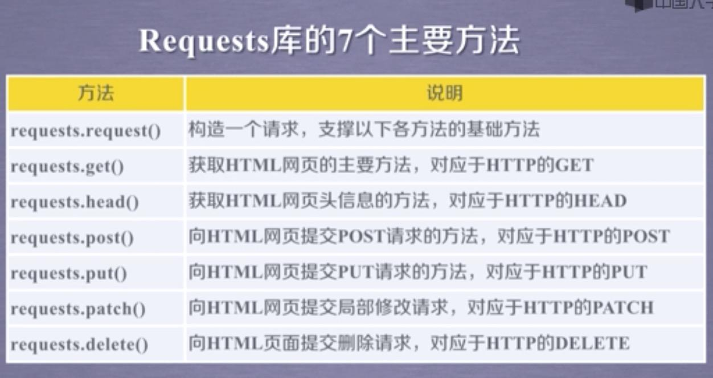

###### 2.requests.get()方法

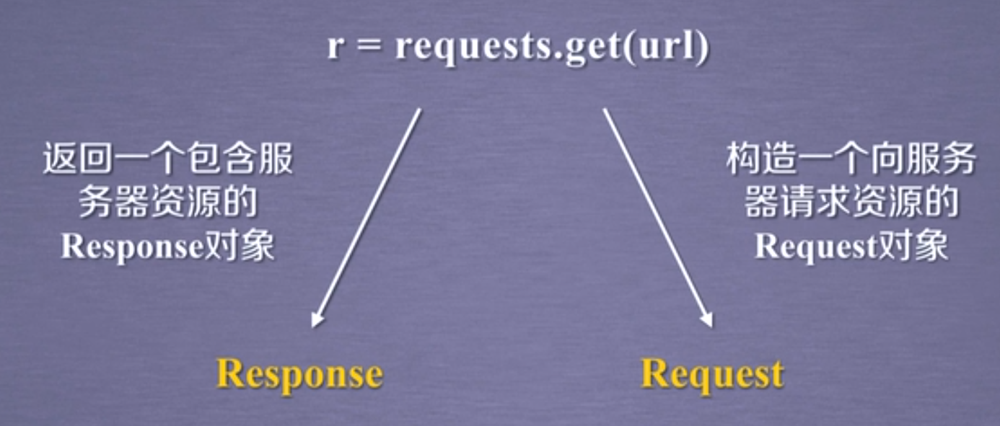

-  get方法是我们做为爬虫最常用的使用方法

- 注意：大小写敏感，对象是大写，方法是小写


  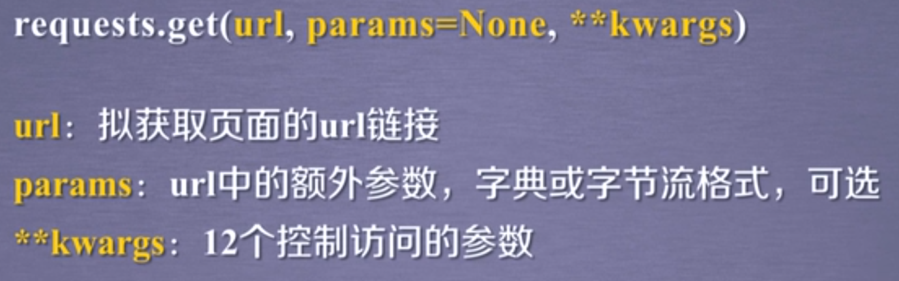

- 打开requests.get(url,params=None,**kwargs)库源代码

  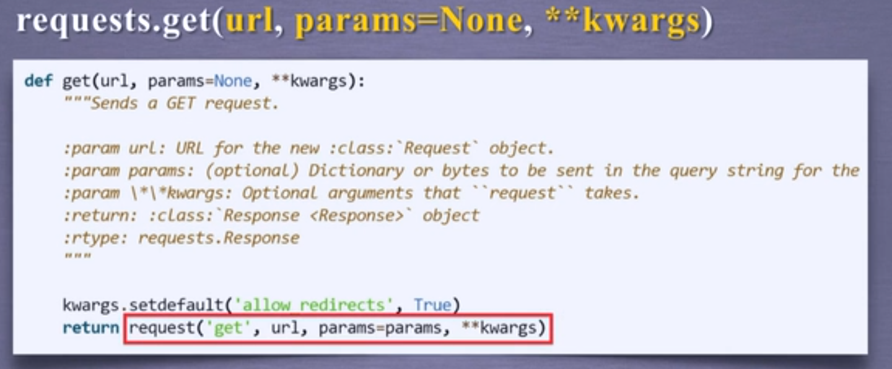

  requests库其实只有request一个方法，但是为了编写程序更方便，提供了其他六个方法

  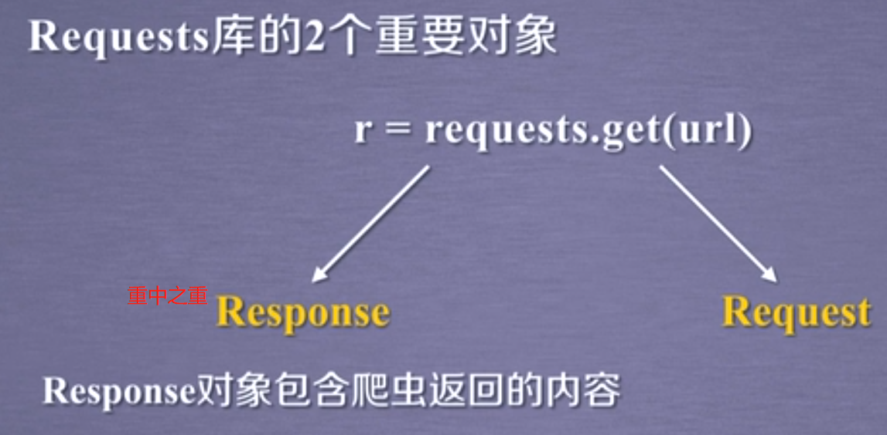

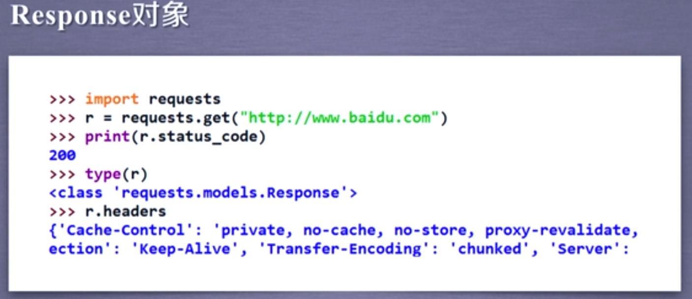

- header返回get请求获得页面的头部信息
- Response包含了服务器返回的所有信息，同时包含向服务器请求的Request信息。

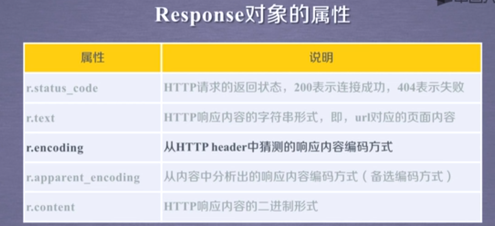

- Response对象属性的使用流程

  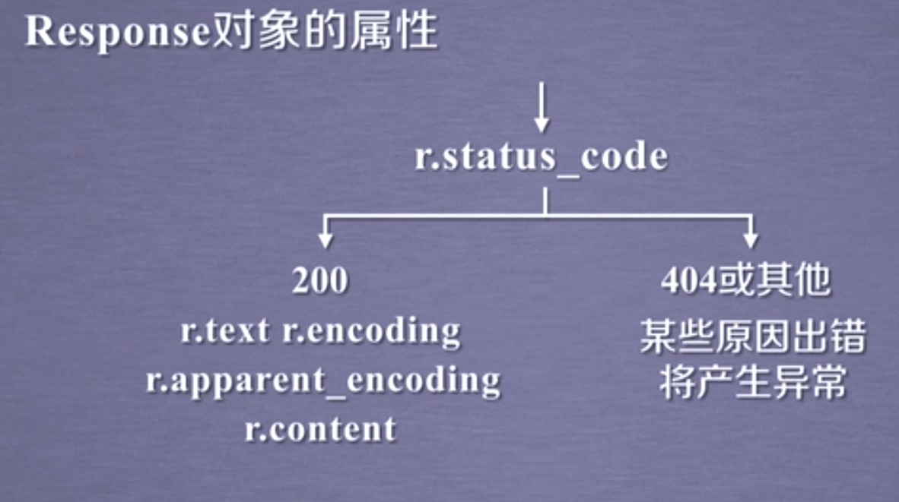

- 当r.encoding不能正常解码时，使用apparent_encoding

  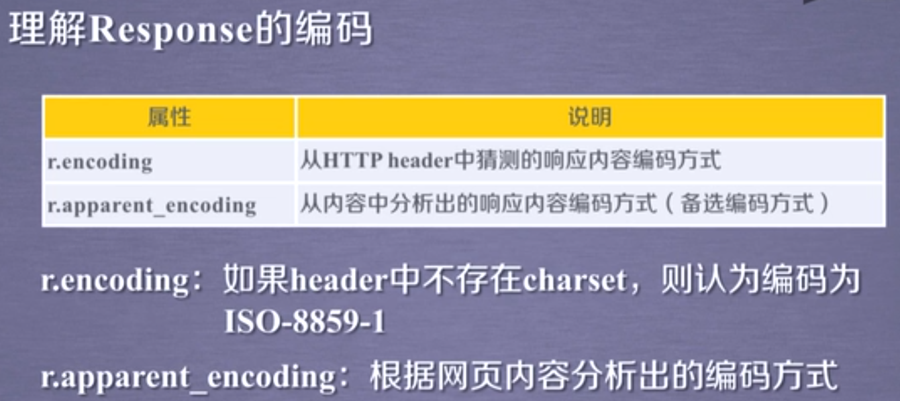

###### 3.爬取网页的通用代码框架

- 网络连接有风险，异常处理很重要
- 支持六种常用的连接异常

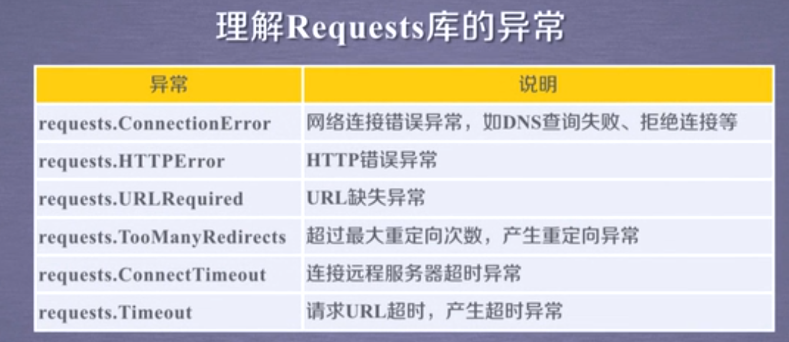

- 理解Requests库的异常

  

- 爬取网页的通用代码框架

  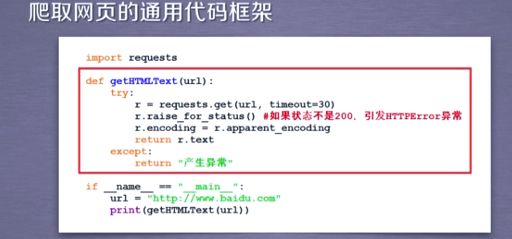

  - 第一种：

```
import requests

def getHTMLText(url):
    try:
        r = requests.get(url,timeout=30)
        r.raise_for_status()
        r.encoding = r.apparent_encoding
        return r.text
    except:
        return "产生异常"

if __name__ == "__main__":
    url = "http://www.baidu.com"
    print(getHTMLText(url))
```

返回：

```
<!DOCTYPE html>

<!--STATUS OK--><html> <head><meta http-equiv=content-type content=text/html;charset=utf-8><meta http-equiv=X-UA-Compatible content=IE=Edge><meta content=always name=referrer><link rel=stylesheet type=text/css href=http://s1.bdstatic.com/r/www/cache/bdorz/baidu.min.css><title>百度一下，你就知道</title></head> <body link=#0000cc> <div id=wrapper> <div id=head> <div class=head_wrapper> <div class=s_form> <div class=s_form_wrapper> <div id=lg>  </div> <form id=form name=f action=//www.baidu.com/s class=fm> <input type=hidden name=bdorz_come value=1> <input type=hidden name=ie value=utf-8> <input type=hidden name=f value=8> <input type=hidden name=rsv_bp value=1> <input type=hidden name=rsv_idx value=1> <input type=hidden name=tn value=baidu><span class="bg s_ipt_wr"><input id=kw name=wd class=s_ipt value maxlength=255 autocomplete=off autofocus></span><span class="bg s_btn_wr"><input type=submit id=su value=百度一下 class="bg s_btn"></span> </form> </div> </div> <div id=u1> <a href=http://news.baidu.com name=tj_trnews class=mnav>新闻</a> <a href=http://www.hao123.com name=tj_trhao123 class=mnav>hao123</a> <a href=http://map.baidu.com name=tj_trmap class=mnav>地图</a> <a href=http://v.baidu.com name=tj_trvideo class=mnav>视频</a> <a href=http://tieba.baidu.com name=tj_trtieba class=mnav>贴吧</a> <noscript> <a href=http://www.baidu.com/bdorz/login.gif?login&amp;tpl=mn&amp;u=http%3A%2F%2Fwww.baidu.com%2f%3fbdorz_come%3d1 name=tj_login class=lb>登录</a> </noscript> <script>document.write('<a href="http://www.baidu.com/bdorz/login.gif?login&tpl=mn&u='+ encodeURIComponent(window.location.href+ (window.location.search === "" ? "?" : "&")+ "bdorz_come=1")+ '" name="tj_login" class="lb">登录</a>');</script> <a href=//www.baidu.com/more/ name=tj_briicon class=bri style="display: block;">更多产品</a> </div> </div> </div> <div id=ftCon> <div id=ftConw> <p id=lh> <a href=http://home.baidu.com>关于百度</a> <a href=http://ir.baidu.com>About Baidu</a> </p> <p id=cp>&copy;2017&nbsp;Baidu&nbsp;<a href=http://www.baidu.com/duty/>使用百度前必读</a>&nbsp; <a href=http://jianyi.baidu.com/ class=cp-feedback>意见反馈</a>&nbsp;京ICP证030173号&nbsp;  </p> </div> </div> </div> </body> </html>
```

- 第二种：

  ```
  import requests
  
  def getHTMLText(url):
      try:
          r = requests.get(url,timeout=30)
          r.raise_for_status()
          r.encoding = r.apparent_encoding
          return r.text
      except:
          return "产生异常"
  
  if __name__ == "__main__":
      url = "www.baidu.com"
      print(getHTMLText(url))
  ```

  返回：

  ```
  >>> 
  ==================== RESTART: D:/soft/python/python/1.py ====================
  产生异常
  ```

###### 4. HTTP协议及Request库方法

- Requests库的七个主要方法

  

- HTTP协议

  

- HTTP URL的理解

  URL是通过HTTP协议存取资源的Internet路径，一个URL对应一个数据资源。

- HTTP协议对资源的操作

  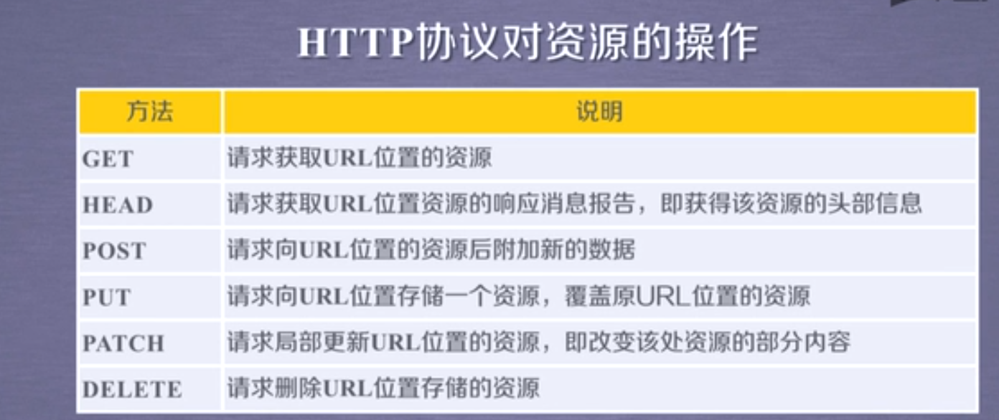

- HTTP协议对资源的操作

  

- 理解patch与put的区别：

  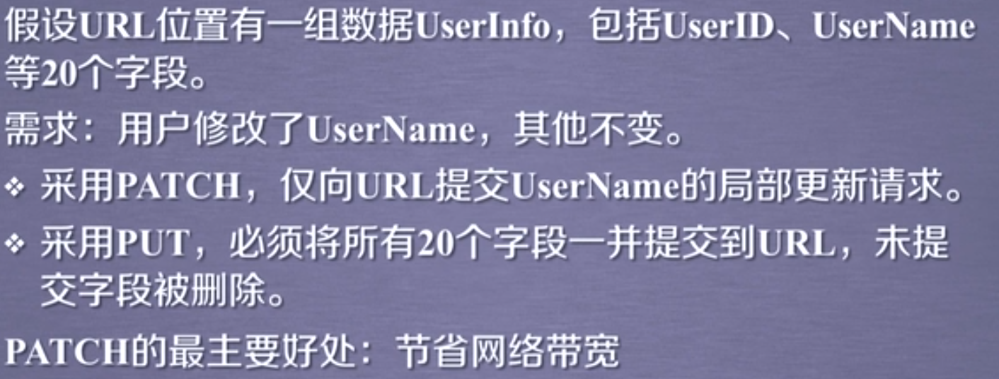

- HTTP与Requests库

  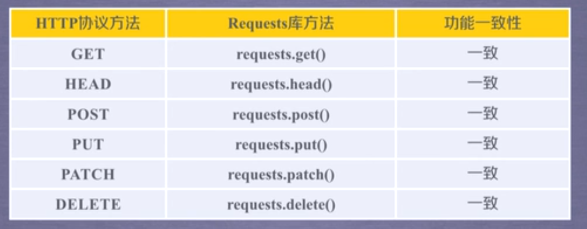

  HTTP与Requests库中的方法一一对应

- Requests库的head()方法

  

  使用r.head()方法可以用较少的流量获取概要信息。

- Requests库的post()方法

  - 
  - 

- Requests库的put()方法

  

put()方法与post()类似，只是它能将原来数据覆盖掉

###### 6. Requests库主要方法解析


- requests.request(method, url, **kwargs)

  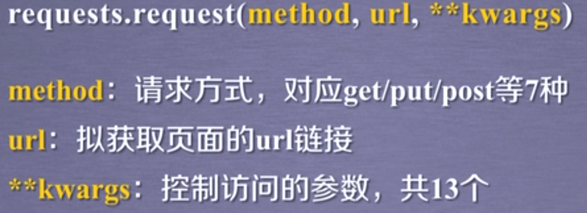

- HTTP协议对应的请求功能：

  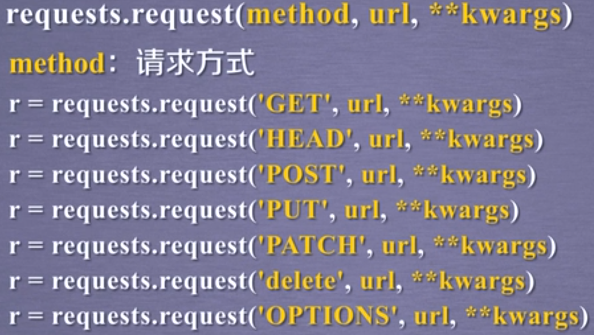

- **kwargs

  - 

  - 
  - 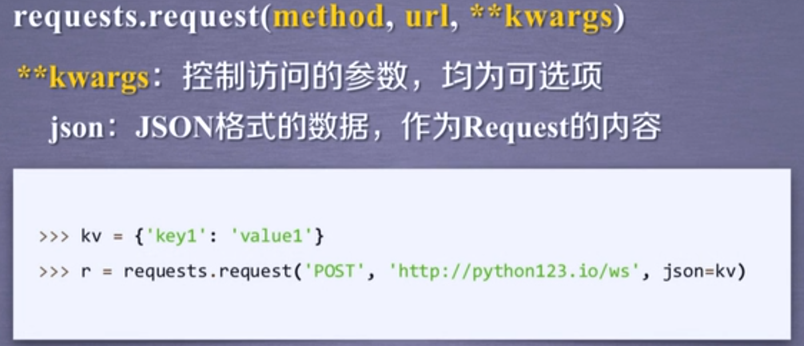
  - 
  - 
  - 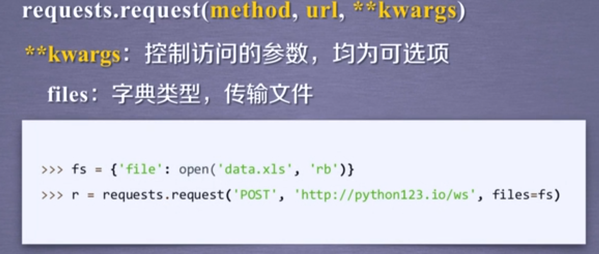
  - 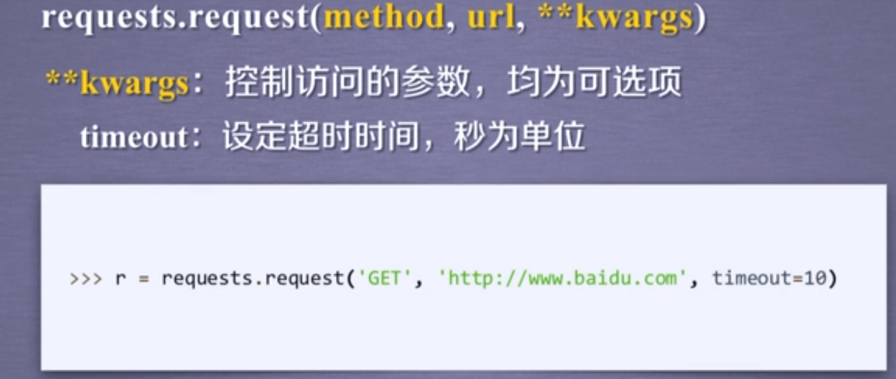
  - 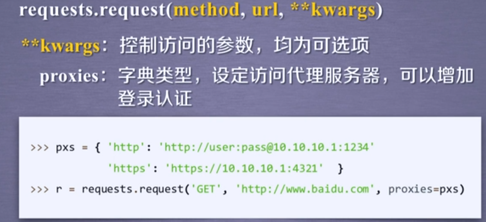
  - 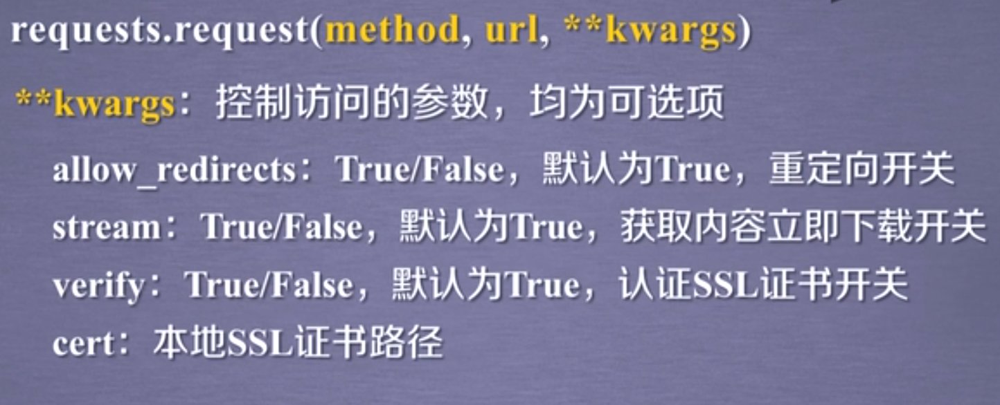
  - 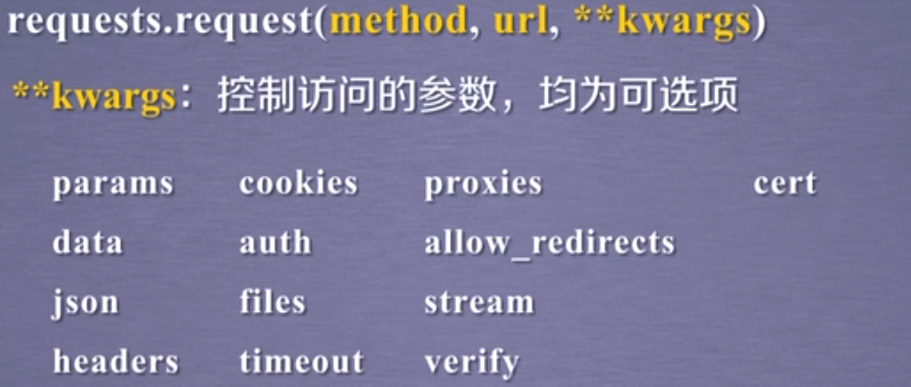
  - 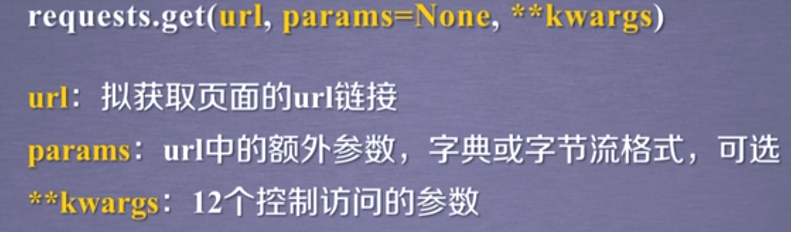
  - 
  - 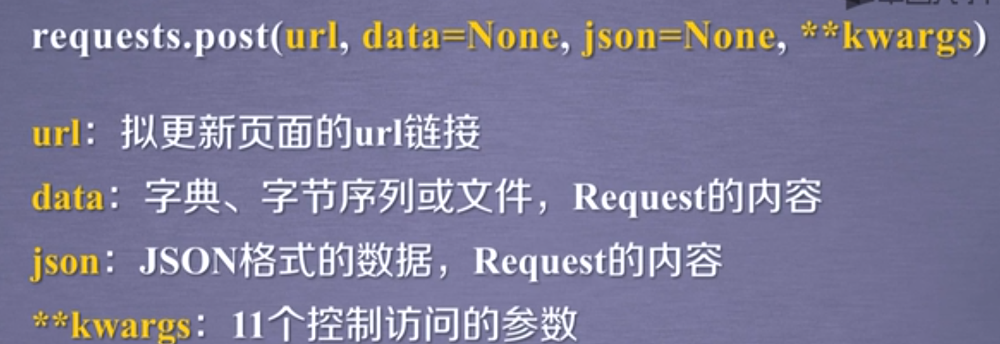
  - 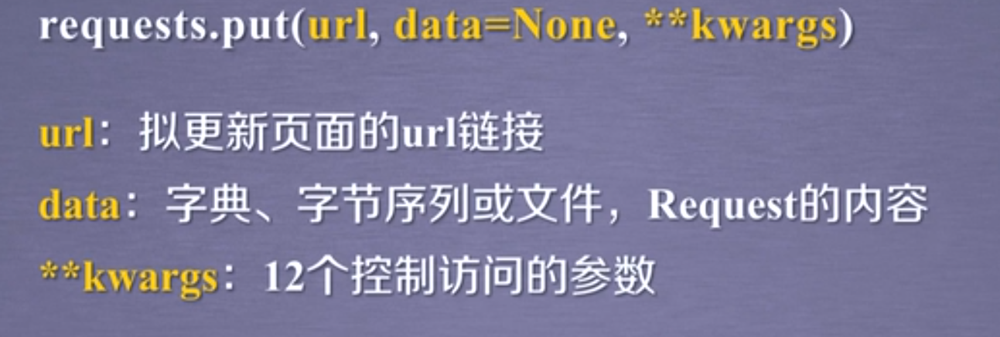
  - 
  - 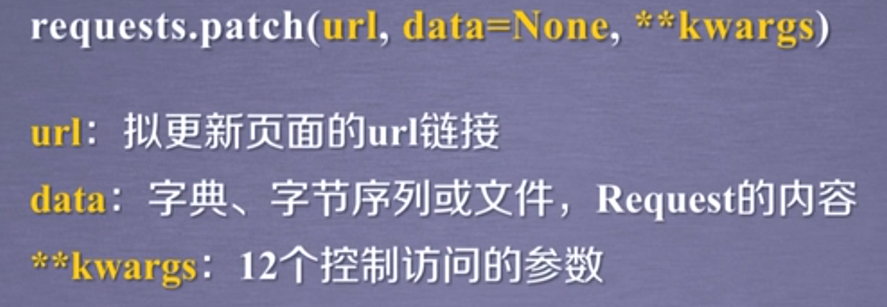

###### 单元小结

- 

  使用最多的是requests.get()方法，对特别大的url链接，使用requests.head()来获取概要信息

- 爬取网页的通用代码框架

  ```
      try:
          r = requests.get(url,timeout=30)
          r.raise_for_status()
          r.encoding = r.apparent_encoding
          return r.text
      except:
          return "产生异常"
  ```

###### 1.网络爬虫引发的问题

- 网络爬虫的尺寸

  

- 网络爬虫引发的问题

  - 骚扰问题

  - 法律问题

    

  - 隐私泄露

    

- 网络爬虫的限制

  

###### 2.Robots协议

- 京东的Robots协议

  

- 其它的一些Robots协议

  

###### 3.Robots协议的遵守

- Robots协议的使用

  

- 对Robots协议的理解

  

- 类人行为可不参考Robots协议

###### 单元小结

- Robots协议基本语法

  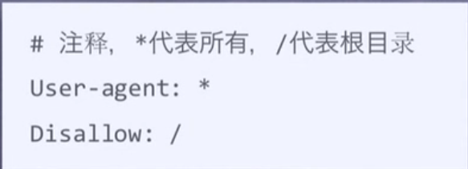


###### 实例一：京东商品页面的爬取

- 全代码：

```
import requests

url = "https://item.jd.com/2967929.html"
try:
	r = requests.get(url,timeout=30)
    r.raise_for_status()
    r.encoding = r.apparent_encoding
    print(r.text[:1000])
except:
    print("爬取失败")
```

###### 实例二：亚马逊商品页面的爬取

- 全代码：

```
import requests

url = "https://www.amazon.cn/gp/product/B01M8L5Z3Y"
try:
    kv = {'user-agent':'Mozilla/5.0'}
    r = requests.get(url,headers=kv)
    r.raise_for_status()
    r.encoding = r.apparent_encoding
    print(r.text[1000:2000])
except:
    print("爬取失败")
```

###### 实例三：百度360搜索关键字提交

- 百度搜索全代码：

```
import requests

keyword = "Python"
try:
    kv = {'wd':keyword}
    r = requests.get("http://www.baidu.com/s",params=kv)
    print(r.request.url)
    r.raise_for_status()
    r.encoding = r.apparent_encoding
    print(len(r.text))
except:
    print("爬取失败")
```

- 360搜索全代码:

```
import requests

keyword = "Python"
try:
    kv = {'q':keyword}
    r = requests.get("http://www.so.com/s",params=kv)
    print(r.request.url)
    r.raise_for_status()
    r.encoding = r.apparent_encoding
    print(len(r.text))
except:
    print("爬取失败")
```

###### 实例四：网络图片的爬取和存储

- 全代码：

```
import requests
import os

url = "https://www.neu.edu.cn/assets/images/roll_4.jpg"
root = "F://pics//"
path = root + url.split('/')[-1]
print(path)
try:
    if not os.path.exists(root):
        os.mkdir(root)
    if not os.path.exists(path):
        r = requests.get(url)
        with open(path, 'wb') as f:
            print(r.content)
            f.write(r.content)
            f.close()
            print("文件保存成功")
    else:
        print("文件已存在")
except:
    print("爬取失败")
```

###### 实例五：IP地址归属地的自动查询

- IP地址查询全代码：

```
import requests

url = "http://m.ip138.com/ip.asp?ip="
try:
    r = requests.get(url+'202.204.80.112')
    r.raise_for_status()
    r.encoding = r.apparent_encoding
    print(r.text[-500:])
except:
    print("爬取失败")
```

######  单元小结

以爬虫角度看待网络内容