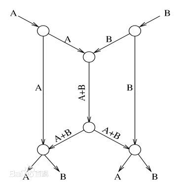

- 网络编码

  

  用编码器取代传统的路由器，发送的是有关信息的证据而不是信息本身，到达接收端后，信息被重新组装。对于多播网络，一个源给多个接收者发送信息，为了达到最大流量，提高网络资源的利用率，有必要在节点上对信息进行编码。

  如右图，考虑一个源（Source）要同时传送A，B两条信息给两个接收者（Receivers），如果使用传统的路由器，中间一条链路同一时间只能传送A或者B，所以，在一个单位时间内，只有一个Receiver能拿到完整的A和B，另一个接收者只能再等下一个单位时间。

  若采用图中的方法，在中间第一个节点里，收到A和B后，先求A⊕B（异或），由于A和B具有相同的长度，则，A⊕B后，长度与A或者B长度相同，所以，发送A+B只需要一个单位时间。所以，两个Receiver可以同时拿到A，A⊕B，或者B，A⊕B，然后，求A⊕（A⊕B），即可得到B，求B⊕（A⊕B）得到A，相当于两个Receivers同时拿到了A和B。

  这样一来，通信容量达到了原带宽的两倍了！

- **同态加密**

  同态加密是一种[加密](https://zh.wikipedia.org/wiki/%E5%8A%A0%E5%AF%86)形式，它允许人们对密文进行特定形式的代数运算得到仍然是加密的结果，将其解密所得到的结果与对[明文](https://zh.wikipedia.org/wiki/%E6%98%8E%E6%96%87)进行同样的运算结果一样。换言之，这项技术令人们可以在加密的数据中进行诸如检索、比较等操作，得出正确的结果，而在整个处理过程中无需对数据进行[解密](https://zh.wikipedia.org/wiki/%E8%A7%A3%E5%AF%86)。其意义在于，真正从根本上解决将数据及其操作委托给第三方时的保密问题，例如对于各种[云计算](https://zh.wikipedia.org/wiki/%E4%BA%91%E8%AE%A1%E7%AE%97)的应用。